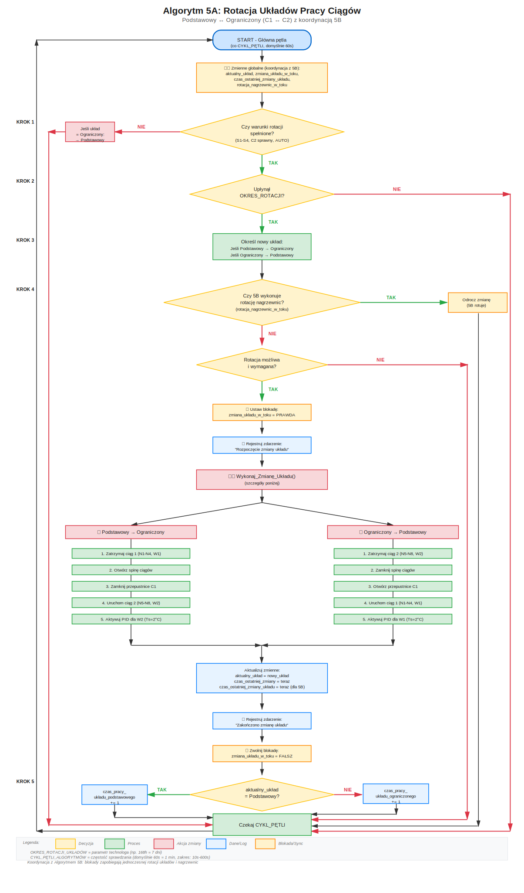
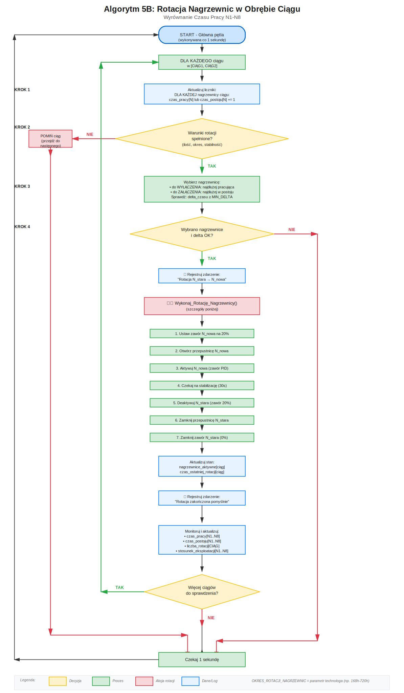

# Algorytmy Cyklicznej Rotacji - System BOGDANKA Szyb 2

**Dokument szczegółowy zawierający algorytmy rotacji**

_Plik ten jest częścią dokumentacji systemu sterowania nagrzewnicami BOGDANKA Szyb 2._

[← Powrót do dokumentacji głównej](System%20Sterowania%20BOGDANKA%20szyb%202.md)

---

**Ostatnia aktualizacja:** 22 Listopad 2025  
**Status:** Algorytmy do implementacji w PLC  
**Zatwierdzenie:** Wymaga akceptacji technologa

---

## Spis Treści

1. [Algorytm Cyklicznej Rotacji Układów Pracy Ciągów (5A)](#5a-algorytm-cyklicznej-rotacji-układów-pracy-ciągów)
2. [Algorytm Cyklicznej Rotacji Nagrzewnic w Obrębie Ciągu (5B)](#5b-algorytm-cyklicznej-rotacji-nagrzewnic-w-obrębie-ciągu)

---

## Wprowadzenie

System sterowania BOGDANKA Szyb 2 wykorzystuje **dwa niezależne algorytmy rotacji** w celu równomiernego rozłożenia eksploatacji urządzeń:

### **Algorytm 5A: Rotacja Układów Pracy Ciągów**
- **Cel:** Wyrównanie eksploatacji między ciągiem 1 (W1) a ciągiem 2 (W2)
- **Zakres:** Zmiana między układem Podstawowym a Ograniczonym
- **Okres:** dni/tygodnie/miesiące (definiowany przez technologa)
- **Dotyczy:** Scenariuszy S1-S4

### **Algorytm 5B: Rotacja Nagrzewnic w Ciągu**
- **Cel:** Wyrównanie eksploatacji nagrzewnic w obrębie jednego ciągu
- **Zakres:** Wymiana pracującej nagrzewnicy na rezerwową w tym samym ciągu
- **Okres:** godziny/dni/tygodnie (definiowany przez technologa)
- **Dotyczy:** Wszystkich nagrzewnic N1-N8

### **Koordynacja Algorytmów**
Oba algorytmy są **skoordynowane** i działają współbieżnie, zapewniając maksymalną równomierność zużycia:
- Wszystkich 8 nagrzewnic (N1-N8)
- Obu ciągów wentylacyjnych (C1, C2)
- Obu wentylatorów (W1, W2)

---


## 5A. Algorytm Cyklicznej Rotacji Układów Pracy Ciągów

### 5A.1 Cel Algorytmu

Algorytm realizuje **cykliczną zmianę układów pracy ciągów grzewczych** w celu:
- Wyrównania czasów eksploatacji ciągów grzewczych (W1 vs W2)
- Uniknięcia nadmiernej eksploatacji ciągu pierwszego
- Zwiększenia niezawodności i równomiernego zużycia urządzeń

### 5A.2 Problem do Rozwiązania

**Bez rotacji układów:**
- Ciąg 1 (N1-N4 + W1) pracuje zawsze w scenariuszach S1-S4 (temp. od 2°C do -11°C)
- Ciąg 2 (N5-N8 + W2) włącza się dopiero w S5-S8 (temp. < -11°C)
- **Rezultat:** Ciąg 1 jest eksploatowany znacznie częściej i intensywniej niż ciąg 2

**Z rotacją układów:**
- System okresowo zmienia układ: Podstawowy → Ograniczony → Podstawowy
- Oba ciągi mają równomierne czasy pracy

### 5A.3 Parametr Konfiguracyjny

**⚙️ OKRES_ROTACJI_UKŁADÓW** - parametr definiowany przez **technologa podczas rozruchu**

| Parametr | Wartość domyślna | Jednostka | Zakres | Opis |
|----------|-----------------|-----------|--------|------|
| OKRES_ROTACJI_UKŁADÓW | Do ustalenia* | godziny lub dni | 24h - 30 dni | Czas po którym następuje zmiana układu pracy |

*Wartość zostanie ustalona podczas testowania pracy układu na obiekcie i może być modyfikowana w zależności od warunków eksploatacyjnych.

**Przykładowe wartości:**
- **168h (7 dni)** - typowa wartość dla równomiernego rozłożenia eksploatacji
- **720h (30 dni)** - dla zmniejszenia częstotliwości przełączeń
- **24h (1 dzień)** - dla testów i weryfikacji działania

### 5A.4 Warunki Aktywacji Rotacji

Rotacja układów jest możliwa **TYLKO** gdy spełnione są **WSZYSTKIE** warunki:

1. **Warunek temperaturowy:**
   - Aktualny scenariusz: S1, S2, S3 lub S4
   - Temperatura zewnętrzna: -11°C < t ≤ 2°C
   - Wymagana ilość nagrzewnic ≤ 4

2. **Warunek gotowości ciągu 2:**
   - Ilość sprawnych nagrzewnic ciągu 2 (N5-N8) ≥ wymagana ilość nagrzewnic
   - Wentylator W2 sprawny i w gotowości operacyjnej
   - Przepustnica na spince ciągów sprawna

3. **Warunek czasowy:**
   - Upłynął OKRES_ROTACJI_UKŁADÓW od ostatniej zmiany układu
   - System pracuje w trybie AUTO

4. **Warunek stabilności:**
   - Brak aktywnych alarmów krytycznych
   - Parametry wody grzewczej w normie
   - System SAR stabilny (brak oscylacji temperatury)

### 5A.5 Algorytm Rotacji Krok po Kroku

**Diagram przepływu algorytmu:**



**Pseudokod:**

```
ZMIENNE:
  - czas_pracy_układu_podstawowego = 0  // [sekundy]
  - czas_pracy_układu_ograniczonego = 0 // [sekundy]
  - aktualny_układ = "Podstawowy"       // domyślnie
  - czas_ostatniej_zmiany = czas_systemowy
  - scenariusz = S0..S8

PARAMETRY:
  - OKRES_ROTACJI_UKŁADÓW              // definiowany przez technologa [s]
  - HISTEREZA_CZASOWA = 300            // 5 minut [s]

GŁÓWNA PĘTLA (co 1 sekundę):
  
  KROK 1: Sprawdź warunki rotacji
    JEŻELI scenariusz ∈ {S1, S2, S3, S4} ORAZ
           wszystkie_nagrzewnice_C2_sprawne ORAZ
           wentylator_W2_sprawny ORAZ
           tryb = AUTO ORAZ
           brak_alarmów_krytycznych WTEDY
      
      rotacja_możliwa = PRAWDA
    
    W PRZECIWNYM RAZIE:
      rotacja_możliwa = FAŁSZ
      // Powrót do układu podstawowego jeśli był ograniczony
      JEŻELI aktualny_układ = "Ograniczony" WTEDY
        Wykonaj_Zmianę_Układu("Podstawowy")
      KONIEC JEŻELI
      PRZEJDŹ DO KROKU 5
    
    KONIEC JEŻELI
  
  KROK 2: Sprawdź czy upłynął okres rotacji
    czas_od_ostatniej_zmiany = czas_systemowy - czas_ostatniej_zmiany
    
    JEŻELI czas_od_ostatniej_zmiany ≥ (OKRES_ROTACJI_UKŁADÓW - HISTEREZA_CZASOWA) WTEDY
      rotacja_wymagana = PRAWDA
    W PRZECIWNYM RAZIE:
      rotacja_wymagana = FAŁSZ
      PRZEJDŹ DO KROKU 5
    KONIEC JEŻELI
  
  KROK 3: Określ nowy układ
    JEŻELI aktualny_układ = "Podstawowy" WTEDY
      nowy_układ = "Ograniczony"
    W PRZECIWNYM RAZIE:
      nowy_układ = "Podstawowy"
    KONIEC JEŻELI
  
  KROK 4: Wykonaj zmianę układu
    JEŻELI rotacja_możliwa = PRAWDA ORAZ rotacja_wymagana = PRAWDA WTEDY
      
      Rejestruj_Zdarzenie("Rozpoczęcie zmiany układu z " + aktualny_układ + " na " + nowy_układ)
      
      // Sekwencja zmiany układu
      Wykonaj_Zmianę_Układu(nowy_układ)
      
      // Aktualizacja zmiennych
      aktualny_układ = nowy_układ
      czas_ostatniej_zmiany = czas_systemowy
      
      Rejestruj_Zdarzenie("Zakończono zmianę układu na " + nowy_układ)
    
    KONIEC JEŻELI
  
  KROK 5: Aktualizuj liczniki czasu pracy
    JEŻELI aktualny_układ = "Podstawowy" WTEDY
      czas_pracy_układu_podstawowego += 1
    W PRZECIWNYM RAZIE:
      czas_pracy_układu_ograniczonego += 1
    KONIEC JEŻELI

KONIEC PĘTLI

FUNKCJA Wykonaj_Zmianę_Układu(docelowy_układ):
  
  JEŻELI docelowy_układ = "Ograniczony" WTEDY
    // Przejście: Podstawowy → Ograniczony
    
    KROK 1: Zatrzymaj ciąg 1 (stopniowo)
      Dla i = ilość_aktywnych_nagrzewnic_C1 DO 1:
        Wyłącz_Nagrzewnicę(Ni)  // sekwencja normalna
        Czekaj(30 sekund)       // stabilizacja
      KONIEC DLA
      Zatrzymaj_Wentylator(W1)
    
    KROK 2: Otwórz przepustnicę na spince ciągów
      Ustaw_Przepustnicę_Spinka(OTWARTA)
      Czekaj(10 sekund)
    
    KROK 3: Zamknij przepustnice ciągu 1
      Ustaw_Przepustnicę_Kolektor_C1(ZAMKNIĘTA)
      Ustaw_Przepustnicę_Wyrzutnia_790(ZAMKNIĘTA)
    
    KROK 4: Uruchom ciąg 2 (stopniowo)
      Uruchom_Wentylator(W2, częstotliwość = 25Hz)
      Czekaj(10 sekund)
      
      Dla i = 1 DO wymagana_ilość_nagrzewnic:
        Załącz_Nagrzewnicę(N[4+i])  // N5, N6, N7, N8
        Czekaj(30 sekund)            // stabilizacja
      KONIEC DLA
    
    KROK 5: Aktywuj regulację PID dla W2
      Ustaw_Wentylator_W2_Tryb(PID)
      Ustaw_Setpoint_W2(Ts = 2°C)
  
  W PRZECIWNYM RAZIE:  // docelowy_układ = "Podstawowy"
    // Przejście: Ograniczony → Podstawowy
    
    KROK 1: Zatrzymaj ciąg 2 (stopniowo)
      Dla i = ilość_aktywnych_nagrzewnic_C2 DO 1:
        Wyłącz_Nagrzewnicę(N[4+i])  // od N8 do N5
        Czekaj(30 sekund)
      KONIEC DLA
      Zatrzymaj_Wentylator(W2)
    
    KROK 2: Zamknij przepustnicę na spince ciągów
      Ustaw_Przepustnicę_Spinka(ZAMKNIĘTA)
      Czekaj(10 sekund)
    
    KROK 3: Otwórz przepustnice ciągu 1
      Ustaw_Przepustnicę_Kolektor_C1(OTWARTA)
      Ustaw_Przepustnicę_Ciąg_C1(OTWARTA)
    
    KROK 4: Uruchom ciąg 1 (stopniowo)
      Uruchom_Wentylator(W1, częstotliwość = 25Hz)
      Czekaj(10 sekund)
      
      Dla i = 1 DO wymagana_ilość_nagrzewnic:
        Załącz_Nagrzewnicę(Ni)  // N1, N2, N3, N4
        Czekaj(30 sekund)
      KONIEC DLA
    
    KROK 5: Aktywuj regulację PID dla W1
      Ustaw_Wentylator_W1_Tryb(PID)
      Ustaw_Setpoint_W1(Ts = 2°C)
  
  KONIEC JEŻELI
  
KONIEC FUNKCJI
```

### 5A.6 Obsługa Stanów Awaryjnych Podczas Rotacji

| Stan Awaryjny | Reakcja Systemu |
|---------------|-----------------|
| Awaria nagrzewnicy podczas zmiany | Kontynuuj zmianę z pominiętą nagrzewnicą, alarm informacyjny |
| Awaria wentylatora podczas zmiany | Natychmiastowy powrót do poprzedniego układu, alarm krytyczny |
| Przekroczenie czasu zmiany (>10 min) | Przerwij zmianę, powrót do układu podstawowego, alarm |
| Oscylacje temperatury podczas zmiany | Zwiększ czas stabilizacji (60s zamiast 30s), kontynuuj |
| Brak przepływu wody grzewczej | Natychmiastowe zatrzymanie zmiany, wyłączenie wszystkich nagrzewnic, alarm krytyczny |

### 5A.7 Monitoring i Statystyki

System rejestruje następujące dane dla analizy:

| Parametr | Opis |
|----------|------|
| Łączny czas pracy C1 | Suma czasu pracy ciągu 1 w układzie podstawowym [h] |
| Łączny czas pracy C2 | Suma czasu pracy ciągu 2 w układzie ograniczonym [h] |
| Liczba zmian układów | Licznik wykonanych rotacji |
| Średni czas zmiany układu | Średni czas trwania procedury zmiany [min] |
| Liczba nieudanych zmian | Licznik przerwanych rotacji z powodu błędów |
| Stosunek eksploatacji C1/C2 | Proporcja czasu pracy obu ciągów (cel: ~1.0) |

**Raport dostępny w HMI:**
- Wykres czasu pracy ciągów (histogram tygodniowy/miesięczny)
- Historia zmian układów z timestampem
- Analiza równomierności eksploatacji

### 5A.8 Przykład Działania

**Warunki początkowe:**
- Temperatura zewnętrzna: -5°C
- Scenariusz: S3 (3 nagrzewnice)
- OKRES_ROTACJI_UKŁADÓW = 168h (7 dni)
- Aktualny układ: Podstawowy
- Czas od ostatniej zmiany: 169h

**Przebieg:**

1. **Dzień 0, godz. 00:00** - System w układzie Podstawowym
   - Pracują: N1, N2, N3 + W1 (PID)
   - Nawiew na +4,30m

2. **Dzień 7, godz. 01:00** - Upłynął OKRES_ROTACJI_UKŁADÓW
   - Warunki rotacji spełnione 
   - Algorytm rozpoczyna zmianę: Podstawowy → Ograniczony

3. **Dzień 7, godz. 01:05** - Zmiana zakończona
   - Pracują: N5, N6, N7 + W2 (PID)
   - Nawiew na +4,30m przez spinę ciągów
   - Zarejestrowano zdarzenie w dzienniku

4. **Dzień 14, godz. 01:00** - Kolejna rotacja
   - Zmiana: Ograniczony → Podstawowy
   - Powrót do N1, N2, N3 + W1

**Rezultat po miesiącu:**
- Ciąg 1: ~360h pracy (50%)
- Ciąg 2: ~360h pracy (50%)
- Stosunek eksploatacji: 1.0 ✅ Idealne wyrównanie

---

## 5B. Algorytm Cyklicznej Rotacji Nagrzewnic w Obrębie Ciągu

### 5B.1 Cel Algorytmu

Algorytm realizuje **cykliczną rotację nagrzewnic pracujących w jednym ciągu wentylacyjnym** w celu:
- Wyrównania czasów eksploatacji poszczególnych nagrzewnic w ciągu
- Zmniejszenia zużycia pojedynczej nagrzewnicy
- Zwiększenia niezawodności systemu przez równomierne zużycie urządzeń

### 5B.2 Problem do Rozwiązania

**Bez rotacji nagrzewnic (przykład dla S3 - 3 nagrzewnice):**
- N1 pracuje ZAWSZE (najdłuższy czas pracy)
- N2 pracuje często (średni czas pracy)
- N3 pracuje rzadziej (krótszy czas pracy)
- N4 NIE pracuje (brak zużycia)
- **Rezultat:** Nierównomierne zużycie nagrzewnic → N1 będzie wymagać konserwacji znacznie wcześniej niż N4

**Z rotacją nagrzewnic:**
```
Dzień 1-7:   N1, N2, N3 pracują
Dzień 8-14:  N2, N3, N4 pracują  (N1 odpoczynek, N4 wchodzi)
Dzień 15-21: N3, N4, N1 pracują  (N2 odpoczynek, N1 wchodzi)
Dzień 22-28: N4, N1, N2 pracują  (N3 odpoczynek, N2 wchodzi)
```
- **Rezultat:** Równomierne zużycie wszystkich 4 nagrzewnic ciągu

### 5B.3 Parametry Konfiguracyjne

Parametry definiowane przez **technologa podczas rozruchu**:

| Parametr | Wartość domyślna | Jednostka | Zakres | Opis |
|----------|-----------------|-----------|--------|------|
| **OKRES_ROTACJI_NAGRZEWNIC** | Do ustalenia* | godziny | 24h - 720h | Czas po którym następuje zmiana nagrzewnicy w ciągu |
| **MIN_DELTA_CZASU** | 3600 | sekundy | 1800 - 7200 | Minimalna różnica czasu pracy dla wykonania rotacji |

*Wartości zostaną ustalone podczas testowania pracy układu na obiekcie (zgodnie z sekcją 1.4 projektu).

**Przykładowe wartości OKRES_ROTACJI_NAGRZEWNIC:**
- **168h (7 dni)** - typowa wartość dla równomiernego rozłożenia eksploatacji
- **720h (30 dni)** - dla zmniejszenia częstotliwości przełączeń
- **48h (2 dni)** - dla intensywnej rotacji i szybszego wyrównania

**Uzasadnienie MIN_DELTA_CZASU:**
- **3600s (1h)** - wartość domyślna, zapobiega częstym rotacjom przy niewielkich różnicach
- **7200s (2h)** - dla bardziej konserwatywnego podejścia
- **1800s (30min)** - dla agresywniejszego wyrównywania w scenariuszach dynamicznych
- Jeśli różnica czasu pracy jest mniejsza niż MIN_DELTA_CZASU, rotacja nie ma sensu (zmiana dla zmiany)

### 5B.4 Warunki Aktywacji Rotacji Nagrzewnic

Rotacja nagrzewnic jest możliwa **TYLKO** gdy spełnione są **WSZYSTKIE** warunki:

1. **Warunek konfiguracji ciągu:**
   - Ilość sprawnych nagrzewnic ciągu > ilość aktualnie pracujących nagrzewnic
   - Co najmniej 1 nagrzewnica musi pozostać aktywna podczas zmiany
   - Maksymalnie 4 nagrzewnice w ciągu

2. **Warunek czasowy:**
   - Upłynął OKRES_ROTACJI_NAGRZEWNIC od ostatniej rotacji w tym ciągu
   - System pracuje w trybie AUTO

3. **Warunek stabilności:**
   - Brak aktywnych alarmów dla nagrzewnic w ciągu
   - Parametry wody grzewczej w normie
   - Temperatura w szybie stabilna (brak oscylacji > ±0.5°C)
   - Wentylator ciągu sprawny i pracujący

4. **Warunek dostępności:**
   - Nagrzewnica zastępcza w gotowości operacyjnej
   - Zawór regulacyjny sprawny
   - Przepustnice sprawne

### 5B.5 Algorytm Rotacji Nagrzewnic Krok po Kroku

**Diagram wizualizujący algorytm:**



```
ZMIENNE (dla każdego ciągu osobno):
  - czas_pracy[N1..N8] = [0, 0, 0, 0, 0, 0, 0, 0]       // [sekundy]
  - czas_postoju[N1..N8] = [0, 0, 0, 0, 0, 0, 0, 0]     // [sekundy]
  - timestamp_zalaczenia[N1..N8] = [0, 0, 0, 0, 0, 0, 0, 0] // [timestamp pierwszego załączenia]
  - czas_ostatniej_rotacji[CIĄG1, CIĄG2] = [0, 0]       // [timestamp]
  - nagrzewnice_aktywne[CIĄG] = []                       // lista aktywnych

PARAMETRY:
  - OKRES_ROTACJI_NAGRZEWNIC[S1..S8]  // definiowany przez technologa [s]
  - MIN_DELTA_CZASU                   // definiowany przez technologa [s] (domyślnie 3600)
  - CZAS_STABILIZACJI = 30            // czas na stabilizację po zmianie [s]

GŁÓWNA PĘTLA (co 1 sekundę):
  
  DLA KAŻDEGO ciągu w [CIĄG1, CIĄG2]:
    
    KROK 1: Aktualizuj liczniki czasu pracy i postoju
      DLA KAŻDEJ nagrzewnicy w ciągu:
        JEŻELI nagrzewnica_aktywna(N) WTEDY
          czas_pracy[N] += 1
        W PRZECIWNYM RAZIE:
          czas_postoju[N] += 1
        KONIEC JEŻELI
      KONIEC DLA
    
    KROK 2: Sprawdź warunki rotacji
      aktualny_scenariusz = Pobierz_Scenariusz()
      ilość_pracujących = Liczba_Aktywnych_Nagrzewnic(ciąg)
      ilość_sprawnych = Liczba_Sprawnych_Nagrzewnic(ciąg)
      
      JEŻELI ilość_sprawnych ≤ ilość_pracujących WTEDY
        // Brak nagrzewnic rezerwowych - rotacja niemożliwa
        POMIŃ ciąg
      KONIEC JEŻELI
      
      czas_od_ostatniej_rotacji = czas_systemowy - czas_ostatniej_rotacji[ciąg]
      okres = OKRES_ROTACJI_NAGRZEWNIC[aktualny_scenariusz]
      
      JEŻELI czas_od_ostatniej_rotacji < okres WTEDY
        // Nie upłynął jeszcze okres rotacji
        POMIŃ ciąg
      KONIEC JEŻELI
      
      JEŻELI NIE Warunki_Stabilności_Spełnione(ciąg) WTEDY
        // System niestabilny - nie wykonuj rotacji
        POMIŃ ciąg
      KONIEC JEŻELI
    
    KROK 3: Wybierz nagrzewnicę do wyłączenia i załączenia
      // Znajdź nagrzewnicę najdłużej pracującą (aktywną)
      nagrzewnica_do_wyłączenia = NULL
      max_czas_pracy = 0
      earliest_timestamp = nieskonczonosc
      
      DLA KAŻDEJ N w nagrzewnice_aktywne[ciąg]:
        JEŻELI czas_pracy[N] > max_czas_pracy WTEDY
          max_czas_pracy = czas_pracy[N]
          nagrzewnica_do_wyłączenia = N
          earliest_timestamp = timestamp_zalaczenia[N]
        W PRZECIWNYM RAZIE JEŻELI czas_pracy[N] = max_czas_pracy WTEDY
          // Przy identycznych czasach pracy wybierz tę załączoną wcześniej
          JEŻELI timestamp_zalaczenia[N] < earliest_timestamp WTEDY
            nagrzewnica_do_wyłączenia = N
            earliest_timestamp = timestamp_zalaczenia[N]
          KONIEC JEŻELI
        KONIEC JEŻELI
      KONIEC DLA
      
      // Znajdź nagrzewnicę najdłużej postoju (nieaktywną, sprawną)
      nagrzewnica_do_załączenia = NULL
      max_czas_postoju = 0
      
      DLA KAŻDEJ N w [nagrzewnice ciągu]:
        JEŻELI N NIE w nagrzewnice_aktywne[ciąg] ORAZ
               N_sprawna(N) ORAZ
               czas_postoju[N] > max_czas_postoju WTEDY
          max_czas_postoju = czas_postoju[N]
          nagrzewnica_do_załączenia = N
        KONIEC JEŻELI
      KONIEC DLA
      
      // Sprawdź czy warto wykonać rotację
      delta_czasu = max_czas_pracy - max_czas_postoju
      JEŻELI delta_czasu < MIN_DELTA_CZASU WTEDY
        // Różnica czasu zbyt mała - nie ma sensu rotować
        POMIŃ ciąg
      KONIEC JEŻELI
    
    KROK 4: Wykonaj rotację
      JEŻELI nagrzewnica_do_wyłączenia ≠ NULL ORAZ 
             nagrzewnica_do_załączenia ≠ NULL WTEDY
        
        Rejestruj_Zdarzenie("Rotacja w " + ciąg + ": " + 
                          nagrzewnica_do_wyłączenia + " → " + 
                          nagrzewnica_do_załączenia)
        
        // Sekwencja rotacji
        Wykonaj_Rotację_Nagrzewnicy(ciąg, 
                                    nagrzewnica_do_wyłączenia,
                                    nagrzewnica_do_załączenia)
        
        // Aktualizacja stanu
        czas_ostatniej_rotacji[ciąg] = czas_systemowy
        
        Rejestruj_Zdarzenie("Rotacja zakończona pomyślnie")
      
      KONIEC JEŻELI
  
  KONIEC DLA

KONIEC PĘTLI

FUNKCJA Wykonaj_Rotację_Nagrzewnicy(ciąg, N_stara, N_nowa):
  
  KROK 1: Przygotowanie nagrzewnicy nowej
    // Sprawdź gotowość N_nowa
    JEŻELI NIE Sprawdź_Gotowość(N_nowa) WTEDY
      Rejestruj_Alarm("Nagrzewnica " + N_nowa + " nie jest gotowa")
      ZWRÓĆ BŁĄD
    KONIEC JEŻELI
    
    // Ustaw zawór N_nowa na pozycję startową (20%)
    Ustaw_Zawór(N_nowa, 20%)
    Czekaj(5 sekund)
  
  KROK 2: Załączenie nagrzewnicy nowej
    // Otwórz przepustnicę dolotową N_nowa
    Ustaw_Przepustnicę_Dolot(N_nowa, OTWARTA)
    Czekaj(5 sekund)
    
    // Otwórz zawór N_nowa stopniowo do 100%
    Dla pozycja = 20 DO 100 KROK 10:
      Ustaw_Zawór(N_nowa, pozycja)
      Czekaj(2 sekundy)
    KONIEC DLA
    
    // Aktywuj regulator PID dla N_nowa
    Ustaw_Regulator_PID(N_nowa, tryb = AUTO, setpoint = 50°C)
    Czekaj(CZAS_STABILIZACJI sekund)
  
  KROK 3: Sprawdź stabilność temperatury
    temp_N_nowa = Odczytaj_Temperaturę(N_nowa)
    
    JEŻELI |temp_N_nowa - 50°C| > 5°C WTEDY
      // Nowa nagrzewnica nie osiągnęła temperatury
      Rejestruj_Alarm("N_nowa nie osiągnęła temp. docelowej")
      // Wycofaj zmianę
      Wyłącz_Nagrzewnicę(N_nowa)
      ZWRÓĆ BŁĄD
    KONIEC JEŻELI
  
  KROK 4: Wyłączenie nagrzewnicy starej
    // Zatrzymaj regulator PID dla N_stara
    Ustaw_Regulator_PID(N_stara, tryb = MANUAL)
    
    // Zamknij zawór N_stara stopniowo do 20%
    aktualna_pozycja = Odczytaj_Pozycję_Zaworu(N_stara)
    Dla pozycja = aktualna_pozycja DO 20 KROK -10:
      Ustaw_Zawór(N_stara, pozycja)
      Czekaj(2 sekundy)
    KONIEC DLA
    
    // Poczekaj na stabilizację
    Czekaj(CZAS_STABILIZACJI sekund)
    
    // Zamknij przepustnicę dolotową N_stara
    Ustaw_Przepustnicę_Dolot(N_stara, ZAMKNIĘTA)
  
  KROK 5: Aktualizacja listy aktywnych nagrzewnic
    Usuń(nagrzewnice_aktywne[ciąg], N_stara)
    Dodaj(nagrzewnice_aktywne[ciąg], N_nowa)
    
    // Zeruj licznik postoju dla N_nowa
    czas_postoju[N_nowa] = 0
    
    // Zapisz timestamp załączenia N_nowa (do rozstrzygania przy identycznych czasach)
    timestamp_zalaczenia[N_nowa] = czas_systemowy
    
    // Kontynuuj liczenie czasu pracy dla N_stara
    // (nie zeruj - chcemy pamiętać łączny czas)
  
  ZWRÓĆ SUKCES

KONIEC FUNKCJI

FUNKCJA Warunki_Stabilności_Spełnione(ciąg):
  // Sprawdź temperaturę w szybie
  temp_szyb = Odczytaj_Temperaturę_Szybu()
  JEŻELI |temp_szyb - 2°C| > 0.5°C WTEDY
    ZWRÓĆ FAŁSZ
  KONIEC JEŻELI
  
  // Sprawdź parametry wody grzewczej
  JEŻELI NIE Parametry_Wody_OK() WTEDY
    ZWRÓĆ FAŁSZ
  KONIEC JEŻELI
  
  // Sprawdź wentylator
  JEŻELI NIE Wentylator_Sprawny(ciąg) WTEDY
    ZWRÓĆ FAŁSZ
  KONIEC JEŻELI
  
  // Sprawdź alarmy
  JEŻELI Aktywne_Alarmy_Krytyczne(ciąg) > 0 WTEDY
    ZWRÓĆ FAŁSZ
  KONIEC JEŻELI
  
  ZWRÓĆ PRAWDA

KONIEC FUNKCJI
```

### 5B.6 Priorytety Rotacji

W scenariuszach S5-S8 pracują oba ciągi jednocześnie. W S1-S4 pracuje **albo C1 (Układ Podstawowy) albo C2 (Układ Ograniczony)** w zależności od aktualnego układu pracy (Algorytm 5A). Gdy wiele ciągów wymaga rotacji jednocześnie, stosuje się następujące priorytety:

| Priorytet | Ciąg | Warunek | Uzasadnienie |
|-----------|------|---------|--------------|
| 1 | **Ciąg aktywny w S1-S4** | **C1 (Układ Podstawowy)** ALBO **C2 (Układ Ograniczony)** - pracuje SOLO | Najwyższe zużycie - całe obciążenie grzewcze na jednym ciągu, priorytetowa rotacja |
| 2 | Ciąg 2 (S5-S7) | C1 MAX + C2 PID | C2 reguluje temperaturę PID - rotacja **MOŻLIWA** i ważna dla stabilności (są nagrzewnice rezerwowe) |
| 3 | Ciąg 1 (S5-S8) | C1 MAX + C2 PID/MAX | C1 pracuje na MAX - rotacja **NIEMOŻLIWA*** (wszystkie N1-N4 pracują, brak rezerwowej) |

**Ograniczenia rotacji:**
- *W **S5-S8**: rotacja 5B w **C1 jest NIEMOŻLIWA** - wszystkie nagrzewnice N1-N4 muszą pracować (brak nagrzewnicy rezerwowej)
- W **S5-S7**: rotacja 5B w **C2 jest MOŻLIWA** - są nagrzewnice rezerwowe (N8 w S7, N7-N8 w S6, N6-N8 w S5)
- W **S8**: rotacja 5B w **C2 jest NIEMOŻLIWA** - wszystkie nagrzewnice N5-N8 muszą pracować (brak nagrzewnicy rezerwowej)

**Koordynacja z Algorytmem 5A (Rotacja Układów):**
- W S1-S4, gdy aktywny jest **Układ Podstawowy**: rotacja 5B dotyczy **C1** (priorytet 1)
- W S1-S4, gdy aktywny jest **Układ Ograniczony**: rotacja 5B dotyczy **C2** (priorytet 1)
- Po zmianie układu (5A) poczekaj min. **1 godzinę** przed rotacją nagrzewnic (5B)
- Priorytet ma zawsze **ciąg aktywny** (pracujący w danym układzie)

**Zasada odstępu:** Nie wykonuj rotacji w dwóch ciągach jednocześnie - zachowaj min. 15 minut odstępu między rotacjami.

**Uzasadnienie odstępu 15 minut:**
- Stabilność systemu (uniknięcie podwójnych perturbacji temperatury)
- Łatwiejsza diagnostyka problemów (wiadomo który ciąg jest przyczyną)
- Czas na reakcję operatora/SCADA w przypadku nieprawidłowości

### 5B.7 Obsługa Stanów Awaryjnych

| Stan Awaryjny | Reakcja Systemu |
|---------------|-----------------|
| Nagrzewnica nowa nie osiąga temperatury | Wycofaj zmianę, przywróć N_starą, alarm |
| Awaria zaworu podczas rotacji | Zatrzymaj rotację, utrzymaj aktualny stan, alarm krytyczny |
| Wentylator zatrzymał się podczas rotacji | Natychmiastowe wyłączenie obu nagrzewnic, alarm krytyczny |
| Temperatura szybu spadła o >1°C | Przerwij rotację, przywróć N_starą, zwiększ moc |
| Przekroczenie czasu rotacji (>5 min) | Przerwij rotację, alarm, przejście na tryb MANUAL |

### 5B.8 Monitoring i Statystyki

System rejestruje następujące dane dla każdej nagrzewnicy:

| Parametr | Opis |
|----------|------|
| Łączny czas pracy [h] | Suma czasu aktywnej pracy nagrzewnicy |
| Łączny czas postoju [h] | Suma czasu kiedy nagrzewnica była wyłączona |
| Liczba załączeń | Licznik startów nagrzewnicy |
| Ostatnie załączenie | Timestamp ostatniego startu |
| Liczba rotacji | Ile razy nagrzewnica była wymieniana przez rotację |
| Średnia temperatura [°C] | Średnia temp. na wylocie podczas pracy |

**Raport dostępny w HMI:**
- Wykres słupkowy czasu pracy dla N1-N8
- Stosunek czasu pracy nagrzewnic w ciągu (cel: wyrównany)
- Historia rotacji z timestampami
- Predykcja następnej rotacji

### 5B.9 Przykłady Działania

#### **Przykład 1: Scenariusz S3 (3 nagrzewnice)**

**Warunki początkowe:**
- Temperatura: -6°C → Scenariusz S3
- Ciąg 1: 4 nagrzewnice sprawne
- Aktualnie pracują: N1, N2, N3
- OKRES_ROTACJI_NAGRZEWNIC = 168h (7 dni)
- Moment: System po pierwszym tygodniu pracy, przed pierwszą rotacją
- Czasy pracy: N1=168h, N2=168h, N3=168h, N4=0h

**Przebieg rotacji:**

1. **Dzień 0** - System w konfiguracji początkowej
   ```
   Czasy: N1=168h, N2=168h, N3=168h, N4=0h
   Pracują: [N1, N2, N3]
   Postój:  [N4]
   ```

2. **Dzień 7** - Pierwsza rotacja (upłynęło 168h)
   ```
   Analiza:
   - Najdłużej pracująca: N1, N2, N3 (wszystkie 336h) - wybór N1 (najwcześniejszy timestamp załączenia)
   - Najdłużej postój: N4 (168h postoju)
   - Delta: 336h - 0h = 336h > MIN_DELTA_CZASU ✅
   
   Akcja: Wyłącz N1, załącz N4
   
   Po rotacji:
   Czasy: N1=336h, N2=336h, N3=336h, N4=0h
   Pracują: [N2, N3, N4]
   Postój:  [N1]
   ```

3. **Dzień 14** - Druga rotacja
   ```
   Czasy pracy: N1=336h (postój 168h), N2=504h, N3=504h, N4=168h
   
   Analiza:
   - Najdłużej pracująca: N2, N3 (obie 504h) - wybór N2 (wcześniejszy timestamp załączenia niż N3)
   - Najdłużej postój: N1 (168h postoju)
   
   Akcja: Wyłącz N2, załącz N1
   
   Po rotacji:
   Czasy: N1=336h, N2=504h, N3=504h, N4=168h
   Pracują: [N3, N4, N1]
   Postój:  [N2]
   ```

4. **Dzień 21** - Trzecia rotacja
   ```
   Czasy pracy: N1=504h, N2=504h (postój 168h), N3=672h, N4=336h
   
   Analiza:
   - Najdłużej pracująca: N3 (672h)
   - Najdłużej postój: N2 (168h postoju)
   
   Akcja: Wyłącz N3, załącz N2
   
   Po rotacji:
   Czasy: N1=504h, N2=504h, N3=672h, N4=336h
   Pracują: [N4, N1, N2]
   Postój:  [N3]
   ```

5. **Dzień 28** - Czwarta rotacja
   ```
   Czasy pracy: N1=672h, N2=672h, N3=672h (postój 168h), N4=504h
   
   Analiza:
   - Najdłużej pracująca: N1, N2 (obie 672h) - wybór wg timestamp (ta załączona wcześniej)
   - Najdłużej postój: N3 (168h postoju)
   
   Akcja: Wyłącz N1, załącz N3
   
   Po rotacji:
   Czasy: N1=672h, N2=672h, N3=672h, N4=504h
   Pracują: [N4, N2, N3]
   Postój:  [N1]
   ```

**Rezultat po 4 tygodniach:**
- N1: 672h pracy ≈ 26.7% (ideał: 25%) → odchylenie +1.7%
- N2: 672h pracy ≈ 26.7% (ideał: 25%) → odchylenie +1.7%
- N3: 672h pracy ≈ 26.7% (ideał: 25%) → odchylenie +1.7%
- N4: 504h pracy ≈ 20.0% (ideał: 25%) → odchylenie -5.0%
- **Suma:** 2520h
- **Różnica max-min:** 672h - 504h = 168h (1 okres rotacji)
- **Wyrównanie:** ~93% ✅ (max odchylenie od średniej 630h to tylko 6.7%)

**Po 3 miesiącach** (12 tygodni = 2016h):
- Wszystkie nagrzewnice: ~1512h ± 50h
- **Różnica max-min:** ~84h (0.5 okresu rotacji)
- **Wyrównanie:** > 95% ✅

#### **Przykład 2: Dynamiczna zmiana scenariuszy**

**Sytuacja:** Temperatura oscyluje między S2 a S3

```
Dzień 1-3: S3 (N1, N2, N3) - 72h
Dzień 4-5: S2 (N1, N2) - 48h     → N3 idzie w postój
Dzień 6-7: S3 (N1, N2, N3) - 48h → N3 wraca do pracy
```

**Algorytm dostosowuje się:**
- Licznik czasu pracy N3: 72h + 48h = 120h (postój nie jest liczony podwójnie)
- Licznik postoju N3: 48h
- N4 cały czas w postoju: 168h
- Po tygodniu: rotacja N1 → N4 (N1 ma najwięcej godzin)

### 5B.10 Integracja z Rotacją Układów (Sekcja 5A)

**Koordynacja dwóch algorytmów rotacji:**

1. **Rotacja układów** (5A) - zmienia CIĄG (C1 ↔ C2)
   - Okres: tygodnie/miesiące
   - Dotyczy wyboru: C1 vs C2

2. **Rotacja nagrzewnic** (5B) - zmienia NAGRZEWNICĘ w ciągu
   - Okres: dni/tygodnie
   - Dotyczy wyboru: N1/N2/N3/N4 w C1 lub N5/N6/N7/N8 w C2

**Zasady koordynacji:**
- Nie wykonuj rotacji nagrzewnic w ciągu, który jest w trakcie zmiany układu
- Po zmianie układu (5A) poczekaj min. 1h przed rotacją nagrzewnic (5B)
- Jeśli zbiegły się oba okresy rotacji → najpierw rotacja układów (5A), potem nagrzewnic (5B) z odstępem min. 1h

**⚠️ WAŻNE - Przesunięcie faz rotacji:**

Jeśli oba algorytmy (5A i 5B) mają ten sam okres (np. 168h), NIE MOGĄ wykonać rotacji w tym samym momencie. System musi zapewnić przesunięcie faz aby uniknąć:
- Podwójnej perturbacji systemu (zmiana układu + zmiana nagrzewnicy)
- Trudności w diagnostyce (niejednoznaczność przyczyny zmian temperatury)

**Rozwiązania:**
1. **Różne okresy rotacji** - np. 5A: 10 dni, 5B: 7 dni
2. **Przesunięcie fazy startowej** - np. 5A start w dniu 0, 5B start w dniu 3
3. **Logika zapobiegania kolizji** - jeśli obie rotacje przypadają tego samego dnia, wykonaj tylko 5A, a 5B przełóż o 1 dzień

**Przykład (zakłada przesunięcie faz):**
```
Dzień 0:  Układ Podstawowy, C1: N1, N2, N3
Dzień 7:  Rotacja nagrzewnic (5B) → C1: N2, N3, N4
Dzień 14: Rotacja układów (5A) → Układ Ograniczony, C2: N5, N6, N7
Dzień 21: Rotacja nagrzewnic (5B) → C2: N6, N7, N8
Dzień 28: Rotacja układów (5A) → Układ Podstawowy, C1: N2, N3, N4
```
*Uwaga: W tym przykładzie okresy są różne lub fazy przesunięte, więc rotacje nie kolidują.*

**Efekt końcowy:**
- Równomierne zużycie wszystkich 8 nagrzewnic
- Równomierne zużycie obu ciągów (W1, W2)
- Maksymalna niezawodność systemu

UWAGA: Powyzsze wyliczenia trzeba potwierdzic w symulacji z roznymi scenariuszami i okresami rotacji

---
