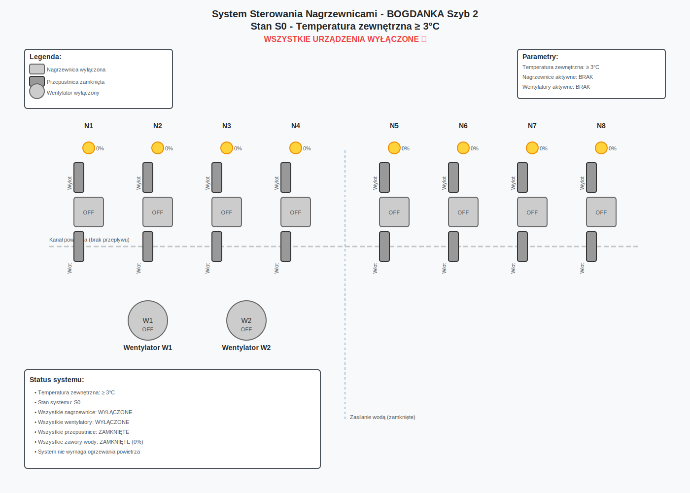
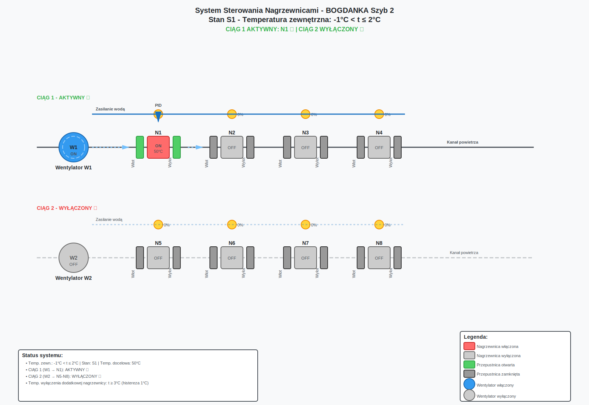
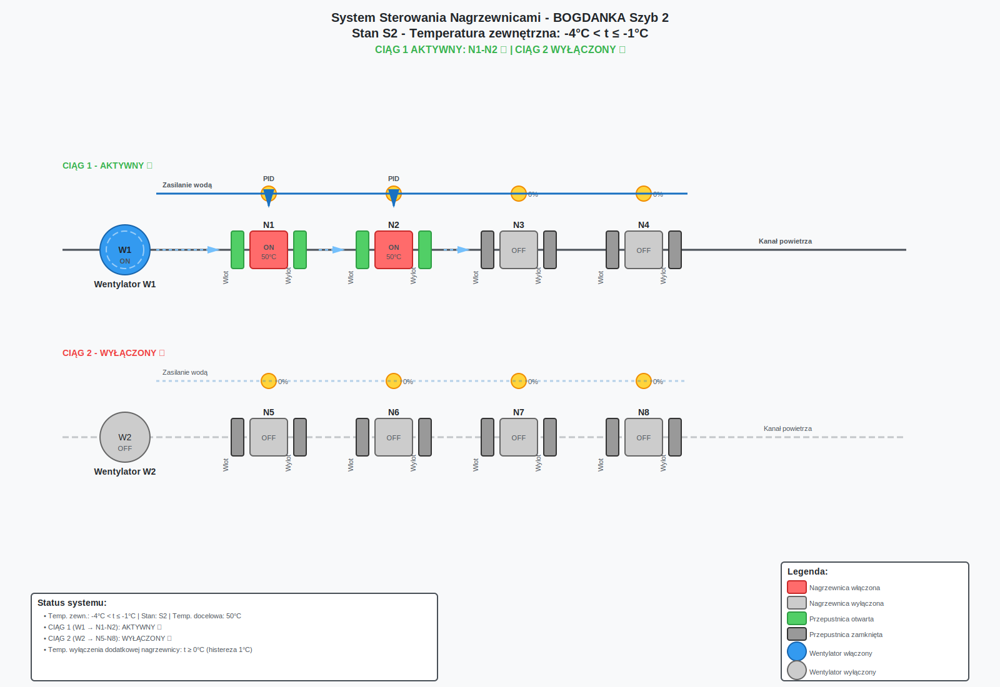
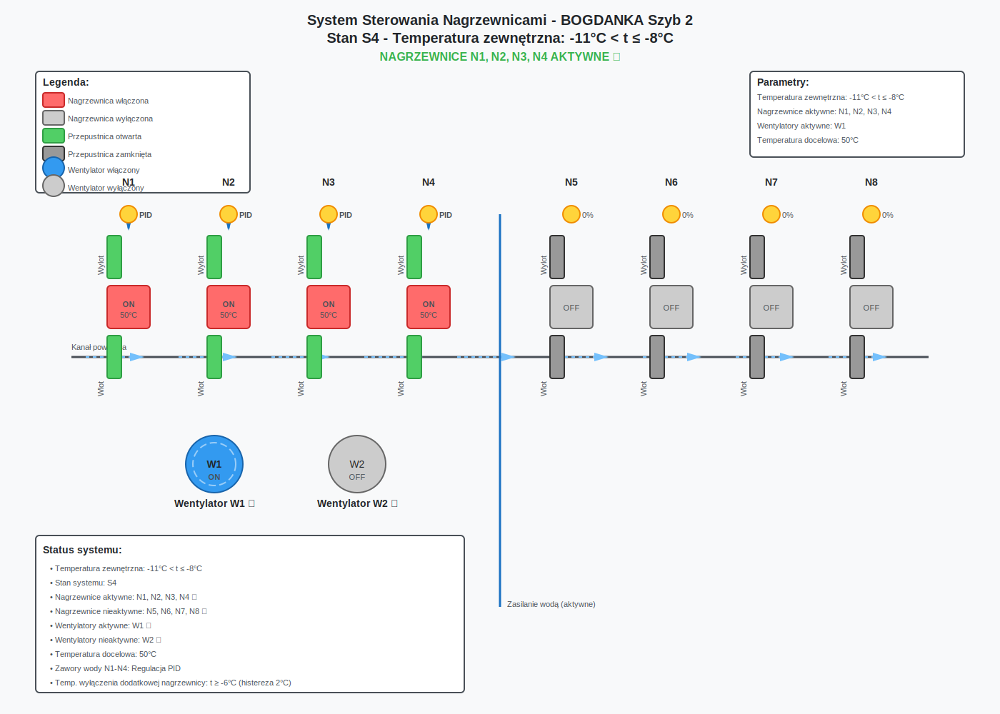
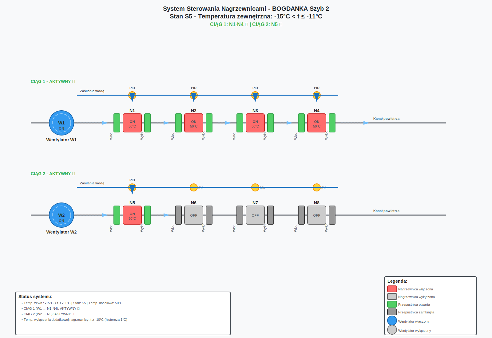
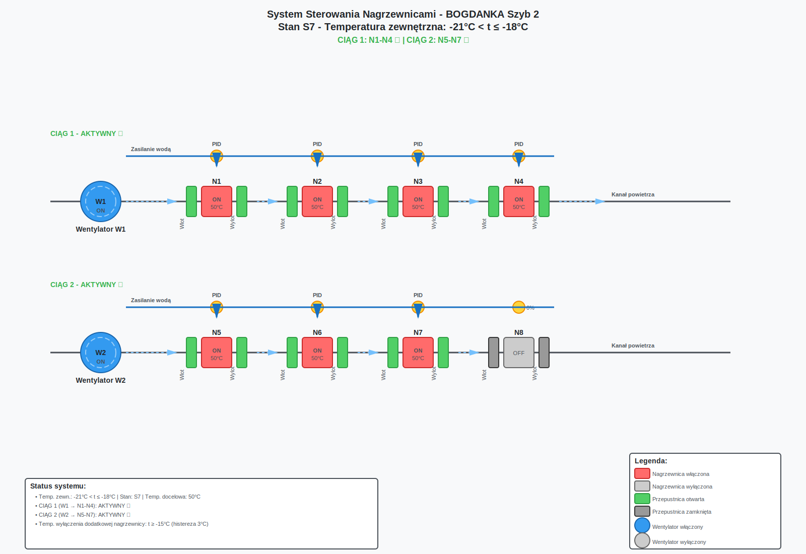

# System Sterowania Nagrzewnicami BOGDANKA Szyb 2

## 1. Dokumentacja od zleceniodawcy

### 1.1 Projekt instalacji ogrzewania szybu

Dokument otrzymany 19 listopad 2025:

[Projekt instalacji ogrzewania szybu - skan dokumentacji](Projekt%20instalacji%20ogrzewania%20szybu.pdf)

### 1.2 Diagram

Dokument otrzymany 17 listopada 2025:


# Opracowanie specyfikacji

**UWAGA** 
```Dokumentacja robocza - aktualizowana na podstawie otrzymywanych wymagan od zleceniodawcy```

Ostatnia aktualizacja: 18 Listopad 2025

## 2. Stany nagrzewnicy

```
- STARTING (uruchamianie - otwieranie przepustnic i zaworu do 100%)
- ON 🟢 (praca - regulacja zaworu wody)
- STOPPING (zatrzymywanie - zamykanie zaworu do 20%)
- OFF 🔴 (wyłączona - zamykanie przepustnic)
```

## 3. Tabela Stanów

Tabela definiująca stan systemu sterowania uzalezniony od temperatury zewnetrznej (tz)

| ID | Zakres Temperatury Zewnętrznej | Nagrzewnice Aktywne | Wentylatory Aktywne | Temp. Docelowa | Temp. Wyłączenia Dodatkowej Nagrzewnicy | Histereza |
|----|-------------------------------|---------------------|---------------------|----------------|----------------------------------------|-----------|
| S0 | t ≥ 3°C | brak  | brak | brak | brak | brak |
| S1 | -1°C < t ≤ 2°C | N1 | W1 | 50°C | t ≥ 3°C | 1°C |
| S2 | -4°C < t ≤ -1°C | N1, N2 | W1 | 50°C | t ≥ 0°C | 1°C |
| S3 | -8°C < t ≤ -4°C | N1, N2, N3 | W1 | 50°C | t ≥ -3°C | 1°C |
| S4 | -11°C < t ≤ -8°C | N1, N2, N3, N4 | W1 | 50°C | t ≥ -6°C | 2°C |
| S5 | -15°C < t ≤ -11°C | N1, N2, N3, N4, N5 | W1, W2 | 50°C | t ≥ -10°C | 1°C |
| S6 | -18°C < t ≤ -15°C | N1, N2, N3, N4, N5, N6, | W1, W2 | 50°C | t ≥ -13°C | 2°C |
| S7 | -21°C < t ≤ -18°C | N1, N2, N3, N4, N5, N6, N7 | W1, W2 | 50°C | t ≥ -15°C | 3°C |
| S8 | t ≤ -21°C | N1, N2, N3, N4, N5, N6, N7, N8 | W1, W2 | 50°C | t ≥ -20°C | 1°C |

## 4. Tabela Decyzyjna
Tabela definiujaca akcje na sterowanym elemencie w zaleznosci od warunku (zadanego stanu systemu sterowania). 

Elementy sterowane (Otwarte/Włączone 🟢 lub Zamkniete/Wyłączone 🔴) to:
- Nagrzewnice, 
- Wentylatory, 
- Przepustnice wlot i wylot. 

Zawór regulacyjny wody sterowany jest sterownikiem PID w celu uzyskania zadanej temperatury na wyjsciu z Nagrzewnicy.

| Sterowany element \ Warunek | S0 | S1 | S2 | S3 | S4 | S5 | S6 | S7 | S8 |
|----------------|----|----|----|----|----|----|----|----|----|
| **NAGRZEWNICE** |
| N1 | 🔴 | 🟢 | 🟢 | 🟢 | 🟢 | 🟢 | 🟢 | 🟢 | 🟢 |
| N2 | 🔴 | 🔴 | 🟢 | 🟢 | 🟢 | 🟢 | 🟢 | 🟢 | 🟢 |
| N3 | 🔴 | 🔴 | 🔴 | 🟢 | 🟢 | 🟢 | 🟢 | 🟢 | 🟢 |
| N4 | 🔴 | 🔴 | 🔴 | 🔴 | 🟢 | 🟢 | 🟢 | 🟢 | 🟢 |
| N5 | 🔴 | 🔴 | 🔴 | 🔴 | 🔴 | 🟢 | 🟢 | 🟢 | 🟢 |
| N6 | 🔴 | 🔴 | 🔴 | 🔴 | 🔴 | 🔴 | 🟢 | 🟢 | 🟢 |
| N7 | 🔴 | 🔴 | 🔴 | 🔴 | 🔴 | 🔴 | 🔴 | 🟢 | 🟢 |
| N8 | 🔴 | 🔴 | 🔴 | 🔴 | 🔴 | 🔴 | 🔴 | 🔴 | 🟢 |
| **WENTYLATORY** |
| W1 | 🔴 | 🟢 | 🟢 | 🟢 | 🟢 | 🟢 | 🟢 | 🟢 | 🟢 |
| W2 | 🔴 | 🔴 | 🔴 | 🔴 | 🔴 | 🟢 | 🟢 | 🟢 | 🟢 |
| **PRZEPUSTNICE** |
| N1 przepustnice wylot i wlot | 🔴 | 🟢 | 🟢 | 🟢 | 🟢 | 🟢 | 🟢 | 🟢 | 🟢 |
| N2 przepustnice wylot i wlot | 🔴 | 🔴 | 🟢 | 🟢 | 🟢 | 🟢 | 🟢 | 🟢 | 🟢 |
| N3 przepustnice wylot i wlot | 🔴 | 🔴 | 🔴 | 🟢 | 🟢 | 🟢 | 🟢 | 🟢 | 🟢 |
| N4 przepustnice wylot i wlot | 🔴 | 🔴 | 🔴 | 🔴 | 🟢 | 🟢 | 🟢 | 🟢 | 🟢 |
| N5 przepustnice wylot i wlot | 🔴 | 🔴 | 🔴 | 🔴 | 🔴 | 🟢 | 🟢 | 🟢 | 🟢 |
| N6 przepustnice wylot i wlot | 🔴 | 🔴 | 🔴 | 🔴 | 🔴 | 🔴 | 🟢 | 🟢 | 🟢 |
| N7 przepustnice wylot i wlot | 🔴 | 🔴 | 🔴 | 🔴 | 🔴 | 🔴 | 🔴 | 🟢 | 🟢 |
| N8 przepustnice wylot i wlot | 🔴 | 🔴 | 🔴 | 🔴 | 🔴 | 🔴 | 🔴 | 🔴 | 🟢 |
| **PARAMETRY REGULACJI** |
| Temperatura docelowa (°C) | | 50 | 50 | 50 | 50 | 50 | 50 | 50 | 50 |
| Temp. włączenia dodatkowej nagrzewnicy (°C) | | 2 | -1 | -4 | -8 | -11 | -15 | -18 | -21 |
| Zawór regulacyjny przy włączeniu (%) | | 100 | 100 | 100 | 100 | 100 | 100 | 100 | 100 |
| Temp. wyłączenia dodatkowej nagrzewnicy (°C) | | 3 | 0 | -3 | -6 | -10 | -13 | -15 | -20 |
| Zawór regulacyjny przy wyłączeniu (%) | | 20 | 20 | 20 | 20 | 20 | 20 | 20 | 20 |
| Zawór regulacyjny przy pracy nagrzewnicy (%) | | PID | PID | PID | PID | PID | PID | PID | PID |

## 5. Sekwencja Operacji

### 5.1 Włączanie Nagrzewnicy
1. Otwórz przepustnicę na wlocie (100%)
2. Otwórz przepustnicę na wylocie (100%)
3. Włącz wentylator(y)
4. Otwórz zawór regulacyjny wody (regulacja PID dla utrzymania 50°C)

### 5.2 Praca Nagrzewnicy
1. Regulacja PID zaworem wody dla utrzymania 50°C

### 5.3 Wyłączanie Nagrzewnicy
1. Ustaw zawór regulacyjny wody na poziomie 20%
2. Monitoruj temperaturę na wlocie i wylocie
3. Zamknij przepustnicę na wlocie (0%)
4. Zamknij przepustnicę na wylocie (0%)
5. Wyłącz nagrzewnicę
6. Pozostaw wentylator włączony jeśli potrzebny dla innych nagrzewnic lub wyłacz (wg. tabeli decyzyjnej)


## 6. Parametry Systemowe

| Parameter | Wartość | Jednostka | Opis |
|-----------|---------|-----------|------|
| Temperatura docelowa | 50 | °C | Temperatura wyjściowa z nagrzewnicy |
| Pozycja zaworu przy stop | 20 | % | Otwarcie zaworu przed kolejnym startem |
| Czas stabilizacji | 5 | s | Czas na stabilizację przed odczytem |
| Okres próbkowania | 1 | s | Częstotliwość odczytu temperatury |
| Max pozycja zaworu | 100 | % | Maksymalne otwarcie zaworu |
| Min pozycja zaworu | 0 | % | Minimalne otwarcie zaworu |
| PID - Kp | 2.0 | - | Człon proporcjonalny (zawor wody) |
| PID - Ki | 1 | - | Człon całkujący (zawor wody) |
| PID - Kd | 0.1 | - | Człon różniczkujący (zawor wody) |

## 7. Obsługa Awarii

| Warunek Awarii | Akcja |
|----------------|-------|
| Brak odczytu temperatury zewnętrznej | Zachowaj ostatni stan, alarm |
| Brak odczytu temperatury wylotowej | Ustaw zawór na 50%, alarm |
| Temperatura wylotowa > 60°C | Zamknij zawór do 20%, alarm |
| Temperatura wylotowa < 40°C przy pracy | Zwiększ otwarcie zaworu do 100%, alarm  |
| Wentylator nie pracuje | Wyłącz odpowiednie nagrzewnice, alarm |
| Przepustnica nie reaguje | Kontynuuj pracę, alarm |

## 8. Przykladowa wizualizacja systemu sterowania w SCADA

**Ponizsze schematy trzeba dostosowac do otrzymanej dokumentacji (zmodyfikowac)** 
[Projekt instalacji ogrzewania szybu - skan dokumentacji](Projekt%20instalacji%20ogrzewania%20szybu.pdf)

















## 9. Pytania wyjasniające

[Szczegółowe pytania wyjaśniające dotyczące wymagań systemu](Pytania_wyjasnien_wymagan.md)

Wybrane pytania potrzebne do zaimplementowania algorytmu i symulacji:

### 9.1 Układ nagrzewnic
- **Pytanie**: Czy nagrzewnice N1-N8 są podłączone równolegle do głównego kanału powietrza czy szeregowo (powietrze przechodzi przez kolejne nagrzewnice)?
- **Znaczenie**: Ma wpływ na sposób regulacji temperatury oraz wizualizacje SCADA.

### 9.2 Przypisanie wentylatorów
- **Pytanie**: Które nagrzewnice są obsługiwane przez wentylator W1, a które przez W2?
  - Czy W1 obsługuje N1-N4, a W2 obsługuje N5-N8?
  - Czy oba wentylatory wspólnie obsługują wszystkie nagrzewnice?
- **Znaczenie**: Krytyczne dla określenia zależności sterowania i sekwencji uruchamiania.

### 9.3 Lokalizacja czujników temperatury
- **Pytanie**: Gdzie dokładnie są zamontowane czujniki temperatury?
  - Temperatura zewnętrzna (t_zewn) - lokalizacja poboru powietrza?
  - Temperatura wylotowa - czy osobny czujnik dla każdej nagrzewnicy, czy wspólny na wylocie z grupy nagrzewnic?
  - Czy są czujniki temperatury na wlocie do każdej nagrzewnicy?
- **Znaczenie**: Wpływa na logikę sterowania i algorytmy regulacji.

### 9.4 Zawory regulacyjne wody
- **Pytanie**: Jaki typ zaworów jest zastosowany?
  - Czas przejazdu zaworu z pozycji 0% do 100% [s]?
  - Charakterystyka zaworu (liniowa, równoprocentowa)?
- **Znaczenie**: Dobór odpowiedniego algorytmu PID i nastaw regulatora.

### 9.5 Wyłączanie nagrzewnicy
- **Pytanie**: W dokumencie jest informacja "Ustaw zawór regulacyjny wody na poziomie 20%" przy wyłączaniu. Czy to oznacza:
  - Czy zawór ma być stopniowo zamykany z 100% do 20% przed wyłączeniem nagrzewnicy?
  - Jak długo zawór ma pozostać na 20% przed pełnym zamknięciem?

### 9.6 Indywidualna czy wspólna regulacja
- **Pytanie**: Czy każda nagrzewnica ma osobny regulator PID z własnymi nastawami, czy wszystkie aktywne nagrzewnice są sterowane jednym regulatorem?
- **Znaczenie**: Liczba wymaganych bloków PID w programie sterującym.

### 9.7 Mechanizm histerezy
- **Pytanie**: Jak działa histereza w tabeli stanów?
  - Przykład S4: "Temp. włączenia: -8°C, Temp. wyłączenia: -6°C, Histereza: 2°C"
  - Czy to oznacza, że przy spadku z -7°C do -8,1°C włączamy N4, a wyłączamy dopiero przy wzroście do -5,9°C?
  - Czy histereza działa tylko przy wyłączaniu, czy również przy włączaniu?
- **Znaczenie**: Uniknięcie częstego przełączania (chattering) nagrzewnic.

### 9.8 Zakres wizualizacji
- **Pytanie**: Jakie są wymagania dla systemu SCADA?
  - Czy SCADA ma być na PC (Windows, Linux) czy panelu HMI?
  - Czy wymagany jest zdalny dostęp (VPN, web-interface)?
- **Znaczenie**: Dobór platformy SCADA i architektury oprogramowania.

### 9.9 Funkcjonalność
- **Pytanie**: Jakie funkcje ma posiadać SCADA?
  - Prezentacja synoptyczna (podobna do dostarczonego diagramu)?
  - Trendy historyczne (czas archiwizacji)?
  - Możliwość zmiany nastaw (zadana temperatura, nastawy PID)?
  - Ręczne sterowanie elementami (bypass automatyki)?
  - Raporty i logi zdarzeń?
- **Znaczenie**: Zakres projektu wizualizacji.

### 9.10 Komunikacja
- **Pytanie**: Jaki protokół komunikacyjny między PLC a SCADA?
  - Modbus TCP/RTU?
  - OPC UA?
  - Proprietary (np. S7, EtherNet/IP)?
- **Znaczenie**: Wazne dla przygotowania algorypmu pod wpiecie w rzeczywisty system