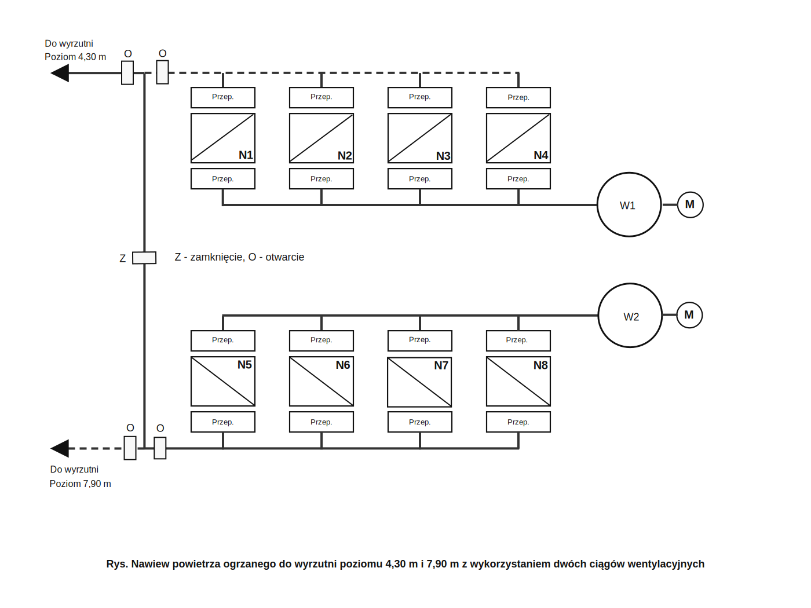

# Projekt instalacji ogrzewania szybu

_Dokument wyodrębniony z pliku PDF przy użyciu OCR i recznych poprawek_

_Liczba stron: 9_

---
## Opis algorytmu systemu automatycznej regulacji (SAR) temperatury szybu 2.2 w Stefanowie.

Zadaniem systemu regulacji automatycznej temperatury szybu jest utrzymanie temperatury szybu na zadanym poziomie oraz ochrona nagrzewnic przed zamrożeniem.

Warunkiem niezbędnym poprawnej pracy **SAR** temperatury szybu jest sprawność układów pomiarowych, sprawność sterowanych urządzeń oraz odpowiedni poziom dostarczanej mocy cieplnej czynnika grzewczego (temperatury i wartości przepływu strumienia wody grzewczej) dostarczanego do nagrzewnic ciągów wentylacyjnych.
*Każde zakłócenie spowodowane niedotrzymaniem podanych wyżej warunków może skutkować utratą stabilności SAR i przełączeniem systemu na sterowanie ręczne.*

Wszystkie wejściowe sygnały pomiarowe systemu będą testowane pod względem ciągłości torów pomiarowych jak również programowo filtrowane i uśredniane na poziomie sterownika PLC. Kontrolowany będzie również czy dany pomiar mieści się w dopuszczalnym zakresie. W ten sposób uzyska się wzrost bezpieczeństwa działania
systemu.

Niniejszy opis zakłada spełnienie powyższych warunków i nie uwzględnia stanów
awaryjnych.

**SAR** temperatury szybu składa się z dwóch podsystemów:

* podsystemu automatycznej regulacji temperatur powietrza grzewczego (**PARTPG**),
* podsystemu automatycznej regulacji temperatury szybu (**PARTS**).

Zadaniem **PARTPG** jest stabilizacja temperatury powietrza grzewczego używanego przez **PARTS**. **PARTPG** składa się z układów automatycznej regulacji (UAR) temperatury powietrza za każdą nagrzewnicą ciągu 1-go i 2-go. Ilość **UAR** odpowiada ilości zainstalowanych w systemie nagrzewnic (8). Jednocześnie podsystem ten realizuje załączania (wyłączania) kolejnych nagrzewnic do (z) ruchu jak również realizuje funkcje zabezpieczenia nagrzewnicy przed przemarzaniem.
W ramach **PARTS** możliwa jest cykliczna zmiana pracy nagrzewnic pracujących
w jednym ciągu wentylacyjnym.

Zadaniem **PARTS** jest utrzymanie temperatury szybu na zadanym poziomie przy stabilnych parametrach (temperatura przy określonym przepływie) powietrza grzewczego utrzymywanych przez **PARTPG**. Brak stabilnych parametrów powietrza grzewczego może skutkować pogorszeniem jakości regulacji **SAR** temperatury szybu, a
w sytuacji krytycznej wyłączeniem **SAR** szybu.

## 1. Działanie podsystemu automatycznej regulacji temperatur powietrza grzewczego (PARTG)

### 1.1 Działanie UAR temperatury powietrza na wylocie z nagrzewnicy.

Na rys. 1 przedstawiono schemat ideowy układu regulacji. Wartością zadaną Tz jest żądana temperatura powietrza na wylocie z nagrzewnicy, a wartością regulowaną jest położenie zaworu regulacyjnego na wylocie wody powrotnej z nagrzewnicy.
Wartość zadana Tz jest ustalona przez technologa i wynosi ona 50 °C. Zakłóceniem układu regulacji jest temperatura strumienia zimnego powietrza na wlocie do nagrzewnicy jak również zmiana parametrów strumienia wody grzewczej do nagrzewnicy. W strukturze UAR zastosowano blok funkcyjny regulatora PID sterownika PLC. Umożliwia on m.in. pracę w trybie automatycznym i sterowanie ręczne zdalne położeniem zaworu regulacyjnego. Przy sterowaniu ręcznym, zdalnym wykorzystywana jest wartość zadana dla regulacji ręcznej Pzm położenia zaworu regulacyjnego. Blok funkcjonalny PID zapewnia bezuderzeniowe (bumpless) przejście między trybami
sterowania ręcznego i automatycznego. Ustawienie wartości maksymalnego i minimalnego poziomu otwarcia zaworu regulacyjnego wyznacza zakres pracy tego zaworu. (tu Pzmin=20+Pzmax=100%). Minimalny (20%) stopień otwarcia zaworu zabezpiecza nagrzewnicę przed zamrożeniem w przypadku wyłączenia jej z ruchu. Spadek temperatury powietrza z nagrzewnicy powoduje wzrost stopnia otwarcia zaworu regulacyjnego, zaś jej wzrost powoduje przymknięcie zaworu. Nastawy Kp, Ti, Td regulatora dobrane będą doświadczalnie podczas procesu uruchomienia UAR na obiekcie.

- Kp — współczynnik wzmocnienia członu proporcjonalnego,
- Ti — stała członu całkującego (czas zdwojenia),
- Td — stała członu różniczkującego (czas wyprzedzenia).

### 1.2 Załączenie nagrzewnicy do ruchu. Wymagana ilość uruchomionych nagrzewnic.

Warunki startowe:
* Zawór regulacyjny sprawny, gotowość operacyjna przepustnicy dolotowej. Zawór i przepustnica pracuje w trybie sterowania zdalnego.
* Parametry wody grzewczej powyzej dolnej dopuszczalnej granicy,
* Przepustnica na wylocie powietrza z nagrzewnicy otwarta,
* Sygnał ządanie zalączenia nagrzewnicy związany z osiągnieciem określonej granicy ujemnej temperatury zawnętrznej,
* Sygnał programowego załączenia nagrzewnicy przy rotacji nagrzewnic pracujących w jednym ciągu wentylacyjnym.

W pracy automatycznej nasępuje cykliczne sprawdzenie temperatury zewnętrznej. Przy obniezeniu jej ponizej określonej (przez technologa), następuje aktywacja sygnału załączenia nagrzewnicy. Warunki termiczne generowania tego sygnału przedstawiono w tabeli 1.

#### Tab. 1. Warunki termiczne załączania nagrzewnic

| Nr nagrz. | Zakres załączania Tz1 [°C] | Zakres załączania Tz2 [°C] | Wyłączenie Tzw [°C] |
|-----------|---------------------------|---------------------------|---------------------|
| N1        |                           | 2                         | 3                   |
| N2        | -1                        | -2                        | 0                   |
| N3        | -4                        | -5                        | -3                  |
| N4        | -8                        | -9                        | -6                  |
| N5        | -11                       | -12                       | -10                 |
| N6        | -15                       | -16                       | -13                 |
| N7        | -18                       | -19                       | -15                 |
| N8        | -21                       |                           | -20                 |

Istnieje możliwość elastycznego (w określonym zakresie) wyznaczania wymaganej ilości załączanych nagrzewnic w funkcji temperatury zewnętrznej. W tym wypadku konkretne nagrzewnice nie są przypisane do określonego zakresu temperatury
zewnętrznej. Unika się w ten sposób zakłóceń w pracy układu regulacyjnego przy wyłączeniu danej nagrzewnicy z eksploatacji (np. wskutek awarii nagrzewnicy). Dodatkowo w ten sposób można realizować algorytm rotacyjnej pracy nagrzewnic. Warunki termiczne dla elastycznej pracy nagrzewnic przedstawiono w tabeli 2.

# Tab. 2. Warunki termiczne dla elastycznej pracy nagrzewnic

| Ilość nagrzewnic | Zakres załączania Tz1 [°C] | Zakres załączania Tz2 [°C] | Wyłączenie Tzw [°C] |
|------------------|---------------------------|---------------------------|---------------------|
| 0                |                           | >2                        | >3                  |
| 1                |                           | 2                         | 3                   |
| 2                | -1                        | -2                        | 0                   |
| 3                | -4                        | -5                        | -3                  |
| 4                | -8                        | -9                        | -6                  |
| 5                | -11                       | -12                       | -10                 |
| 6                | -15                       | -16                       | -13                 |
| 7                | -18                       | -19                       | -15                 |
| 8                | -21                       |                           | -20                 |

Stosując zasadę elastyczności pracy nagrzewnic, kadorazowo następuje 
sprawczanie czy aktualna ilość pracujących nagrzewnic odpowiada wymaganej ilości 
określonej w tab. 2. Stosując zasadę priorytetu nawiewu ciepłego powietrza na poziom
+4,30, w pierwszej kolejności zostaną uruchomione nagrzewnice zasilające ten właśnie
ciąg. Jeżeli z przyczyn technicznych ilość nagrzewnic ciągu pierwszego (brak gotowości
operacyjnej na skutek uszkodzenia) jest mniejsza od wymaganej ilości pracujących
nagrzewnic, zostanie uruchomiony nawiew na poziom +7,80. W ten sposób zapewnia
się dostarczenie wymaganej mocy ciepinej SAR temperatury szybu.

Istnieje różnica pomiędzy temperaturą załączania a temperaturą wyłączania
nagrzewnicy. Z pracy Przyjęto, że temperatur wyłączania jest wyższa od temperatury
załączania o 1+2 °C. Jest to wartość histerezy układu sterowania nagrzewnicą.
technologicznego.
Przy spełnionych warunkach startowych następuje otwarcie przepustnicy na dolocie
zimnego powietrza do nagrzewnicy i rozpoczyna się proces regulacji.

### 1.3 Wyłączenie nagrzewnicy z ruchu.

Warunki startowe:

* Zawór regulacyjny sprawny, gotowość operacyjna przepustnicy dolotowej. Zawór
i przepustnica pracuje w trybie sterowania zdalnego,

Wyłączenie nagrzewnicy z pracy następuje:
* po osiągnięciu parametrów wody grzewczej poniżej dolnej dopuszczalnej
granicy,
* po zamknięciu przepustnicy na wylocie powietrza z nagrzewnicy,
* po wystąpieniu sygnału ządania wyłączenia nagrzewnicy związany
z osiągnieciem określonej temperatury zewnętrznej dla danej nagrzewnicy.
(Temperatura Tzw p. tab 1),
* po wystąpieniu sygnału programowego wyłączenia nagrzewnicy przy rotacji
nagrzewnic pracujących w jednym ciągu wentylacyjnym.

Wyłączenie z ruchu nagrzewnicy powoduje ustawienie zaworu regulacyjnego
w pozycji minimalnego otwarcia oraz zamknięcie przepustnicy dolotowej powietrza 
zimnego przepustnicy.

**Kazde awaryjne wyłączenie nagrzewnicy powoduje załączenie sygnalizacji
alarmowej systemu, co wymaga dokonania operacji skwitowania przez obsługę.**

### 1.4 Cykliczna rotacja nagrzewnic pracujących w jednym ciągu
wentylacyjnym.

Cykliczna rotacja nagrzewnic pracujących w jednym ciągu wentylacyjnym polega
na okresowej zmianie pracującej nagrzewnicy danego ciągu wentylacyjnego.

Jest ona możliwa wówczas, gdy ilość nagrzewnic ciągu wentylacyjnego (max 4)
przewyższa ilość aktualnie pracujących nagrzewnic danego ciągu. (co najmniej 1)

W takim przypadku możliwe jest wyłączenie z ruchu nagrzewnicy najdłużej
pracującej, a załączenie w jej miejsce nagrzewnicy o najdłuższym czasie postoju.
Wyrównuje się w ten sposób czasy eksploatacji nagrzewnic. Okres rotacji zostanie
ustalony przez technologa w czasie testowania pracy układu na obiekcie.

## 2. Działanie podsystemu automatycznej regulacji temperatury szybu (PARTS)

### 2.1. Układy pracy ciągów grzewczych.
Istnieją dwa stabilne układy pracy ciągów grzewczych:

* **Podstawowy**, w którym wyrzutnie poziomu +4,30m zasilane są z ciągu
pierwszego (wentylator W1), a wyrzutnie poziomu +7,90m zasilane są z ciągu
drugiego (wentylator W2). W tym przypadku przepustnica na spince ciągów
wentylacyjnych jest zamknięta, a przepustnice w ciągach są otwarte. Stan ten
przedstawiono na rysunku 3.

* **Ograniczony**, w którym wyrzutnie poziomu +4,30m zasilane są z ciągu drugiego
(wentylator W2), a wyrzutnie poziomu +7,90m nie są zasilane. W tym wypadku
na kolektorze ciepłego powietrza ciągu pierwszego oraz 
przepustnica na zasilaniu wyrzutni poziomu +7,90m zostaje zamknięta.
Pozostałe przepustnice układu sterowania nawiewem pozostają otwarte. Stan ten
przedstawiono na rysunku 4.

Nalezy zauważyć, że praca w układzie ograniczonym jest możliwa jedynie w sytuacji
w której wymagana zewnętrznymi warunkami termicznymi ilość pracujących nagrzewnic
jest nizsza od ilości nagrzewnic ciągu drugiego znajdujących się w gotowości
operacyjnej. Dla maksymalnej ilości nagrzewnic ciągu drugiego posiadających zdolność
operacyjną (4) zakres temperatury zewnetrznej wynosi do -11 °C, a dla 2 nagrzewnic do
-4°C. Spadek temperatury zewnętrznej poniżej dopuszczalnej powoduje przejście z
układu ograniczonego do układu podstawowego.

Układy pracy różne od opisanych powyżej są w trybie regulacji automatycznej,
układami przejściowymi wynikającymi z przechodzenia z jednego trybu stabilnego do
drugiego. Przy sterowaniu ręcznym możliwe jest kształtowanie układu zasilania
w sposób zgodny z uznaniem operatora.

### 2.2. Cykliczna zmiana układów pracy ciągów grzewczych.

**PARTS** umożliwia cykliczną zmianę układów pracy ciągów grzewczych. Polega
ona na okresowym (ustalonym przez technologa) zmianie układu pracy ciągów.
Możliwość ta może być wykorzystana jedynie przy zachowaniu warunków
przedstawionych w p. 2.1. Stosując cykliczną zmianę układów pracy ciągów uzyskuje
się wyrównanie czasów eksploatacji ciągów grzewczych. Należy zauważyć, że praca
jedynie w układzie podstawowym powoduje nadmierną eksploatację ciągu pierwszego
ponieważ ciąg drugi zostaje włączony dopiero przy zapotrzebowaniu na moc cieplną
przekraczającą wartość dostarczanej mocy ciągu pierwszego.

### 2.3 Działanie UAR temperatury powietrza w szybie.
Na rys. 2 przedstawiono schemat ideowy układu regulacji. Wartością zadaną Ts jest zadana temperatura powietrza w szybie mierzona na poziomie -30m, a wartością regulowaną jest prędkość obrotowa wentylatorów W1 i W2.

Wartość zadana Ts jest ustalona przez technologa i wynosi ona 2 °C. Zakłóceniem układu regulacji jest temperatura strumienia zimnego powietrza wdechowego oraz zmiana parametrów strumienia powietrza grzewczego ciągów. W strukturze UAR zastosowano dwa bloki funkcyjne regulatorów PID sterownika PLC. Umożliwia on m. inn. pracę w trybie automatycznym i sterowanie ręczne zdalne obrotami wentylatorów. Przy sterowaniu ręcznym, zdalnym wykorzystywana jest wartość zadana prędkości obrotowej dla regulacji ręcznej wentylatorów. Blok funkcjonalny PID zapewnia bezuderzeniowe (bumpless) przejście między trybami sterowania ręcznego i automatycznego. Ustawienie wartości minimalnej prędkości obrotowej wentylatorów jest na poziomie NWmin = 25 Hz, natomiast wartość maksymalna zależy od ilości nagrzewnic posiadających gotowość operacyjną i pracujących w jednym ciągu grzewczym. Dla maksymalnej ilości wentylatorów (4) wynosi ona NWmax = 50 Hz. Górne ograniczenie prędkości obrotowej wentylatora zabezpiecza nagrzewnice przed nadmiernym wychłodzeniem. Górne wartości NWmax zostaną określone przez technologa w czasie rozruchu technologicznego układu regulacji.

Spadek temperatury powietrza w szybie na poziomie -30m powoduje wzrost prędkości obrotowej wentylatora w aktualnie sterowanym ciągu.

Nastawy Kp, Ti, Td regulatora dobrane będą doświadczalnie podczas procesu uruchomienia UAR na obiekcie.

Kp – współczynnik wzmocnienia członu proporcjonalnego,
Ti – stała członu całkującego (czas zdwojenia),
Td – stała członu różniczkującego (czas wyprzedzenia).

W układzie podstawowym pracy ciągów grzewczych, przy pracy wentylatorów dwóch ciągów, wentylator W1 pierwszego ciągu grzewczego pracuje ze swoją maksymalną prędkością. W tym przypadku wentylatorem regulacyjnym (na którym dokonuje się zmiana prędkości obrotowej) jest wentylator W2.

Rys. 1. Schemat ideowy UAR temperatury powietrza na wylocie z nagrzewnicy.

Rys. 2. Schemat ideowy UAR temperatury w szybie.

Rys. 3. Nawiew powietrza ogrzanego z wykorzystaniem dwóch ciągów wentylacyjnych.

Rys. 4. Nawiew powietrza ogrzanego do wyrzutni poziomu 4,30 m z wykorzystaniem drugiego ciągu wentylacyjnego.

