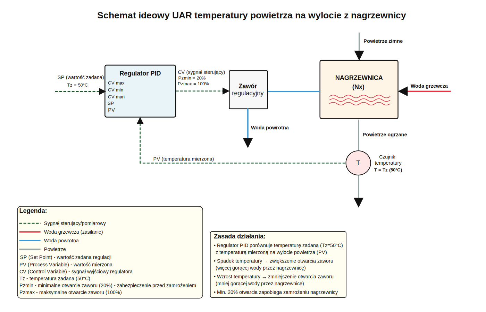
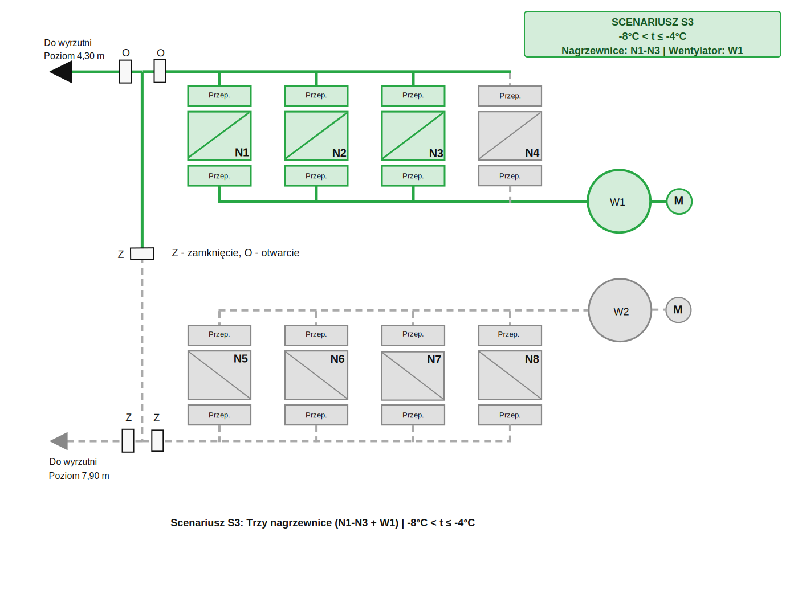
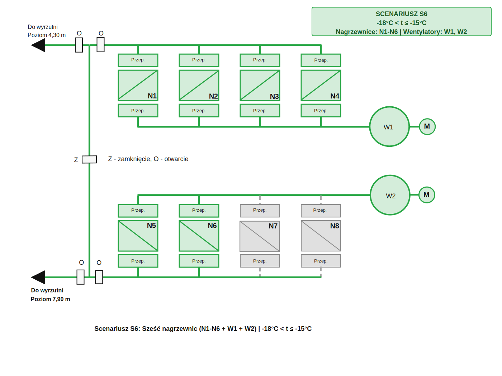
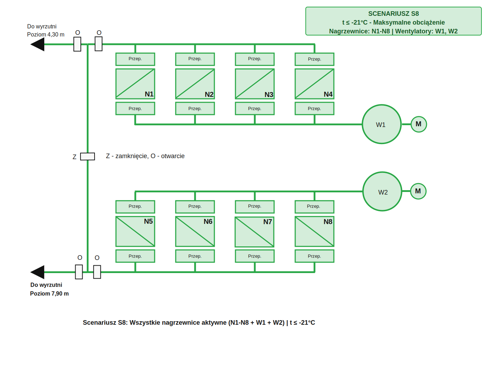
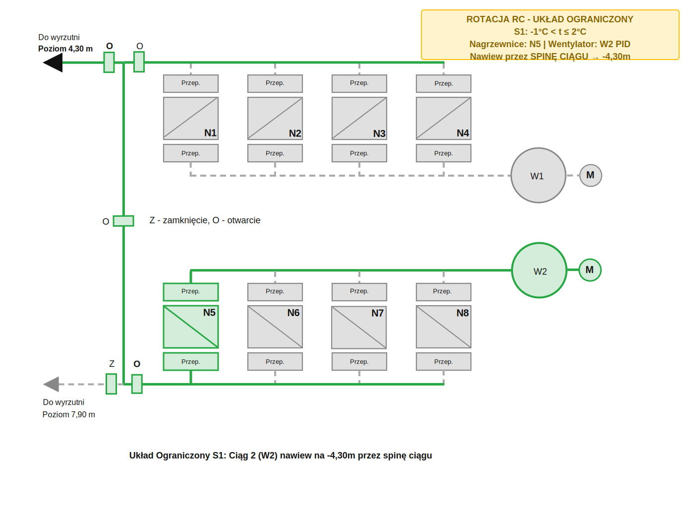
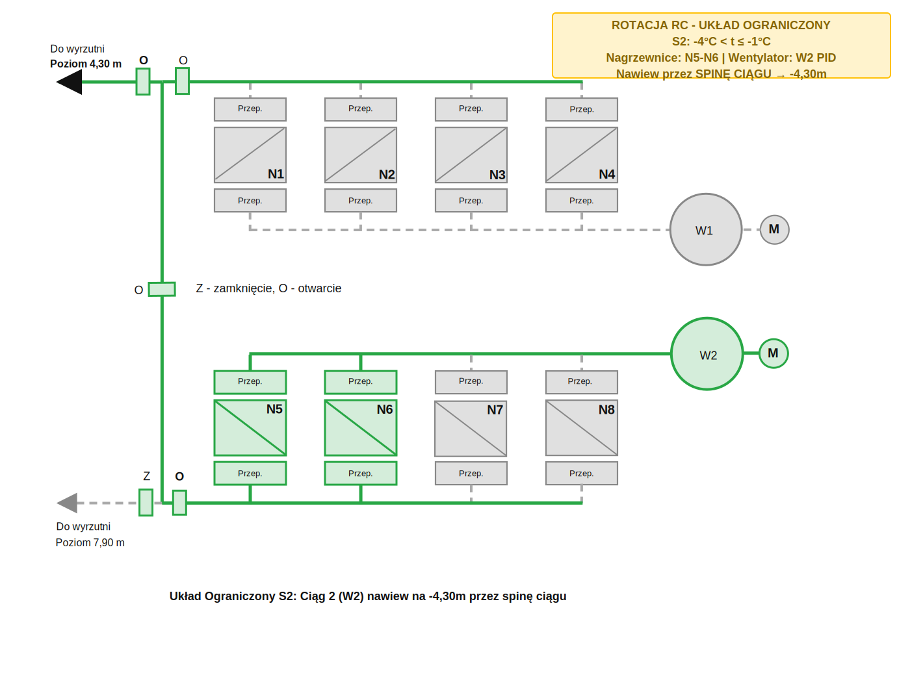
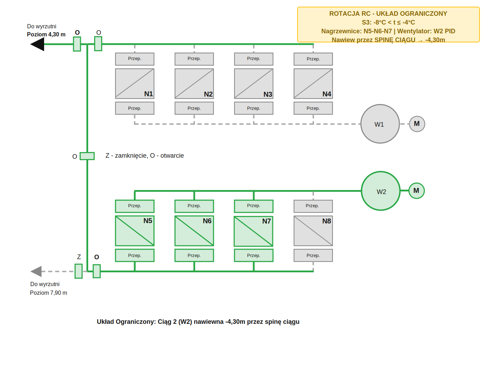
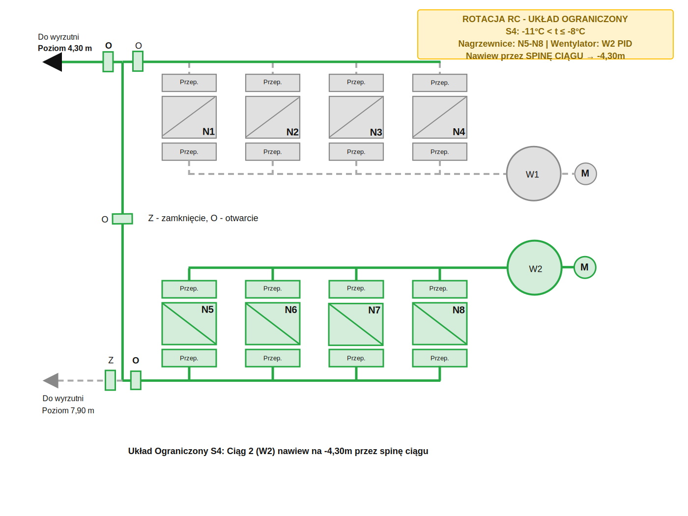
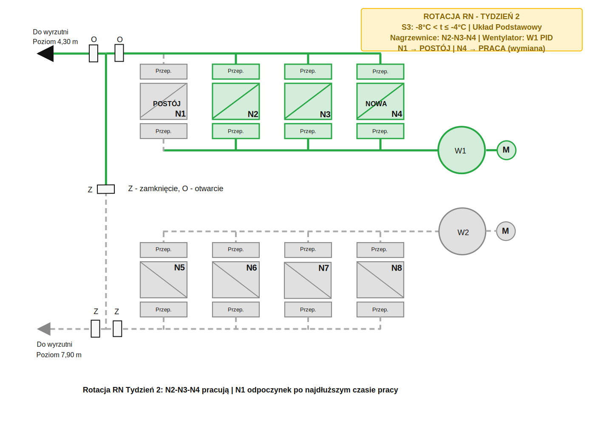

# Projekt Instalacji Ogrzewania Szybu BOGDANKA Szyb 2

**Szczegółowy opis układu fizycznego instalacji, schematy scenariuszy i przykłady rotacji**

_Plik ten jest częścią dokumentacji systemu sterowania nagrzewnicami BOGDANKA Szyb 2._

[← Powrót do dokumentacji głównej](../start.md)

---

## 1. Układ Instalacji

System składa się z:

### 1.1 Ciąg 1 (C1)
- 4 nagrzewnice: N1, N2, N3, N4
- Wentylator: W1 (sterowanie 25-50 Hz)
- Wyrzutnia: -4,30m

### 1.2 Ciąg 2 (C2)
- 4 nagrzewnice: N5, N6, N7, N8
- Wentylator: W2 (sterowanie 25-50 Hz)
- Wyrzutnia: -7,90m

### 1.3 Elementy Wspólne
- Spinka ciągów (dla układu ograniczonego)
- Przepustnice regulacyjne (ciąg 1, ciąg 2, spinka, wyrzutnie)
- Czujniki temperatury (8 na wylotach nagrzewnic + 1 w szybie na -30m)
- Zawory wody grzewczej (8 regulacyjnych, zakres 20-100%)

### 1.4 Schematy Instalacji

#### Nawiew z dwóch ciągów wentylacyjnych (Układ Podstawowy)

Rys. 1. Nawiew powietrza ogrzanego z wykorzystaniem dwóch ciągów wentylacyjnych.

**Charakterystyka:**
- Oba ciągi pracują niezależnie
- Przepustnica na spince ciągów: **ZAMKNIĘTA**
- Nawiew na poziomy: -4,30m (C1) i -7,90m (C2)
- Stosowany w scenariuszach S5-S8 (temperatura < -11°C)

#### Nawiew z dolnego ciągu przez spinę (Układ Ograniczony)

Rys. 2. Nawiew powietrza ogrzanego do wyrzutni poziomu 4,30 m z wykorzystaniem drugiego ciągu wentylacyjnego przez spinę ciągów.

**Charakterystyka:**
- Ciąg 2 (C2) aktywny, Ciąg 1 (C1) wyłączony
- Przepustnica na spince ciągów: **OTWARTA**
- Nawiew przez spinę na poziom: -4,30m
- Stosowany w scenariuszach S1-S4 podczas rotacji układów (Algorytm RC)

---

## 2. Schematy Regulacji (UAR)

### 2.1 UAR Nagrzewnicy (Tz = 50°C)

Regulator PID steruje zaworem wody grzewczej:
- **Wejście:** temperatura powietrza na wylocie z nagrzewnicy
- **Wyjście:** pozycja zaworu (20-100%)
- **Setpoint:** 50°C

**Opis działania:**
- **Regulator PID** porównuje temperaturę zadaną (Tz=50°C) z temperaturą mierzoną
- **Sygnał sterujący (CV)** kontroluje zawór regulacyjny wody grzewczej (20-100%)
- **Zawór regulacyjny** zmienia przepływ gorącej wody przez nagrzewnicę
- **Czujnik temperatury** mierzy temperaturę powietrza na wylocie
- **Pętla sprzężenia zwrotnego** zapewnia automatyczną regulację
- 🔴 Woda grzewcza (zasilanie) - czerwona linia
- 🔵 Woda powrotna - niebieska linia
- 🟢 Sygnały sterujące/pomiarowe - ciemnozielone przerywane linie

**Stan aktywny:**
- Regulator PID w trybie REGULACJA (CV = 20-100%, zmienne)
- Przepustnice otwarte
- Ciągła korekta temperatury

**Stan nieaktywny:**
- Regulator PID w trybie UTRZYMANIE (CV = 20%, stałe)
- Zawór utrzymywany na 20% (ochrona przed zamrożeniem)
- Przepustnice zamknięte

### 2.2 UAR Wentylatora (Ts = 2°C)

Regulator PID steruje częstotliwością wentylatora:
- **Wejście:** temperatura w szybie (na -30m)
- **Wyjście:** częstotliwość (25-50 Hz)
- **Setpoint:** 2°C

**Opis działania:**
- **Regulator PID** utrzymuje temperaturę w szybie (Ts=2°C na poziomie -30m)
- **Sygnał sterujący (CV)** kontroluje częstotliwość (25-50 Hz)
- **Przetwornica częstotliwości (Falownik)**
  - Konwertuje sygnał PID na zmienną częstotliwość
  - Wyjście: 400V 3~ o częstotliwości 25-50 Hz
  
- **Wentylator (W1/W2)**
  - W1 obsługuje nagrzewnice N1-N4 (poziom -4,30m)
  - W2 obsługuje nagrzewnice N5-N8 (poziom -7,90m)
  - Wydajność zależy od prędkości obrotowej

- **Czujnik temperatury w szybie**
  - Poziom -30m
  - Sprzężenie zwrotne do regulatora

**Logika regulacji:**
- 🔻 T_szyb ↓ (za zimno) → PID ↑ częstotliwość → silnik szybciej → więcej ciepłego powietrza
- 🔺 T_szyb ↑ (za ciepło) → PID ↓ częstotliwość → silnik wolniej → mniej ciepłego powietrza

---

## 3. Układy Pracy

### 3.1 Układ Podstawowy (S1-S8)

**Dla S1-S4:**
- Aktywny: Ciąg 1 (C1)
- Wentylator: W1 (PID)
- Nawiew: -4,30m
- Spinka: zamknięta

**Dla S5-S8:**
- Aktywny: Ciąg 1 (C1) + Ciąg 2 (C2)
- Wentylatory: W1 (MAX 50 Hz), W2 (PID)
- Nawiew: -4,30m i -7,90m
- Spinka: zamknięta

Zobacz: [Schematy scenariuszy S0-S8](#5-scenariusze-pracy-systemu)

### 3.2 Układ Ograniczony (S1-S4)

**Zastosowanie:** Podczas rotacji układów (Algorytm RC)

- Aktywny: Ciąg 2 (C2)
- Wentylator: W2 (PID)
- Nawiew: przez spinę do -4,30m
- Spinka: otwarta
- Przepustnica C1: zamknięta

Zobacz: [Rotacja układów RC](#63-algorytm-rc-rotacja-układów-pracy-ciągów)

---

## 4. Parametry Techniczne

### 4.1 Nagrzewnice
- Ilość: 8 (N1-N8)
- Temperatura powietrza na wylocie: 50°C (regulowana)
- Zawory: 8 regulacyjnych (20-100%)
- Ochrona antyzamrożeniowa: min. 20% otwarcia zaworu

### 4.2 Wentylatory
- Ilość: 2 (W1, W2)
- Zakres częstotliwości: 25-50 Hz
- Tryby pracy: PID / MAX / OFF
- Sterowanie: falownik (przetwornica częstotliwości)

### 4.3 Przepustnice
- Ciąg 1: główna + kolektor
- Ciąg 2: główna + kolektor
- Spinka: regulacyjna (dla układu ograniczonego)
- Wyrzutnie: -4,30m, -7,90m

### 4.4 Czujniki
- Temperatura zewnętrzna: 1 czujnik (wejście do Algorytmu WS)
- Temperatury nagrzewnic: 8 czujników (wyloty N1-N8)
- Temperatura w szybie: 1 czujnik (poziom -30m)

---

## 5. Scenariusze Pracy Systemu

System automatycznie przełącza się między scenariuszami pracy w zależności od temperatury zewnętrznej (T_zewn) oraz algorytmów rotacji:

**Scenariusze bazowe (S0-S8):** 9 scenariuszy zależnych od temperatury  
**Algorytm WS:** Automatyczny wybór scenariusza  
**Algorytm RC:** Rotacja układów pracy ciągów (Podstawowy ↔ Ograniczony)  
**Algorytm RN:** Rotacja nagrzewnic w obrębie ciągu

**[Szczegóły algorytmów sterowania](../02-algorytmy/algorytmy.md)**

### 5.0 Scenariusz S0: Brak Ogrzewania
**Warunki:** t ≥ 3°C | **Nagrzewnice:** Brak | **Wentylatory:** Brak

**Stan systemu:**
- Wszystkie nagrzewnice wyłączone
- Wszystkie wentylatory wyłączone
- Wszystkie zawory zamknięte (Z)
- Brak przepływu powietrza (przepustnice zamknięte)
- System w trybie czuwania - oszczędzanie energii

---

### 5.1 Scenariusz S1: Minimalne Ogrzewanie
**Warunki:** -1°C < t ≤ 2°C | **Nagrzewnice:** N1 | **Wentylatory:** W1 (PID)

**Stan systemu:**
- Nagrzewnica N1 aktywna (zielona)
- Wentylator W1 pracuje z regulacją PID
- Nawiew do wyrzutni poziom -4,30m
- Temp. docelowa: 50°C na wylocie z N1

---

### 5.2 Scenariusz S2: Dwie Nagrzewnice
**Warunki:** -4°C < t ≤ -1°C | **Nagrzewnice:** N1-N2 | **Wentylatory:** W1 (PID)

**Stan systemu:**
- Nagrzewnice N1, N2 aktywne
- Wentylator W1 pracuje z regulacją PID
- Nawiew do wyrzutni poziom -4,30m
- Zwiększona moc grzewcza przy spadku temperatury

---

### 5.3 Scenariusz S3: Trzy Nagrzewnice
**Warunki:** -8°C < t ≤ -4°C | **Nagrzewnice:** N1-N3 | **Wentylatory:** W1 (PID)

**Stan systemu:**
- Nagrzewnice N1, N2, N3 aktywne
- Wentylator W1 pracuje na wyższej mocy
- Nawiew do wyrzutni poziom -4,30m
- Stopniowe zwiększanie mocy grzewczej

---

### 5.4 Scenariusz S4: Pełny Górny Ciąg
**Warunki:** -11°C < t ≤ -8°C | **Nagrzewnice:** N1-N4 | **Wentylatory:** W1 (PID lub MAX)

**Stan systemu:**
- Wszystkie nagrzewnice górnego ciągu (N1-N4) aktywne
- Wentylator W1 w pełnej mocy
- Nawiew do wyrzutni poziom -4,30m
- Maksymalna moc górnego ciągu

---

### 5.5 Scenariusz S5: Uruchomienie Dolnego Ciągu
**Warunki:** -15°C < t ≤ -11°C | **Nagrzewnice:** N1-N5 | **Wentylatory:** W1 (MAX), W2 (PID)

**Stan systemu:**
- Nagrzewnice N1-N5 aktywne (wszystkie z ciągu 1 + jedna z ciągu 2)
- Wentylator W1 pracuje z maksymalną prędkością (50 Hz)
- Wentylator W2 sterowany regulatorem PID (25-50 Hz)
- **Nawiew na OBA poziomy: -4,30m i -7,90m**
- Uruchomienie drugiego ciągu wentylacyjnego
- Znaczące zwiększenie mocy grzewczej

---

### 5.6 Scenariusz S6: Sześć Nagrzewnic
**Warunki:** -18°C < t ≤ -15°C | **Nagrzewnice:** N1-N6 | **Wentylatory:** W1 (MAX), W2 (PID)

**Stan systemu:**
- Nagrzewnice N1-N6 aktywne (cały ciąg 1 + dwie z ciągu 2)
- Wentylator W1 pracuje z maksymalną prędkością (50 Hz)
- Wentylator W2 sterowany regulatorem PID (25-50 Hz)
- **Nawiew na OBA poziomy: -4,30m i -7,90m**
- Zwiększona moc dolnego ciągu (N5-N6)

---

### 5.7 Scenariusz S7: Siedem Nagrzewnic
**Warunki:** -21°C < t ≤ -18°C | **Nagrzewnice:** N1-N7 | **Wentylatory:** W1 (MAX), W2 (PID)

**Stan systemu:**
- Nagrzewnice N1-N7 aktywne (cały ciąg 1 + trzy z ciągu 2)
- Wentylator W1 pracuje z maksymalną prędkością (50 Hz)
- Wentylator W2 sterowany regulatorem PID (25-50 Hz)
- **Nawiew na OBA poziomy: -4,30m i -7,90m**
- Bardzo niskie temperatury zewnętrzne

---

### 5.8 Scenariusz S8: Maksymalne Obciążenie
**Warunki:** t ≤ -21°C | **Nagrzewnice:** N1-N8 | **Wentylatory:** W1 (MAX), W2 (PID)

**Stan systemu:**
- WSZYSTKIE nagrzewnice N1-N8 aktywne (wszystkie z obu ciągów)
- Wentylator W1 pracuje z maksymalną prędkością (50 Hz)
- Wentylator W2 sterowany regulatorem PID (25-50 Hz)
- **Nawiew na OBA poziomy: -4,30m i -7,90m**
- System działa na maksymalnym obciążeniu - pełna moc obu ciągów

---

### 5.9 Rotacja Układów Pracy Ciągów (Algorytm RC)

**Cel:** W scenariuszach S1-S4 system cyklicznie zmienia układ pracy dla wyrównania eksploatacji wentylatorów W1 i W2.

**Dwa warianty układu pracy:**

#### S1: Rotacja przy 1 nagrzewnicy

| Układ | Nagrzewnice | Wentylator | Wizualizacja |
|-------|-------------|------------|--------------|
| **Podstawowy** | N1 | W1 PID |  |
| **Ograniczony** | N5 | W2 PID |  |

#### S2: Rotacja przy 2 nagrzewnicach

| Układ | Nagrzewnice | Wentylator | Wizualizacja |
|-------|-------------|------------|--------------|
| **Podstawowy** | N1, N2 | W1 PID |  |
| **Ograniczony** | N5, N6 | W2 PID |  |

#### S3: Rotacja przy 3 nagrzewnicach

| Układ | Nagrzewnice | Wentylator | Wizualizacja |
|-------|-------------|------------|--------------|
| **Podstawowy** | N1, N2, N3 | W1 PID |  |
| **Ograniczony** | N5, N6, N7 | W2 PID |  |

#### S4: Rotacja przy 4 nagrzewnicach

| Układ | Nagrzewnice | Wentylator | Wizualizacja |
|-------|-------------|------------|--------------|
| **Podstawowy** | N1-N4 | W1 PID |  |
| **Ograniczony** | N5-N8 | W2 PID |  |

**Uwaga:** W scenariuszach S5-S8 rotacja nie jest stosowana - system zawsze pracuje w układzie Podstawowym.

📖 **[Logika algorytmu RC](../03-algorytmy/algorytmy.md#algorytm-rc-cykliczna-rotacja-układów-pracy-ciągów)**

---

### 5.10 Rotacja Nagrzewnic w Ciągu (Algorytm RN)

**Cel:** Cykliczna wymiana nagrzewnic w ciągu dla równomiernego zużycia.

**Przykład dla S3 (3 nagrzewnice) - 4 tygodnie rotacji:**

#### Tydzień 1: N1, N2, N3

Pracują: N1, N2, N3 | Postój: N4

#### Tydzień 2: N2, N3, N4

Pracują: N2, N3, N4 | Postój: N1 | Zmiana: Wyłączono N1, załączono N4

#### Tydzień 3: N3, N4, N1

Pracują: N3, N4, N1 | Postój: N2 | Zmiana: Wyłączono N2, załączono N1

#### Tydzień 4: N4, N1, N2

Pracują: N4, N1, N2 | Postój: N3 | Zmiana: Wyłączono N3, załączono N2

**Zasada:** Najdłużej pracująca → Postój, Najdłużej w postoju → Praca

📖 **[Logika algorytmu RN](../03-algorytmy/algorytmy.md#algorytm-rn-cykliczna-rotacja-nagrzewnic-w-obrębie-ciągu)**

---

## Powiązane Dokumenty

- [System Sterowania](../01-system/system.md) - przegląd architektury systemu SAR
- [Algorytmy WS, RC, RN](../03-algorytmy/algorytmy.md) - szczegółowe opisy logiki sterowania
- [System SCADA/HMI](../04-scada-hmi/scada-hmi.md) - interfejs operatorski, wizualizacja, alarmy
- [Dokumentacja wejściowa](../01-system/dokumentacja-wejsciowa/Projekt%20instalacji%20ogrzewania%20szybu.md) - pliki projektowe od zleceniodawcy

---

**Ostatnia aktualizacja:** 24 Listopad 2025  
**Wersja dokumentu:** 1.5  