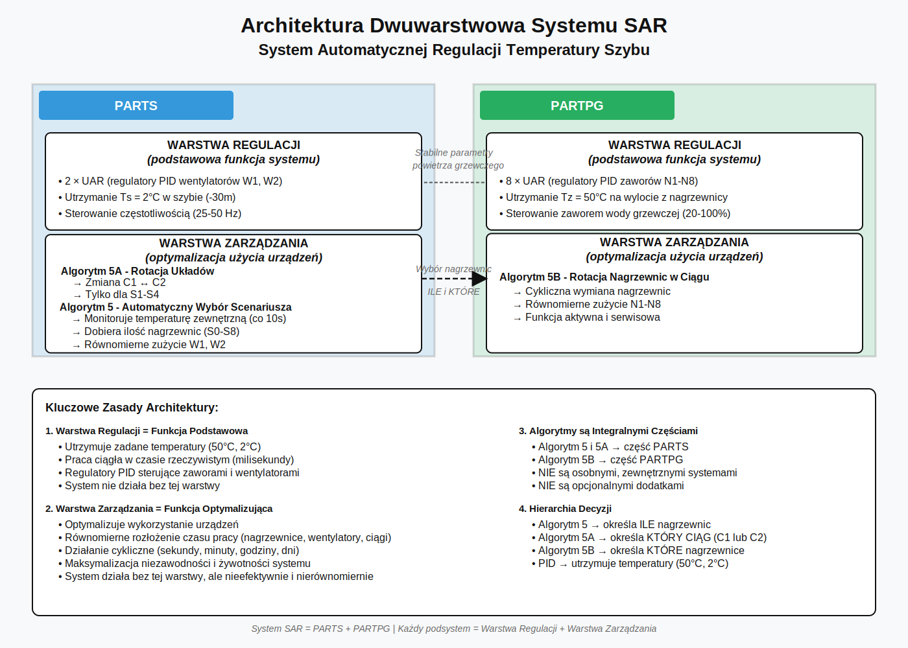
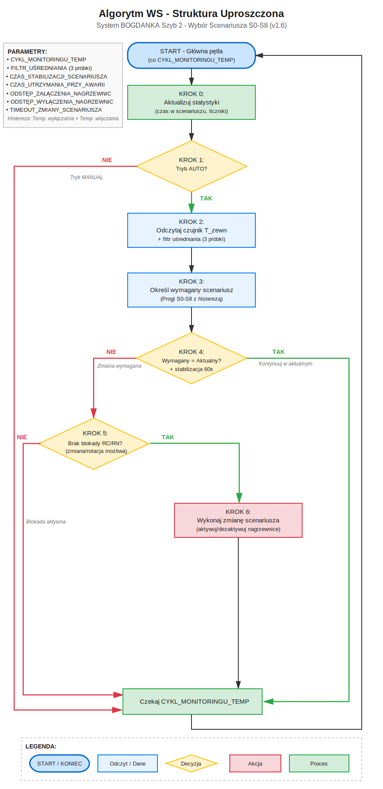
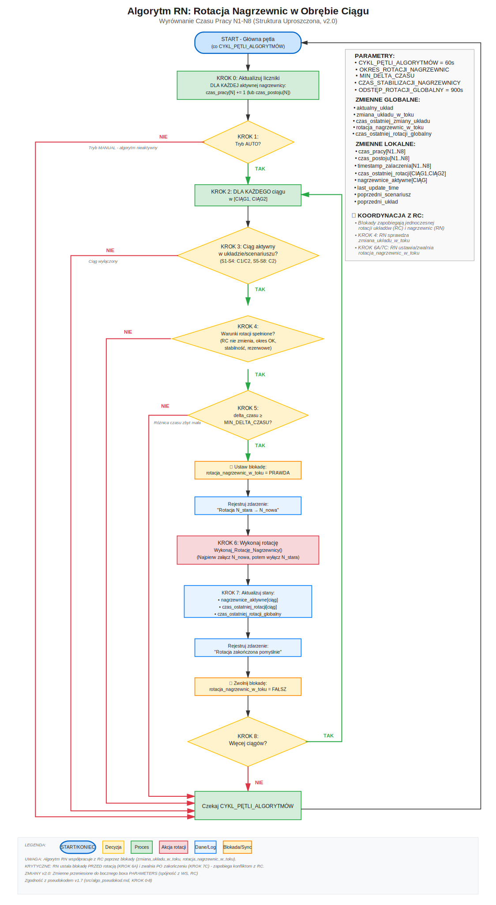
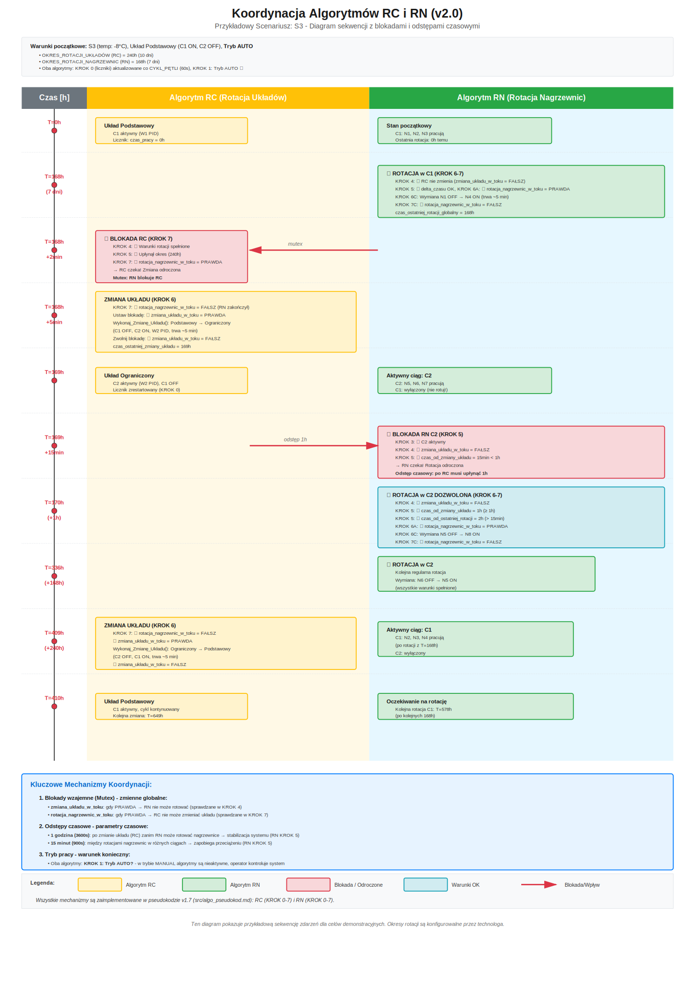

# Algorytmy Sterowania - System BOGDANKA Szyb 2

**Dokument szczegółowy zawierający algorytmy automatycznego sterowania i rotacji**

_Plik ten jest częścią dokumentacji systemu sterowania nagrzewnicami BOGDANKA Szyb 2._

[← Powrót do dokumentacji głównej](../start.md)

---

**Ostatnia aktualizacja:** 24 Listopad 2025  
**Status:** Algorytmy do implementacji w PLC  
**Zatwierdzenie:** Wymaga akceptacji technologa

---

## 📑 Spis Treści - Nawigacja

### Przegląd
- [Wprowadzenie](#wprowadzenie)
- [Kontekst: Relacja PARTPG/PARTS ↔ Algorytmy](#kontekst-relacja-partpgparts--algorytmy)

### Algorytmy (szczegółowe)
- **[Algorytm WS - Automatyczny Wybór Scenariusza](#algorytm-ws-automatyczny-wybór-scenariusza-pracy)**
  - [Cel algorytmu](#1-cel-algorytmu)
  - [Tabela scenariuszy](#3-tabela-scenariuszy---referencja)
  - [Pseudokod](#5-algorytm-krok-po-kroku)
  - [Koordynacja z RC/RN](#6-koordynacja-z-algorytmami-rc-i-rn)
  - [Szczegółowe sekwencje](#10-szczegółowe-sekwencje-zmian-scenariuszy)

- **[Algorytm RC - Rotacja Układów Pracy Ciągów](#algorytm-rc-cykliczna-rotacja-układów-pracy-ciągów)**
  - [Cel algorytmu](#1-cel-algorytmu-1)
  - [Pseudokod](#5-algorytm-rotacji-krok-po-kroku)
  - [Przykład działania](#8-przykład-działania-1)

- **[Algorytm RN - Rotacja Nagrzewnic](#algorytm-rn-cykliczna-rotacja-nagrzewnic-w-obrębie-ciągu)**
  - [Cel algorytmu](#1-cel-algorytmu-2)
  - [Pseudokod](#5-algorytm-rotacji-nagrzewnic-krok-po-kroku)
  - [Integracja z RC](#10-integracja-z-rotacją-układów-sekcja-rc)
  - [Wizualizacja koordynacji RC↔RN](#rn11-wizualizacja-koordynacji-algorytmów-rc-i-rn)


---

## Wprowadzenie

System sterowania BOGDANKA Szyb 2 wykorzystuje **trzy współpracujące algorytmy** zapewniające automatyczne sterowanie i równomierne rozłożenie eksploatacji urządzeń:

### **Algorytm WS: Automatyczny Wybór Scenariusza Pracy**
- **Cel:** Automatyczny dobór ilości nagrzewnic i konfiguracji systemu w zależności od temperatury zewnętrznej
- **Zakres:** Przełączanie między scenariuszami S0-S8
- **Częstotliwość:** Ciągły monitoring temperatury
- **Dotyczy:** Całego systemu - fundament sterowania

### **Algorytm RC: Rotacja Układów Pracy Ciągów**
- **Cel:** Wyrównanie eksploatacji między ciągiem 1 (W1) a ciągiem 2 (W2)
- **Zakres:** Zmiana między układem Podstawowym a Ograniczonym
- **Okres:** dni/tygodnie/miesiące (definiowany przez technologa)
- **Dotyczy:** Scenariuszy S1-S4

### **Algorytm RN: Rotacja Nagrzewnic w Ciągu**
- **Cel:** Wyrównanie eksploatacji nagrzewnic w obrębie jednego ciągu
- **Zakres:** Wymiana pracującej nagrzewnicy na rezerwową w tym samym ciągu
- **Okres:** godziny/dni/tygodnie (definiowany przez technologa)
- **Dotyczy:** Wszystkich nagrzewnic N1-N8

### **Hierarchia i Koordynacja Algorytmów**

```
┌────────────────────────────────────────────┐
│ Algorytm WS: Wybór Scenariusza (S0-S8)     │
│ └─ Decyduje: ile nagrzewnic, który układ   │
└─────────────────────┬──────────────────────┘
                      │
            ┌─────────┴─────────┐
            │                   │
            ▼                   ▼
     ┌──────────────┐    ┌──────────────┐
     │ Algorytm RC  │    │ Algorytm RN  │
     │ Rotacja      │◄───┤ Rotacja      │
     │ Układów      │───►│ Nagrzewnic   │
     │ (C1 ↔ C2)    │    │ (N1-N8)      │
     └──────────────┘    └──────────────┘
```

Algorytmy są **skoordynowane** i działają współbieżnie, zapewniając:
- Automatyczną adaptację do warunków atmosferycznych (Alg. WS)
- Równomierność zużycia ciągów wentylacyjnych C1, C2 i wentylatorów W1, W2 (Alg. RC)
- Równomierność zużycia wszystkich 8 nagrzewnic N1-N8 (Alg. RN)

---

## Kontekst: Relacja PARTPG/PARTS ↔ Algorytmy

System automatycznej regulacji (SAR) ma **dwuwarstwową architekturę**:



*Rys. Dwuwarstwowa architektura systemu SAR z podziałem na warstwy regulacji i zarządzania.*

📖 **[Opis architektury → system.md](../01-system/system.md#2-architektura-sterowania-sar)**

### Kluczowe Różnice Między Warstwami

**Warstwa Regulacji = Funkcja Podstawowa**
- Utrzymanie zadanych temperatur (Tz=50°C, Ts=2°C)
- Praca ciągła, realizacja w czasie rzeczywistym
- Regulatory PID (8 zaworów + 2 wentylatory)
- **Niezbędna** dla działania systemu

**Warstwa Zarządzania = Funkcja Optymalizująca** (Algorytmy WS, RC, RN)
- Równomierne wykorzystanie urządzeń
- Minimalizacja zużycia pojedynczych komponentów
- Maksymalizacja niezawodności i żywotności systemu
- Automatyczna adaptacja do warunków zewnętrznych

**Kluczowa obserwacja:**
- Bez warstwy **regulacji** (PID) → system nie utrzyma temperatury
- Bez warstwy **zarządzania** (algorytmy) → system działa, ale nierównomierne zużycie → awarie

**Ten dokument** opisuje szczegółowo **warstwę zarządzania** (algorytmy WS, RC, RN).  
**Warstwa regulacji** (UAR, PID) jest opisana w [system.md](../01-system/system.md) i [projekt-instalacji.md](../02-projekt-instalacji/projekt-instalacji.md).


# ═════════════════════════════════════
# Algorytm WS: Automatyczny Wybór Scenariusza Pracy
# ═════════════════════════════════════


> **Powiązane algorytmy:** Algorytm RC, Algorytm RN

## 1. Cel Algorytmu

Algorytm realizuje **automatyczny dobór scenariusza pracy systemu (S0-S8)** w zależności od temperatury zewnętrznej w celu:
- Utrzymania temperatury szybu na poziomie 2°C (na głębokości -30m)
- Optymalnego wykorzystania mocy grzewczej (tylko tyle nagrzewnic ile potrzeba)
- Automatycznej adaptacji do zmian warunków atmosferycznych
- Zapewnienia bezpiecznego i stabilnego ogrzewania szybu

## 2. Problem do Rozwiązania

**Wyzwanie:**
- Temperatura zewnętrzna zmienia się dynamicznie (dobowe wahania, fronty atmosferyczne)
- Zapotrzebowanie na moc grzewczą zależy od temperatury zewnętrznej
- Zbyt mało nagrzewnic → przemarzanie szybu (niebezpieczne)
- Zbyt dużo nagrzewnic → marnowanie energii, nadmierne zużycie urządzeń

**Rozwiązanie:**
- Ciągły monitoring temperatury zewnętrznej
- Automatyczny dobór ilości nagrzewnic według tabeli scenariuszy
- Histereza przy wyłączaniu (zapobiega częstym przełączeniom)
- Bezpieczne sekwencje przejść między scenariuszami

## 3. Tabela Scenariuszy - Referencja

Szczegółowa tabela scenariuszy znajduje się w [dokumentacji głównej - Sekcja 4](../01-system/system.md#4-scenariusze-pracy-s0-s8).

**Podsumowanie:**

| Scenariusz | Zakres Temp. | Nagrzewnice | W1 | W2 | Temp. Wyłączenia | Histereza |
|------------|-------------|-------------|----|----|--------------------|-----------|
| S0 | t ≥ 3°C | - | OFF | OFF | - | - |
| S1 | -1°C < t ≤ 2°C | 1 | PID | OFF | t ≥ 3°C | 1°C |
| S2 | -4°C < t ≤ -1°C | 2 | PID | OFF | t ≥ 0°C | 1°C |
| S3 | -8°C < t ≤ -4°C | 3 | PID | OFF | t ≥ -3°C | 1°C |
| S4 | -11°C < t ≤ -8°C | 4 | PID/MAX | OFF | t ≥ -6°C | 2°C |
| S5 | -15°C < t ≤ -11°C | 5 | MAX | PID | t ≥ -10°C | 1°C |
| S6 | -18°C < t ≤ -15°C | 6 | MAX | PID | t ≥ -13°C | 2°C |
| S7 | -21°C < t ≤ -18°C | 7 | MAX | PID | t ≥ -15°C | 3°C |
| S8 | t ≤ -21°C | 8 | MAX | PID | t ≥ -20°C | 1°C |

## 4. Parametry Konfiguracyjne

**Parametry monitoringu temperatury:**

| Parametr | Wartość domyślna | Jednostka | Zakres | Opis |
|----------|-----------------|-----------|--------|------|
| **CYKL_MONITORINGU_TEMP** | 10 | sekundy | 5-60 | Częstotliwość odczytu temperatury zewnętrznej |
| **CZAS_UTRZYMANIA_PRZY_AWARII** | 300 | sekundy | 60-1800 | Czas utrzymania ostatniego scenariusza przy awarii czujnika |
| **FILTR_UŚREDNIANIA** | 3 | próbki | 1-10 | Liczba próbek do uśrednienia (filtr antyfluktuacyjny) |
| **CZAS_STABILIZACJI_SCENARIUSZA** | 60 | sekundy | 30-300 | Min. czas w scenariuszu przed kolejną zmianą |

**Parametry przejść między scenariuszami:**

| Parametr | Wartość domyślna | Jednostka | Opis |
|----------|-----------------|-----------|------|
| **CZAS_MIĘDZY_ZAŁĄCZENIAMI** | 30 | sekundy | Odstęp między załączaniem kolejnych nagrzewnic |
| **CZAS_MIĘDZY_WYŁĄCZENIAMI** | 30 | sekundy | Odstęp między wyłączaniem kolejnych nagrzewnic |
| **TIMEOUT_ZMIANY_SCENARIUSZA** | 600 | sekundy | Max. czas na zmianę scenariusza (alarm po przekroczeniu) |

**Uzasadnienie wartości:**
- **CYKL_MONITORINGU_TEMP** - szybka reakcja na zmiany pogody, niewielkie obciążenie PLC
- **300s** dla CZAS_UTRZYMANIA_PRZY_AWARII - 5 minut to czas wystarczający na diagnostykę/naprawę czujnika
- **3 próbki** dla filtru - eliminacja pojedynczych skoków (zakłócenia), zachowanie responsywności
- **60s** dla stabilizacji - zapobiega oscylacjom przy temperaturach granicznych

## 5. Algorytm Krok po Kroku

**Diagram przepływu algorytmu:**



<details>
<summary>Pseudokod</summary>

```
ZMIENNE GLOBALNE:
  - aktualny_scenariusz = S0                    // Scenariusz (S0-S8)
  - T_zewn_bufor[FILTR_UŚREDNIANIA] = []       // Bufor pomiarów temp.
  - ostatni_poprawny_odczyt = 0                 // Ostatni prawidłowy odczyt temp.
  - timestamp_ostatniej_zmiany = 0              // Timestamp ostatniej zmiany scenariusza
  - timestamp_ostatniego_odczytu = 0            // Dla wykrywania awarii czujnika
  - alarm_czujnik_temp = FAŁSZ                  // Flaga awarii czujnika

PARAMETRY:
  - CYKL_MONITORINGU_TEMP = 10                  // [sekundy]
  - CZAS_UTRZYMANIA_PRZY_AWARII = 300           // [sekundy]
  - FILTR_UŚREDNIANIA = 3                       // [próbki]
  - CZAS_STABILIZACJI_SCENARIUSZA = 60          // [sekundy]
  - CZAS_MIĘDZY_ZAŁĄCZENIAMI = 30               // [sekundy]
  - CZAS_MIĘDZY_WYŁĄCZENIAMI = 30               // [sekundy]
  - TIMEOUT_ZMIANY_SCENARIUSZA = 600            // [sekundy]

GŁÓWNA PĘTLA (co CYKL_MONITORINGU_TEMP sekund):
  
  KROK 1: Odczyt i walidacja temperatury zewnętrznej
    T_zewn_raw = Odczytaj_Czujnik_Temperatury_Zewnętrznej()
    
    // Walidacja odczytu
    JEŻELI T_zewn_raw = NULL LUB 
           T_zewn_raw < -40°C LUB 
           T_zewn_raw > 50°C WTEDY
      
      // Awaria czujnika
      alarm_czujnik_temp = PRAWDA
      Rejestruj_Alarm("Awaria czujnika temperatury zewnętrznej")
      
      czas_od_ostatniego_odczytu = czas_systemowy - timestamp_ostatniego_odczytu
      
      JEŻELI czas_od_ostatniego_odczytu < CZAS_UTRZYMANIA_PRZY_AWARII WTEDY
        // Utrzymaj ostatni scenariusz
        T_zewn = ostatni_poprawny_odczyt
        Rejestruj_Zdarzenie("Utrzymanie scenariusza " + aktualny_scenariusz + 
                           " (awaria czujnika, t=" + T_zewn + "°C)")
      W PRZECIWNYM RAZIE:
        // Za długi czas bez odczytu - przejdź na tryb bezpieczny (S4 lub aktualny)
        Rejestruj_Alarm("KRYTYCZNE: Brak odczytu > " + CZAS_UTRZYMANIA_PRZY_AWARII + "s")
        Przełącz_Na_Tryb_Manual()
        PRZEJDŹ DO KOŃCA PĘTLI
      KONIEC JEŻELI
    
    W PRZECIWNYM RAZIE:
      // Odczyt prawidłowy
      alarm_czujnik_temp = FAŁSZ
      ostatni_poprawny_odczyt = T_zewn_raw
      timestamp_ostatniego_odczytu = czas_systemowy
      
      // Dodaj do bufora i oblicz średnią (filtr antyfluktuacyjny)
      Dodaj_Do_Bufora(T_zewn_bufor, T_zewn_raw)
      T_zewn = Średnia(T_zewn_bufor)
    
    KONIEC JEŻELI
  
  KROK 2: Określ wymagany scenariusz na podstawie temperatury
    wymagany_scenariusz = Określ_Scenariusz_Dla_Temperatury(T_zewn, aktualny_scenariusz)
  
  KROK 3: Sprawdź czy wymagana zmiana scenariusza
    JEŻELI wymagany_scenariusz = aktualny_scenariusz WTEDY
      // Brak zmiany - kontynuuj w aktualnym scenariuszu
      PRZEJDŹ DO KOŃCA PĘTLI
    KONIEC JEŻELI
    
    // Sprawdź czas stabilizacji (zapobieganie oscylacjom)
    czas_od_ostatniej_zmiany = czas_systemowy - timestamp_ostatniej_zmiany
    
    JEŻELI czas_od_ostatniej_zmiany < CZAS_STABILIZACJI_SCENARIUSZA WTEDY
      // Za krótki czas od ostatniej zmiany
      Rejestruj_Zdarzenie("Zmiana scenariusza odroczona (stabilizacja)")
      PRZEJDŹ DO KOŃCA PĘTLI
    KONIEC JEŻELI
  
  KROK 4: Sprawdź tryb pracy
    JEŻELI tryb_pracy ≠ AUTO WTEDY
      // W trybie MANUAL operator kontroluje system
      Rejestruj_Zdarzenie("Scenariusz " + wymagany_scenariusz + 
                         " wymagany, ale tryb=MANUAL")
      PRZEJDŹ DO KOŃCA PĘTLI
    KONIEC JEŻELI
  
  KROK 4A: Sprawdź blokady RC/RN
    JEŻELI zmiana_układu_w_toku = PRAWDA LUB rotacja_nagrzewnic_w_toku = PRAWDA WTEDY
      Rejestruj_Zdarzenie("Zmiana scenariusza odroczona (koordynacja RC/RN)")
      PRZEJDŹ DO KOŃCA PĘTLI
    KONIEC JEŻELI
  
  KROK 5: Wykonaj zmianę scenariusza
    Rejestruj_Zdarzenie("Zmiana scenariusza: " + aktualny_scenariusz + 
                       " → " + wymagany_scenariusz + " (t=" + T_zewn + "°C)")
    
    timestamp_start_zmiany = czas_systemowy
    
    wynik = Wykonaj_Zmianę_Scenariusza(aktualny_scenariusz, wymagany_scenariusz)
    
    JEŻELI wynik = SUKCES WTEDY
      aktualny_scenariusz = wymagany_scenariusz
      timestamp_ostatniej_zmiany = czas_systemowy
      
      czas_zmiany = czas_systemowy - timestamp_start_zmiany
      Rejestruj_Zdarzenie("Scenariusz " + aktualny_scenariusz + 
                         " aktywny (zmiana: " + czas_zmiany + "s)")
    
    W PRZECIWNYM RAZIE:
      Rejestruj_Alarm("BŁĄD zmiany scenariusza " + aktualny_scenariusz + 
                     " → " + wymagany_scenariusz)
      
      // Próba powrotu do bezpiecznego stanu
      JEŻELI aktualny_scenariusz ≠ S0 WTEDY
        // Zostań w aktualnym scenariuszu i zgłoś alarm
        Przełącz_Na_Tryb_Manual()
      KONIEC JEŻELI
    
    KONIEC JEŻELI

KONIEC PĘTLI

//=============================================================================
// FUNKCJA: Określenie wymaganego scenariusza z histerezą
//=============================================================================

FUNKCJA Określ_Scenariusz_Dla_Temperatury(T_zewn, aktualny_scenariusz):
  
  // Progi włączania (temperatura spada - dodajemy nagrzewnice)
  JEŻELI T_zewn ≥ 3.0 WTEDY
    ZWRÓĆ S0
  KONIEC JEŻELI
  
  JEŻELI T_zewn > 2.0 WTEDY
    // Strefa histerezy: utrzymuj S1 aż do 3°C, ale nie wymuszaj przełączenia przy ochłodzeniu
    JEŻELI aktualny_scenariusz = S1 WTEDY
      ZWRÓĆ S1
    W PRZECIWNYM RAZIE:
      ZWRÓĆ S0
    KONIEC JEŻELI
  KONIEC JEŻELI
  
  // S1: -1°C < t ≤ 2°C (wyłączenie: t ≥ 3°C)
  JEŻELI T_zewn > -1.0 WTEDY
    ZWRÓĆ S1
  KONIEC JEŻELI
  
  // S2: -4°C < t ≤ -1°C (wyłączenie: t ≥ 0°C)
  JEŻELI T_zewn > -4.0 WTEDY
    ZWRÓĆ S2
  KONIEC JEŻELI
  
  // Histereza S2→S1
  JEŻELI T_zewn ≥ 0.0 ORAZ aktualny_scenariusz = S2 WTEDY
    ZWRÓĆ S1
  KONIEC JEŻELI
  
  // S3: -8°C < t ≤ -4°C (wyłączenie: t ≥ -3°C)
  JEŻELI T_zewn > -8.0 WTEDY
    ZWRÓĆ S3
  KONIEC JEŻELI
  
  // Histereza S3→S2
  JEŻELI T_zewn ≥ -3.0 ORAZ aktualny_scenariusz = S3 WTEDY
    ZWRÓĆ S2
  KONIEC JEŻELI
  
  // S4: -11°C < t ≤ -8°C (wyłączenie: t ≥ -6°C, histereza 2°C)
  JEŻELI T_zewn > -11.0 WTEDY
    ZWRÓĆ S4
  KONIEC JEŻELI
  
  // Histereza S4→S3
  JEŻELI T_zewn ≥ -6.0 ORAZ aktualny_scenariusz = S4 WTEDY
    ZWRÓĆ S3
  KONIEC JEŻELI
  
  // S5: -15°C < t ≤ -11°C (wyłączenie: t ≥ -10°C)
  JEŻELI T_zewn > -15.0 WTEDY
    ZWRÓĆ S5
  KONIEC JEŻELI
  
  // Histereza S5→S4
  JEŻELI T_zewn ≥ -10.0 ORAZ aktualny_scenariusz = S5 WTEDY
    ZWRÓĆ S4
  KONIEC JEŻELI
  
  // S6: -18°C < t ≤ -15°C (wyłączenie: t ≥ -13°C, histereza 2°C)
  JEŻELI T_zewn > -18.0 WTEDY
    ZWRÓĆ S6
  KONIEC JEŻELI
  
  // Histereza S6→S5
  JEŻELI T_zewn ≥ -13.0 ORAZ aktualny_scenariusz = S6 WTEDY
    ZWRÓĆ S5
  KONIEC JEŻELI
  
  // S7: -21°C < t ≤ -18°C (wyłączenie: t ≥ -15°C, histereza 3°C)
  JEŻELI T_zewn > -21.0 WTEDY
    ZWRÓĆ S7
  KONIEC JEŻELI
  
  // Histereza S7→S6
  JEŻELI T_zewn ≥ -15.0 ORAZ aktualny_scenariusz = S7 WTEDY
    ZWRÓĆ S6
  KONIEC JEŻELI
  
  // S8: t ≤ -21°C (wyłączenie: t ≥ -20°C)
  JEŻELI T_zewn ≤ -21.0 WTEDY
    ZWRÓĆ S8
  KONIEC JEŻELI
  
  // Histereza S8→S7
  JEŻELI T_zewn ≥ -20.0 ORAZ aktualny_scenariusz = S8 WTEDY
    ZWRÓĆ S7
  KONIEC JEŻELI
  
  // Domyślnie zwróć aktualny scenariusz (nie powinno wystąpić)
  ZWRÓĆ aktualny_scenariusz

KONIEC FUNKCJI

//=============================================================================
// FUNKCJA: Wykonanie zmiany scenariusza
//=============================================================================

FUNKCJA Wykonaj_Zmianę_Scenariusza(scenariusz_stary, scenariusz_nowy):
  
  timestamp_start = czas_systemowy
  
  // Pobierz konfiguracje scenariuszy
  config_stara = Pobierz_Konfigurację_Scenariusza(scenariusz_stary)
  config_nowa = Pobierz_Konfigurację_Scenariusza(scenariusz_nowy)
  
  // Sprawdź timeout
  PODCZAS (czas_systemowy - timestamp_start) < TIMEOUT_ZMIANY_SCENARIUSZA:
    
    // KROK 1: Zatrzymaj zbędne nagrzewnice (jeśli przechodzimy na niższy scenariusz)
    JEŻELI config_nowa.ilość_nagrzewnic < config_stara.ilość_nagrzewnic WTEDY
      
      ilość_do_wyłączenia = config_stara.ilość_nagrzewnic - config_nowa.ilość_nagrzewnic
      
      // Pobierz listę nagrzewnic do wyłączenia (koordynacja z Algorytmem RC i RN)
      nagrzewnice_do_wyłączenia = Pobierz_Nagrzewnice_Do_Wyłączenia(
                                    config_stara, 
                                    ilość_do_wyłączenia)
      
      // Wyłączaj stopniowo
      DLA KAŻDEJ N w nagrzewnice_do_wyłączenia:
        wynik = Wyłącz_Nagrzewnicę(N)
        JEŻELI wynik ≠ SUKCES WTEDY
          Rejestruj_Alarm("Błąd wyłączenia " + N)
          // Kontynuuj mimo błędu (nie przerywaj sekwencji)
        KONIEC JEŻELI
        Czekaj(CZAS_MIĘDZY_WYŁĄCZENIAMI sekund)
      KONIEC DLA
    
    KONIEC JEŻELI
    
    // KROK 2: Skonfiguruj wentylatory
    wynik_W1 = Konfiguruj_Wentylator(W1, config_nowa.tryb_W1, config_nowa.freq_W1)
    wynik_W2 = Konfiguruj_Wentylator(W2, config_nowa.tryb_W2, config_nowa.freq_W2)
    
    JEŻELI wynik_W1 ≠ SUKCES LUB wynik_W2 ≠ SUKCES WTEDY
      Rejestruj_Alarm("Błąd konfiguracji wentylatorów")
      ZWRÓĆ BŁĄD
    KONIEC JEŻELI
    
    Czekaj(10 sekund)  // Stabilizacja wentylatorów
    
    // KROK 3: Skonfiguruj przepustnice (układ podstawowy/ograniczony)
    wynik_przepustnice = Konfiguruj_Przepustnice(config_nowa.układ_pracy)
    
    JEŻELI wynik_przepustnice ≠ SUKCES WTEDY
      Rejestruj_Alarm("Błąd konfiguracji przepustnic")
      ZWRÓĆ BŁĄD
    KONIEC JEŻELI
    
    Czekaj(5 sekund)
    
    // KROK 4: Uruchom dodatkowe nagrzewnice (jeśli przechodzimy na wyższy scenariusz)
    JEŻELI config_nowa.ilość_nagrzewnic > config_stara.ilość_nagrzewnic WTEDY
      
      ilość_do_załączenia = config_nowa.ilość_nagrzewnic - config_stara.ilość_nagrzewnic
      
      // Pobierz listę nagrzewnic do załączenia (koordynacja z Algorytmem RC i RN)
      nagrzewnice_do_załączenia = Pobierz_Nagrzewnice_Do_Załączenia(
                                     config_nowa, 
                                     ilość_do_załączenia)
      
      // Załączaj stopniowo
      DLA KAŻDEJ N w nagrzewnice_do_załączenia:
        wynik = Załącz_Nagrzewnicę(N)
        JEŻELI wynik ≠ SUKCES WTEDY
          Rejestruj_Alarm("Błąd załączenia " + N)
          // Kontynuuj (system może działać z mniejszą ilością nagrzewnic)
        KONIEC JEŻELI
        Czekaj(CZAS_MIĘDZY_ZAŁĄCZENIAMI sekund)
      KONIEC DLA
    
    KONIEC JEŻELI
    
    // KROK 5: Weryfikacja stanu końcowego
    czas_weryfikacji = 30  // sekundy
    Czekaj(czas_weryfikacji sekund)
    
    JEŻELI Weryfikuj_Scenariusz(scenariusz_nowy) = PRAWDA WTEDY
      ZWRÓĆ SUKCES
    W PRZECIWNYM RAZIE:
      Rejestruj_Alarm("Weryfikacja scenariusza " + scenariusz_nowy + " NIEPOWODZENIE")
      ZWRÓĆ BŁĄD
    KONIEC JEŻELI
  
  KONIEC PODCZAS
  
  // Przekroczono timeout
  Rejestruj_Alarm("TIMEOUT zmiany scenariusza (>" + TIMEOUT_ZMIANY_SCENARIUSZA + "s)")
  ZWRÓĆ BŁĄD

KONIEC FUNKCJI

//=============================================================================
// FUNKCJA: Pobranie konfiguracji scenariusza
//=============================================================================

FUNKCJA Pobierz_Konfigurację_Scenariusza(scenariusz):
  
  PRZYPADEK scenariusz:
    
    S0:
      ZWRÓĆ {
        ilość_nagrzewnic: 0,
        tryb_W1: OFF,
        tryb_W2: OFF,
        freq_W1: 0,
        freq_W2: 0,
        układ_pracy: NULL,
        nawiew: NULL
      }
    
    S1:
      ZWRÓĆ {
        ilość_nagrzewnic: 1,
        tryb_W1: PID,
        tryb_W2: OFF,
        freq_W1: 25-50,  // Regulacja PID
        freq_W2: 0,
        układ_pracy: "Podstawowy lub Ograniczony",  // Zależy od Algorytmu RC
        nawiew: "-4,30m"
      }
    
    S2:
      ZWRÓĆ {
        ilość_nagrzewnic: 2,
        tryb_W1: PID,
        tryb_W2: OFF,
        freq_W1: 25-50,
        freq_W2: 0,
        układ_pracy: "Podstawowy lub Ograniczony",
        nawiew: "-4,30m"
      }
    
    S3:
      ZWRÓĆ {
        ilość_nagrzewnic: 3,
        tryb_W1: PID,
        tryb_W2: OFF,
        freq_W1: 25-50,
        freq_W2: 0,
        układ_pracy: "Podstawowy lub Ograniczony",
        nawiew: "-4,30m"
      }
    
    S4:
      ZWRÓĆ {
        ilość_nagrzewnic: 4,
        tryb_W1: PID,  // Lub MAX jeśli temp. bardzo niska
        tryb_W2: OFF,
        freq_W1: 25-50,
        freq_W2: 0,
        układ_pracy: "Podstawowy lub Ograniczony",
        nawiew: "-4,30m"
      }
    
    S5:
      ZWRÓĆ {
        ilość_nagrzewnic: 5,
        tryb_W1: MAX,
        tryb_W2: PID,
        freq_W1: 50,    // Stała maksymalna częstotliwość
        freq_W2: 25-50, // Regulacja PID
        układ_pracy: "Podstawowy",  // ZAWSZE podstawowy w S5-S8
        nawiew: "-4,30m -7,90m"
      }
    
    S6:
      ZWRÓĆ {
        ilość_nagrzewnic: 6,
        tryb_W1: MAX,
        tryb_W2: PID,
        freq_W1: 50,
        freq_W2: 25-50,
        układ_pracy: "Podstawowy",
        nawiew: "-4,30m -7,90m"
      }
    
    S7:
      ZWRÓĆ {
        ilość_nagrzewnic: 7,
        tryb_W1: MAX,
        tryb_W2: PID,
        freq_W1: 50,
        freq_W2: 25-50,
        układ_pracy: "Podstawowy",
        nawiew: "-4,30m -7,90m"
      }
    
    S8:
      ZWRÓĆ {
        ilość_nagrzewnic: 8,
        tryb_W1: MAX,
        tryb_W2: PID,
        freq_W1: 50,
        freq_W2: 25-50,
        układ_pracy: "Podstawowy",
        nawiew: "-4,30m -7,90m"
      }
  
  KONIEC PRZYPADEK

KONIEC FUNKCJI

//=============================================================================
// FUNKCJA: Pobranie nagrzewnic do załączenia/wyłączenia
//=============================================================================

FUNKCJA Pobierz_Nagrzewnice_Do_Załączenia(config, ilość):
  
  // KOORDYNACJA z Algorytmem RC i RN
  // Algorytm RC decyduje o układzie (Podstawowy: C1, Ograniczony: C2)
  // Algorytm RN decyduje które nagrzewnice w ciągu (rotacja N1-N4 lub N5-N8)
  
  aktualny_układ = Pobierz_Aktualny_Układ()  // Od Algorytmu RC
  
  JEŻELI config.układ_pracy = "Podstawowy lub Ograniczony" WTEDY
    // Scenariusze S1-S4 - decyduje Algorytm RC
    
    JEŻELI aktualny_układ = "Podstawowy" WTEDY
      // Użyj ciągu 1 (N1-N4)
      ciąg = CIĄG1
    W PRZECIWNYM RAZIE:
      // Użyj ciągu 2 (N5-N8)
      ciąg = CIĄG2
    KONIEC JEŻELI
    
    // Pobierz nagrzewnice z Algorytmu RC (uwzględnia rotację)
    nagrzewnice = Algorytm_RN_Pobierz_Nagrzewnice_Do_Pracy(ciąg, ilość)
  
  W PRZECIWNYM RAZIE:  // Układ Podstawowy (S5-S8)
    // W S5-S8 zawsze:
    // - C1 pracuje w całości (N1-N4) - WSZYSTKIE nagrzewnice C1 muszą pracować
    // - C2 pracuje z N5, N6, N7, N8 w zależności od scenariusza
    
    JEŻELI ilość ≤ 4 WTEDY
      // Tylko C1 - Deleguj wybór do RN (śledzi czasy pracy dla statystyk)
      nagrzewnice = Algorytm_RN_Pobierz_Nagrzewnice_Do_Pracy(CIĄG1, ilość)
      // Uwaga: W S1-S4 wybór jest dynamiczny (rotacja RN aktywna)
      // W praktyce przy braku awarii to będą N1-N4 w S4, ale RN decyduje
    W PRZECIWNYM RAZIE:
      // C1 cały + częściowo C2
      // W S5-S8 wszystkie N1-N4 MUSZĄ pracować (brak rezerwowej w C1)
      nagrzewnice_C1 = Algorytm_RN_Pobierz_Nagrzewnice_Do_Pracy(CIĄG1, 4)
      ilość_C2 = ilość - 4
      
      // W C2 może działać Algorytm RN (jeśli są nagrzewnice rezerwowe)
      nagrzewnice_C2 = Algorytm_RN_Pobierz_Nagrzewnice_Do_Pracy(CIĄG2, ilość_C2)
      
      nagrzewnice = nagrzewnice_C1 + nagrzewnice_C2
    KONIEC JEŻELI
  
  KONIEC JEŻELI
  
  ZWRÓĆ nagrzewnice

KONIEC FUNKCJI

FUNKCJA Pobierz_Nagrzewnice_Do_Wyłączenia(config, ilość):
  
  // Wyłączaj w odwrotnej kolejności niż załączanie
  // Najpierw z C2, potem z C1
  
  aktualnie_pracujące = Pobierz_Listę_Aktywnych_Nagrzewnic()
  
  // Sortuj: najpierw C2 (N5-N8), potem C1 (N1-N4)
  // W ramach ciągu: od najwyższego numeru do najniższego
  posortowane = Sortuj_Descending(aktualnie_pracujące)
  
  nagrzewnice_do_wyłączenia = posortowane[0:ilość]
  
  ZWRÓĆ nagrzewnice_do_wyłączenia

KONIEC FUNKCJI

//=============================================================================
// FUNKCJE POMOCNICZE
//=============================================================================

FUNKCJA Załącz_Nagrzewnicę(N):
  
  Rejestruj_Zdarzenie("Załączanie nagrzewnicy " + N)
  
  // Sprawdź gotowość
  JEŻELI NIE Sprawdź_Gotowość_Nagrzewnicy(N) WTEDY
    Rejestruj_Alarm("Nagrzewnica " + N + " nie jest gotowa")
    ZWRÓĆ BŁĄD
  KONIEC JEŻELI
  
  // Sekwencja załączania (zgodnie z sekcją 3.1 dokumentacji głównej)
  
  // 1. Ustaw zawór na pozycję minimalną (20%)
  Ustaw_Zawór(N, 20%)
  Czekaj(3 sekundy)
  
  // 2. Otwórz przepustnicę dolotową
  Ustaw_Przepustnicę_Dolot(N, OTWARTA)
  Czekaj(5 sekund)
  
  // 3. Aktywuj regulator PID
  Ustaw_Regulator_PID(N, tryb=AUTO, setpoint=50°C)
  Czekaj(10 sekund)
  
  // 4. Weryfikacja
  temp = Odczytaj_Temperaturę(N)
  JEŻELI temp > 30°C WTEDY  // Nagrzewnica zaczyna działać
    Rejestruj_Zdarzenie("Nagrzewnica " + N + " załączona (T=" + temp + "°C)")
    ZWRÓĆ SUKCES
  W PRZECIWNYM RAZIE:
    Rejestruj_Alarm("Nagrzewnica " + N + " nie osiąga temperatury")
    ZWRÓĆ BŁĄD
  KONIEC JEŻELI

KONIEC FUNKCJI

FUNKCJA Wyłącz_Nagrzewnicę(N):
  
  Rejestruj_Zdarzenie("Wyłączanie nagrzewnicy " + N)
  
  // Sekwencja wyłączania (zgodnie z sekcją 3.2 dokumentacji głównej)
  
  // 1. Zatrzymaj regulator PID, ustaw zawór na 20%
  Ustaw_Regulator_PID(N, tryb=MANUAL)
  Ustaw_Zawór(N, 20%)
  Czekaj(10 sekund)
  
  // 2. Zamknij przepustnicę dolotową
  Ustaw_Przepustnicę_Dolot(N, ZAMKNIĘTA)
  Czekaj(3 sekundy)
  
  Rejestruj_Zdarzenie("Nagrzewnica " + N + " wyłączona")
  ZWRÓĆ SUKCES

KONIEC FUNKCJI

FUNKCJA Konfiguruj_Wentylator(W, tryb, częstotliwość):
  
  JEŻELI tryb = OFF WTEDY
    Zatrzymaj_Wentylator(W)
    ZWRÓĆ SUKCES
  KONIEC JEŻELI
  
  JEŻELI tryb = MAX WTEDY
    Ustaw_Wentylator(W, tryb=MANUAL, częstotliwość=50 Hz)
    ZWRÓĆ SUKCES
  KONIEC JEŻELI
  
  JEŻELI tryb = PID WTEDY
    Ustaw_Wentylator(W, tryb=AUTO, setpoint=2°C)
    ZWRÓĆ SUKCES
  KONIEC JEŻELI
  
  ZWRÓĆ BŁĄD

KONIEC FUNKCJI

FUNKCJA Weryfikuj_Scenariusz(scenariusz):
  
  config = Pobierz_Konfigurację_Scenariusza(scenariusz)
  
  // Sprawdź ilość aktywnych nagrzewnic
  aktywne = Policz_Aktywne_Nagrzewnice()
  JEŻELI aktywne ≠ config.ilość_nagrzewnic WTEDY
    Rejestruj_Alarm("Weryfikacja: nieprawidłowa ilość nagrzewnic")
    ZWRÓĆ FAŁSZ
  KONIEC JEŻELI
  
  // Sprawdź wentylatory
  JEŻELI config.tryb_W1 = OFF ORAZ Wentylator_Pracuje(W1) WTEDY
    Rejestruj_Alarm("Weryfikacja: W1 powinien być wyłączony")
    ZWRÓĆ FAŁSZ
  KONIEC JEŻELI
  
  JEŻELI config.tryb_W2 = OFF ORAZ Wentylator_Pracuje(W2) WTEDY
    Rejestruj_Alarm("Weryfikacja: W2 powinien być wyłączony")
    ZWRÓĆ FAŁSZ
  KONIEC JEŻELI
  
  // Wszystko OK
  ZWRÓĆ PRAWDA

KONIEC FUNKCJI
```
</details>

## 6. Koordynacja z Algorytmami RC i RN

**Hierarchia działania:**

1. **Algorytm WS**  - określa **ILE** nagrzewnic potrzeba (S0-S8)
2. **Algorytm RC** - określa **KTÓRY CIĄG** w S1-S4 (Podstawowy: C1, Ograniczony: C2)
3. **Algorytm RN** - określa **KTÓRE KONKRETNIE** nagrzewnice w ciągu (rotacja)

**Zasady koordynacji:**

- **S0:** Brak nagrzewnic - algorytmy RC i RN nieaktywne
- **S1-S4:** 
  - Algorytm RC wybiera układ (C1 lub C2)
  - Algorytm RN wybiera konkretne nagrzewnice w aktywnym ciągu
  - Algorytm WS wywołuje funkcje pomocnicze które respektują wybory RC i RN
- **S5-S8:**
  - Algorytm RC nieaktywny (zawsze układ Podstawowy)
  - Algorytm RN aktywny tylko dla C2 (jeśli są nagrzewnice rezerwowe)
  - C1 pracuje zawsze w pełnej konfiguracji (N1-N4)

**Blokady:**

```
JEŻELI zmiana_układu_w_toku = PRAWDA (Algorytm RC) WTEDY
  // Odrocz zmianę scenariusza do zakończenia rotacji układów
  Czekaj(...)
KONIEC JEŻELI

JEŻELI rotacja_nagrzewnic_w_toku = PRAWDA (Algorytm RN) WTEDY
  // Odrocz zmianę scenariusza do zakończenia rotacji nagrzewnic
  Czekaj(...)
KONIEC JEŻELI
```

## 7. Obsługa Stanów Awaryjnych

| Stan Awaryjny | Reakcja Systemu |
|---------------|-----------------|
| Brak odczytu T_zewn | Utrzymaj ostatni scenariusz przez CZAS_UTRZYMANIA_PRZY_AWARII (300s), potem alarm krytyczny i tryb MANUAL |
| Nagrzewnica nie załącza się | Pomiń nagrzewnicę, kontynuuj z mniejszą ilością, alarm informacyjny |
| Wentylator nie uruchamia się | Przerwij zmianę scenariusza, alarm krytyczny, tryb MANUAL |
| Przekroczenie czasu zmiany | Przerwij zmianę, alarm, powrót do poprzedniego scenariusza lub tryb MANUAL |
| Temperatura szybu poza zakresem | Przyspieszenie/opóźnienie zmiany scenariusza, alarm ostrzegawczy |
| Oscylacje temperatury zewnętrznej | Zwiększenie CZAS_STABILIZACJI_SCENARIUSZA, filtrowanie odczytów |

## 8. Przykład Działania

**Scenariusz: Ochłodzenie nocne**

```
Dzień 1, godz. 18:00 - Temperatura: +5°C
  Scenariusz: S0
  Stan: Wszystkie nagrzewnice wyłączone
  
Dzień 1, godz. 20:00 - Temperatura: +1°C (spadek)
  Algorytm wykrywa: t=1°C → wymagany S1
  Scenariusz: S0 → S1
  Akcja:
    - Uruchom wentylator W1 (PID, 25 Hz)
    - Załącz nagrzewnicę N1 (zgodnie z Algorytmem RC/RN)
    - Czas zmiany: ~50 sekund
  
Dzień 1, godz. 22:00 - Temperatura: -2°C (dalszy spadek)
  Algorytm wykrywa: t=-2°C → wymagany S2
  Scenariusz: S1 → S2
  Akcja:
    - Wentylator W1 już pracuje (zwiększenie częstotliwości przez PID)
    - Załącz nagrzewnicę N2
    - Czas zmiany: ~40 sekund (mniej bo wentylator już pracuje)
  
Dzień 2, godz. 02:00 - Temperatura: -6°C (mróz nocny)
  Algorytm wykrywa: t=-6°C → wymagany S3
  Scenariusz: S2 → S3
  Akcja:
    - Załącz nagrzewnicę N3
    - Czas zmiany: ~40 sekund
  
Dzień 2, godz. 08:00 - Temperatura: -3°C (ocieplenie poranne)
  Algorytm wykrywa: t=-3°C
  Histereza S3: wyłączenie dopiero przy t≥-3°C
  Scenariusz: S3 → S2
  Akcja:
    - Wyłącz nagrzewnicę N3
    - Czas zmiany: ~40 sekund
  
Dzień 2, godz. 14:00 - Temperatura: +1°C (dzień)
  Algorytm wykrywa: t=1°C
  Histereza S2: wyłączenie dopiero przy t≥0°C → jeszcze nie
  Scenariusz: S2 (utrzymany)
  
Dzień 2, godz. 16:00 - Temperatura: +4°C (ocieplenie)
  Algorytm wykrywa: t=4°C
  Histereza S1: wyłączenie przy t≥3°C
  Scenariusz: S1 → S0
  Akcja:
    - Wyłącz nagrzewnicę N1
    - Zatrzymaj wentylator W1
    - Czas zmiany: ~50 sekund
```

**Obserwacje:**
- Histereza zapobiega częstym przełączeniom przy temperaturach granicznych
- System reaguje szybko na spadki temperatury
- System wolniej reaguje na wzrosty (oszczędzanie energii z bezpieczeństwem)

## 9. Monitoring i Statystyki

System rejestruje następujące dane:

| Parametr | Opis |
|----------|------|
| Historia temperatury zewnętrznej | Bufor 24h z rozdzielczością co CYKL_MONITORINGU_TEMP |
| Historia scenariuszy | Timestampy zmian S0↔S1↔...↔S8 |
| Liczba zmian scenariusza | Licznik przejść (dziennie/miesięcznie) |
| Średni czas zmiany | Średni czas trwania sekwencji zmiany scenariusza |
| Liczba odroczeń | Ile razy zmiana została odroczona (stabilizacja/koordynacja) |
| Czas w każdym scenariuszu | Łączny czas pracy w S0, S1, ..., S8 [h] |
| Awarie czujnika | Licznik i czas trwania awarii odczytu temperatury |

**Raport dostępny w HMI:**
- Wykres temperatury zewnętrznej (24h/7dni/30dni)
- Timeline scenariuszy (wizualizacja kiedy system był w S0-S8)
- Statystyki zużycia energii w poszczególnych scenariuszach
- Analiza efektywności (czy scenariusze dobierały się optymalnie)

## 10. Szczegółowe Sekwencje Zmian Scenariuszy

Każda zmiana scenariusza wymaga **skoordynowanej sekwencji** operacji na:
- Zaworach regulacyjnych wody grzewczej (20-100%)
- Przepustnicach dolotowych nagrzewnic (otwarte/zamknięte)
- Przepustnicach głównych systemu (kolektory, spinka, wyrzutnie)
- Wentylatorach (start/stop, tryb PID)

**Hierarchia sterowania:**

System ma **trzy poziomy sterowania**:

1. **Algorytm WS (Nadzorca scenariuszy)** ← monitoruje **T_zewn**
   - Decyduje ILE nagrzewnic potrzeba
   - WŁĄCZA i WYŁĄCZA nagrzewnice
   - Zarządza przejściami między scenariuszami

2. **PID Nagrzewnicy (UAR temperatury powietrza)** ← monitoruje **T_wylot**
   - Utrzymuje 50°C na wylocie z nagrzewnicy
   - Reguluje zawór wody (20-100%)

3. **PID Wentylatora (UAR temperatury szybu)** ← monitoruje **T_szyb**
   - Utrzymuje 2°C w szybie na -30m
   - Reguluje prędkość wentylatora (25-50Hz)
   - Dostosowuje się do ilości nagrzewnic

**Przykład interakcji:**
```
T_zewn = 3°C (wzrost)
  ↓
Algorytm WS: "Nie potrzebuję już nagrzewnic" → decyzja o przejściu S1→S0
  ↓
Sekwencja wyłączania:
  1. Przełącz PID nagrzewnicy: AUTO → MANUAL
  2. Zamknij zawór ręcznie: aktualna_pozycja → 20%
  3. Zamknij przepustnicę
  4. Zatrzymaj wentylator
```

#### 5.10.1 Typy Przejść

System rozróżnia 4 typy przejść między scenariuszami:

| Typ | Opis | Przykłady | Złożoność |
|-----|------|-----------|-----------|
| **A** | Wyłączenie systemu | S1→S0 | Niska |
| **B** | Uruchomienie systemu | S0→S1 | Średnia |
| **C** | Zmiana w obrębie jednego ciągu | S1→S2, S2→S3, S3→S4 | Średnia |
| **D** | Uruchomienie drugiego ciągu | S4→S5 | **Wysoka** |
| **E** | Zatrzymanie drugiego ciągu | S5→S4 | **Wysoka** |
| **F** | Zmiana w obrębie dwóch ciągów | S5→S6, S6→S7, S7→S8 | Niska |

#### 5.10.2 Sekwencja TYP A: Wyłączenie Systemu (S1→S0)

**Warunki:** Temperatura wzrosła do t ≥ 3°C

```
SEKWENCJA S1→S0 (Wyłączenie systemu):

UWAGA: Algorytm WS decyduje o wyłączeniu na podstawie T_zewn ≥ 3°C

KROK 1: Przełącz PID nagrzewnicy w tryb MANUAL
  Ustaw_Regulator_PID(N_aktywna, tryb=MANUAL)
  // PID przestaje regulować, zawór "zamrażany" w aktualnej pozycji

KROK 2: Zamknij zawór wody grzewczej stopniowo do 20%
  aktualna_pozycja = Odczytaj_Pozycję_Zaworu(N_aktywna)
  Dla pozycja = aktualna_pozycja DO 20 KROK -10:
    Ustaw_Zawór(N_aktywna, pozycja)
    Czekaj(2 sekundy)
  KONIEC DLA
  Czekaj(10 sekund)  // Stabilizacja

KROK 3: Zamknij przepustnicę dolotową nagrzewnicy
  Ustaw_Przepustnicę_Dolot(N_aktywna, ZAMKNIĘTA)
  Czekaj(5 sekund)

KROK 4: Zatrzymaj wentylator W1
  Zmniejsz_Częstotliwość(W1, od_aktualnej DO 25Hz, krok=5Hz, czas=2s)
  Czekaj(5 sekund)
  Zatrzymaj_Wentylator(W1)
  
KROK 5: Zamknij przepustnice główne ciągu 1
  Ustaw_Przepustnicę_Kolektor_C1(ZAMKNIĘTA)
  Ustaw_Przepustnicę_Ciąg_C1(ZAMKNIĘTA)

KROK 6: Rejestracja
  Rejestruj_Zdarzenie("Scenariusz S0 aktywny - system wyłączony")
  
Czas sekwencji: ~60 sekund
```

#### 5.10.3 Sekwencja TYP B: Uruchomienie Systemu (S0→S1)

**Warunki:** Temperatura spadła do t ≤ 2°C

```
SEKWENCJA S0→S1 (Uruchomienie systemu):

KROK 1: Otwórz przepustnice główne ciągu 1
  Ustaw_Przepustnicę_Ciąg_C1(OTWARTA)
  Ustaw_Przepustnicę_Kolektor_C1(OTWARTA)
  Ustaw_Przepustnicę_Wyrzutnia_430(OTWARTA)
  Czekaj(10 sekund)  // Stabilizacja ciśnienia

KROK 2: Uruchom wentylator W1
  Uruchom_Wentylator(W1, częstotliwość=25Hz)
  Czekaj(10 sekund)  // Stabilizacja obrotów
  Sprawdź_Prąd_Silnika(W1)  // Weryfikacja pracy

KROK 3: Przygotuj nagrzewnicę N (wybrana przez Algorytm RC/RN)
  Ustaw_Zawór(N, 20%)  // Pozycja startowa
  Czekaj(5 sekund)

KROK 4: Otwórz przepustnicę dolotową nagrzewnicy
  Ustaw_Przepustnicę_Dolot(N, OTWARTA)
  Czekaj(5 sekund)  // Przepływ powietrza przez nagrzewnicę

KROK 5: Aktywuj regulację PID nagrzewnicy
  Ustaw_Regulator_PID(N, tryb=AUTO, setpoint=50°C)
  // Zawór zacznie się otwierać zgodnie z potrzebami
  Czekaj(30 sekund)  // Stabilizacja temperatury

KROK 6: Aktywuj regulację PID wentylatora
  Ustaw_Wentylator(W1, tryb=AUTO, setpoint=2°C)
  // Wentylator zacznie regulować prędkość

KROK 7: Weryfikacja
  temp_N = Odczytaj_Temperaturę(N)
  JEŻELI temp_N < 30°C WTEDY
    Alarm("Nagrzewnica nie osiąga temperatury")
    PRZERWIJ
  KONIEC JEŻELI
  
  Rejestruj_Zdarzenie("Scenariusz S1 aktywny")
  
Czas sekwencji: ~70 sekund
```

#### 5.10.4 Sekwencja TYP C: Dodanie Nagrzewnicy w Tym Samym Ciągu (S1→S2, S2→S3, S3→S4)

**Przykład: S2→S3** (2 nagrzewnice → 3 nagrzewnice)

```
SEKWENCJA S2→S3 (Dodanie trzeciej nagrzewnicy):

UWAGA: Wentylator W1 i nagrzewnice N1, N2 już pracują

KROK 1: Wybierz nagrzewnicę do załączenia
  N_nowa = Algorytm_RN_Wybierz_Nagrzewnicę(CIĄG1, ilość=3)
  // Algorytm RN wybiera na podstawie czasu postoju (najdłużej nieużywana)

KROK 2: Przygotuj nagrzewnicę N_nowa
  Ustaw_Zawór(N_nowa, 20%)
  Czekaj(3 sekundy)

KROK 3: Otwórz przepustnicę dolotową
  Ustaw_Przepustnicę_Dolot(N_nowa, OTWARTA)
  Czekaj(5 sekund)

KROK 4: Aktywuj regulację PID
  Ustaw_Regulator_PID(N_nowa, tryb=AUTO, setpoint=50°C)
  Czekaj(30 sekund)

KROK 5: Weryfikacja i dostrojenie wentylatora
  // PID wentylatora automatycznie dostosuje prędkość
  // do zwiększonego zapotrzebowania (3 nagrzewnice zamiast 2)
  
KROK 6: Sprawdź stabilność
  temp_N_nowa = Odczytaj_Temperaturę(N_nowa)
  JEŻELI |temp_N_nowa - 50°C| > 5°C WTEDY
    Alarm("N_nowa nie osiąga temperatury docelowej")
  KONIEC JEŻELI
  
  Rejestruj_Zdarzenie("Scenariusz S3 aktywny")

Czas sekwencji: ~45 sekund
```

#### 5.10.5 Sekwencja TYP D: Uruchomienie Drugiego Ciągu (S4→S5) 

**Warunki:** Temperatura spadła do t ≤ -11°C  
**Złożoność:** WYSOKA - uruchomienie drugiego poziomu wyrzutni

```
SEKWENCJA S4→S5 (Uruchomienie drugiego ciągu):

UWAGA: Ciąg 1 (N1-N4 + W1) już pracuje w pełnej mocy

KROK 0: Weryfikacja stanu początkowego
  // Sprawdź czy C1 ma 4 aktywne nagrzewnice (wymagane w S4)
  ilość_aktywnych_C1 = Policz_Aktywne_Nagrzewnice(CIĄG1)
  JEŻELI ilość_aktywnych_C1 ≠ 4 WTEDY
    Alarm("S4→S5: Ciąg 1 niekompletny (" + ilość_aktywnych_C1 + "/4)")
    PRZERWIJ
  KONIEC JEŻELI

KROK 1: Przygotuj przepustnice dla układu dwuciągowego
  // Przepustnice ciągu 1 pozostają OTWARTE
  // Otwieramy przepustnice ciągu 2
  Ustaw_Przepustnicę_Ciąg_C2(OTWARTA)
  Ustaw_Przepustnicę_Wyrzutnia_790(OTWARTA)  // DRUGI poziom wyrzutni!
  Czekaj(10 sekund)  // Stabilizacja ciśnienia w systemie

KROK 2: Przełącz W1 na tryb MAX (pełna moc)
  // W1 będzie teraz pracował z maksymalną częstotliwością
  Ustaw_Wentylator(W1, tryb=MANUAL, częstotliwość=50Hz)
  Czekaj(10 sekund)
  Sprawdź_Prąd_Silnika(W1)  // Weryfikacja obciążenia

KROK 3: Uruchom wentylator W2
  Uruchom_Wentylator(W2, częstotliwość=25Hz)
  Czekaj(10 sekund)
  Sprawdź_Prąd_Silnika(W2)

KROK 4: Wybierz i przygotuj pierwszą nagrzewnicę ciągu 2
  // Deleguj wybór do Algorytmu RC (śledzi czasy pracy/postoju)
  N_nowa = Algorytm_RN_Wybierz_Nagrzewnicę(CIĄG2, ilość=1)
  // Może to być N5, N6, N7 lub N8 - zależy od historii pracy
  
  Ustaw_Zawór(N_nowa, 20%)
  Czekaj(5 sekund)

KROK 5: Otwórz przepustnicę dolotową N_nowa
  Ustaw_Przepustnicę_Dolot(N_nowa, OTWARTA)
  Czekaj(5 sekund)

KROK 6: Aktywuj regulację PID dla N_nowa
  Ustaw_Regulator_PID(N_nowa, tryb=AUTO, setpoint=50°C)
  Czekaj(30 sekund)  // Stabilizacja temperatury N_nowa

KROK 7: Aktywuj regulację PID dla W2
  // W2 teraz będzie regulacyjnym wentylatorem
  Ustaw_Wentylator(W2, tryb=AUTO, setpoint=2°C)
  Czekaj(20 sekund)

KROK 8: Weryfikacja systemu dwuciągowego
  temp_N_nowa = Odczytaj_Temperaturę(N_nowa)
  JEŻELI temp_N_nowa < 30°C WTEDY
    Alarm(N_nowa + " nie osiąga temperatury")
    // Wycofaj zmianę - przywróć S4
    PRZERWIJ
  KONIEC JEŻELI
  
  sprawdź_W1 = Sprawdź_Częstotliwość(W1)
  sprawdź_W2 = Sprawdź_Częstotliwość(W2)
  
  JEŻELI sprawdź_W1 ≠ 50Hz LUB sprawdź_W2 < 25Hz WTEDY
    Alarm("Wentylatory nie pracują poprawnie")
    PRZERWIJ
  KONIEC JEŻELI
  
KROK 9: Otwórz przepustnicę kolektora C2
  Ustaw_Przepustnicę_Kolektor_C2(OTWARTA)
  
  Rejestruj_Zdarzenie("Scenariusz S5 aktywny - dwa ciągi w pracy")

Czas sekwencji: ~100 sekund
```

**Kluczowe aspekty S4→S5:**
- ⚠️ Pierwszy raz otwieramy wyrzutnie -7,90m
- ⚠️ W1 przechodzi z PID → MAX (zmiana trybu regulacji)
- ⚠️ Uruchomienie W2 jako regulacyjnego
- ⚠️ Koordynacja dwóch niezależnych ciągów

#### 5.10.6 Sekwencja TYP E: Zatrzymanie Drugiego Ciągu (S5→S4)

**Warunki:** Temperatura wzrosła do t ≥ -10°C  
**Złożoność:** WYSOKA - zamknięcie drugiego poziomu wyrzutni

```
SEKWENCJA S5→S4 (Zatrzymanie drugiego ciągu):

UWAGA: Algorytm WS decyduje o zatrzymaniu C2 na podstawie T_zewn ≥ -10°C
       Oba ciągi pracują (C1: N1-N4 + W1 MAX, C2: N5 + W2 PID)

KROK 1: Przełącz PID nagrzewnicy N5 w tryb MANUAL
  Ustaw_Regulator_PID(N5, tryb=MANUAL)
  // PID przestaje regulować, przejmujemy ręczne sterowanie
  
KROK 2: Zamknij zawór N5 do 20%
  aktualna_pozycja = Odczytaj_Pozycję_Zaworu(N5)
  Dla pozycja = aktualna_pozycja DO 20 KROK -10:
    Ustaw_Zawór(N5, pozycja)
    Czekaj(2 sekundy)
  KONIEC DLA
  Czekaj(10 sekund)

KROK 3: Zamknij przepustnicę dolotową N5
  Ustaw_Przepustnicę_Dolot(N5, ZAMKNIĘTA)
  Czekaj(5 sekund)

KROK 4: Zatrzymaj wentylator W2
  Zmniejsz_Częstotliwość(W2, od_aktualnej DO 25Hz, krok=5Hz, czas=2s)
  Czekaj(5 sekund)
  Zatrzymaj_Wentylator(W2)

KROK 5: Zamknij przepustnice ciągu 2
  Ustaw_Przepustnicę_Kolektor_C2(ZAMKNIĘTA)
  Ustaw_Przepustnicę_Wyrzutnia_790(ZAMKNIĘTA)  // ⚠️ Zamykamy poziom -7,90m
  Ustaw_Przepustnicę_Ciąg_C2(ZAMKNIĘTA)
  Czekaj(10 sekund)

KROK 6: Przełącz W1 z MAX na PID
  // W1 przejmuje pełną regulację temperatury
  Ustaw_Wentylator(W1, tryb=AUTO, setpoint=2°C)
  Czekaj(20 sekund)  // Stabilizacja regulacji

KROK 7: Weryfikacja
  JEŻELI Wentylator_Pracuje(W2) WTEDY
    Alarm("W2 nie zatrzymał się")
    PRZERWIJ
  KONIEC JEŻELI
  
  temp_szyb = Odczytaj_Temperaturę_Szybu()
  JEŻELI |temp_szyb - 2°C| > 1°C WTEDY
    Alarm("Temperatura szybu niestabilna po przejściu na S4")
  KONIEC JEŻELI
  
  Rejestruj_Zdarzenie("Scenariusz S4 aktywny - jeden ciąg w pracy")

Czas sekwencji: ~70 sekund
```

#### 5.10.7 Sekwencja TYP F: Dodanie Nagrzewnicy w Drugim Ciągu (S5→S6, S6→S7, S7→S8)

**Przykład: S5→S6** (5 nagrzewnic → 6 nagrzewnic)

```
SEKWENCJA S5→S6 (Dodanie szóstej nagrzewnicy):

UWAGA: C1 (N1-N4) + W1 MAX, C2 (N5) + W2 PID już pracują

KROK 1: Wybierz nagrzewnicę z ciągu 2
  N_nowa = Algorytm_RN_Wybierz_Nagrzewnicę(CIĄG2, ilość=2)
  // Algorytm RN wybiera na podstawie czasu postoju (najdłużej nieużywana)

KROK 2: Przygotuj N_nowa
  Ustaw_Zawór(N_nowa, 20%)
  Czekaj(3 sekundy)

KROK 3: Otwórz przepustnicę dolotową
  Ustaw_Przepustnicę_Dolot(N_nowa, OTWARTA)
  Czekaj(5 sekund)

KROK 4: Aktywuj regulację PID
  Ustaw_Regulator_PID(N_nowa, tryb=AUTO, setpoint=50°C)
  Czekaj(30 sekund)

KROK 5: Weryfikacja
  // PID W2 automatycznie dostosuje prędkość
  temp_N_nowa = Odczytaj_Temperaturę(N_nowa)
  JEŻELI |temp_N_nowa - 50°C| > 5°C WTEDY
    Alarm("N_nowa nie osiąga temperatury")
  KONIEC JEŻELI
  
  Rejestruj_Zdarzenie("Scenariusz S6 aktywny")

Czas sekwencji: ~45 sekund
```

#### 5.10.8 Tabela Czasów Sekwencji

| Przejście | Typ | Czas [s] | Uwagi |
|-----------|-----|----------|-------|
| S0→S1 | B | ~70 | Uruchomienie systemu od zera |
| S1→S0 | A | ~60 | Wyłączenie systemu |
| S1→S2, S2→S3, S3→S4 | C | ~45 | Dodanie nagrzewnicy w C1 |
| S4→S3, S3→S2, S2→S1 | C | ~50 | Usunięcie nagrzewnicy z C1 |
| **S4→S5** | **D** | **~100** | **⚠️ uruchomienie C2** |
| **S5→S4** | **E** | **~70** | **⚠️ zatrzymanie C2** |
| S5→S6, S6→S7, S7→S8 | F | ~45 | Dodanie nagrzewnicy w C2 |
| S8→S7, S7→S6, S6→S5 | F | ~50 | Usunięcie nagrzewnicy z C2 |

#### 5.10.9 Koordynacja Przepustnic - Stany dla Wszystkich Scenariuszy

| Element | S0 | S1-S4 Podst. | S1-S4 Ogr. | S5-S8 |
|---------|----|--------------|-----------| ------|
| **Ciąg 1:** | | | | |
| Przepustnica C1 | Z | **O** | **Z** | **O** |
| Kolektor C1 | Z | **O** | **Z** | **O** |
| Wyrzutnia -4,30m | Z | **O** | Z | **O** |
| **Ciąg 2:** | | | | |
| Przepustnica C2 | Z | Z | **O** | **O** |
| Kolektor C2 | Z | Z | **O** | **O** |
| Wyrzutnia -7,90m | Z | Z | Z | **O** |
| **Spinka:** | | | | |
| Przepustnica spinka | Z | Z | **O** | Z |

**Legenda:** O = Otwarta, Z = Zamknięta

**Kluczowe przejścia przepustnic:**
- **S4→S5:** Otwieramy wyrzutnię -7,90m po raz pierwszy
- **S5→S4:** Zamykamy wyrzutnię -7,90m
- **Układ Podst.→Ogr.:** Zamykamy C1, otwieramy spinę i C2
- **Układ Ogr.→Podst.:** Zamykamy spinę i C2, otwieramy C1

#### 5.10.10 Zarządzanie Zaworami - Strategia Bezpieczeństwa

**Zasady zarządzania zaworami wody grzewczej:**

1. **Nigdy nie zamykaj zaworu poniżej 20%** (ochrona antyzamrożeniowa)
2. **Stopniowe zamykanie:** krok 10%, przerwa 2s (zapobiega uderzeniom hydraulicznym)
3. **Stopniowe otwieranie:** krok 10%, przerwa 2s (stopniowe ogrzewanie)
4. **Stabilizacja PID:** min. 30s po aktywacji regulatora
5. **Weryfikacja temperatury:** przed uznaniem nagrzewnicy za aktywną

**Stany zaworu podczas pracy:**

| Stan nagrzewnicy | Pozycja zaworu | Tryb regulatora | Uwagi |
|------------------|----------------|-----------------|-------|
| **OFF** (postój) | 20% stała | MANUAL | Ochrona przed zamrożeniem |
| **STARTING** | 20% → AUTO | MANUAL → AUTO | Przejście do pracy |
| **RUNNING** | 20-100% PID | AUTO | Praca normalna |
| **STOPPING** | AUTO → 20% | AUTO → MANUAL | Przejście do postoju |

# ═════════════════════════════════════
# Algorytm RC: Cykliczna Rotacja Układów Pracy Ciągów
# ═════════════════════════════════════


> **Powiązane algorytmy:** Algorytm WS, Algorytm RN

## 1. Cel Algorytmu

Algorytm realizuje **cykliczną zmianę układów pracy ciągów grzewczych** w celu:
- Wyrównania czasów eksploatacji ciągów grzewczych (W1 vs W2)
- Uniknięcia nadmiernej eksploatacji ciągu pierwszego
- Zwiększenia niezawodności i równomiernego zużycia urządzeń

## 2. Problem do Rozwiązania

**Bez rotacji układów:**
- Ciąg 1 (N1-N4 + W1) pracuje zawsze w scenariuszach S1-S4 (temp. od 2°C do -11°C)
- Ciąg 2 (N5-N8 + W2) włącza się dopiero w S5-S8 (temp. < -11°C)
- **Rezultat:** Ciąg 1 jest eksploatowany znacznie częściej i intensywniej niż ciąg 2

**Z rotacją układów:**
- System okresowo zmienia układ: Podstawowy → Ograniczony → Podstawowy
- Oba ciągi mają równomierne czasy pracy

## 3. Parametr Konfiguracyjny

**⚙️ OKRES_ROTACJI_UKŁADÓW** - parametr definiowany przez **technologa podczas rozruchu**

| Parametr | Wartość domyślna | Jednostka | Zakres | Opis |
|----------|-----------------|-----------|--------|------|
| OKRES_ROTACJI_UKŁADÓW | Do ustalenia* | godziny lub dni | 24h - 30 dni | Czas po którym następuje zmiana układu pracy |

*Wartość zostanie ustalona podczas testowania pracy układu na obiekcie i może być modyfikowana w zależności od warunków eksploatacyjnych.

**Przykładowe wartości:**
- **168h (7 dni)** - typowa wartość dla równomiernego rozłożenia eksploatacji
- **720h (30 dni)** - dla zmniejszenia częstotliwości przełączeń
- **24h (1 dzień)** - dla testów i weryfikacji działania

**CYKL_PĘTLI_ALGORYTMÓW** - parametr częstotliwości sprawdzania (wspólny dla RC i RN)

| Parametr | Wartość domyślna | Jednostka | Zakres | Opis |
|----------|-----------------|-----------|--------|------|
| CYKL_PĘTLI_ALGORYTMÓW | 60 | sekundy | 10s - 600s | Częstotliwość wykonywania pętli głównej algorytmów |

**Uzasadnienie i przykładowe wartości:**
- **60s (1 minuta)** - zalecane dla krótkich okresów rotacji (24h-168h)
  - Dokładność: ±1 minuta (0.04% błędu dla 168h)
  - Obciążenie: ~10,080 sprawdzeń na 7 dni
  - Liczniki czasu pracy: aktualizacja co 1 minutę
- **300s (5 minut)** - zalecane dla długich okresów rotacji (168h-720h)
  - Dokładność: ±5 minut (0.2% błędu dla 168h)
  - Obciążenie: ~2,016 sprawdzeń na 7 dni (bardzo niskie)
  - Liczniki czasu pracy: aktualizacja co 5 minut
- **600s (10 minut)** - dla bardzo długich okresów (>720h)
  - Dokładność: ±10 minut (0.4% błędu dla 168h)
  - Obciążenie: ~1,008 sprawdzeń na 7 dni (minimalne)

**Wpływ na liczniki:**
- `czas_pracy_układu_podstawowego` i `czas_pracy_układu_ograniczonego` aktualizują się co CYKL_PĘTLI_ALGORYTMÓW
- Dla 60s: dokładność ±1 minuta (akceptowalna dla okresów dni/tygodni)
- Dla 300s: dokładność ±5 minut (nadal akceptowalna)

## 4. Warunki Aktywacji Rotacji

Rotacja układów jest możliwa **TYLKO** gdy spełnione są **WSZYSTKIE** warunki:

1. **Warunek temperaturowy:**
   - Aktualny scenariusz: S1, S2, S3 lub S4
   - Temperatura zewnętrzna: -11°C < t ≤ 2°C
   - Wymagana ilość nagrzewnic ≤ 4

2. **Warunek gotowości ciągu 2:**
   - Ilość sprawnych nagrzewnic ciągu 2 (N5-N8) ≥ wymagana ilość nagrzewnic
   - Wentylator W2 sprawny i w gotowości operacyjnej
   - Przepustnica na spince ciągów sprawna

3. **Warunek czasowy:**
   - Upłynął OKRES_ROTACJI_UKŁADÓW od ostatniej zmiany układu
   - System pracuje w trybie AUTO

4. **Warunek stabilności:**
   - Brak aktywnych alarmów krytycznych
   - Parametry wody grzewczej w normie
   - System SAR stabilny (brak oscylacji temperatury)

## 5. Algorytm Rotacji Krok po Kroku

**Diagram przepływu algorytmu:**


<details>
<summary>Pseudokod</summary>

```
ZMIENNE GLOBALNE (współdzielone z Algorytmem RN):
  - aktualny_układ = "Podstawowy"               // aktualny układ pracy
  - zmiana_układu_w_toku = FAŁSZ                // blokada dla koordynacji z RN
  - czas_ostatniej_zmiany_układu = 0            // timestamp dla RN [sekundy]
  - rotacja_nagrzewnic_w_toku = FAŁSZ           // blokada dla koordynacji z RN

ZMIENNE LOKALNE (tylko dla RC):
  - czas_pracy_układu_podstawowego = 0          // [sekundy]
  - czas_pracy_układu_ograniczonego = 0         // [sekundy]
  - czas_ostatniej_zmiany = czas_systemowy      // timestamp ostatniej rotacji układu
  - scenariusz = S0..S8                         // aktualny scenariusz

PARAMETRY:
  - OKRES_ROTACJI_UKŁADÓW                       // definiowany przez technologa [s]
  - HISTEREZA_CZASOWA = 300                     // 5 minut [s]
  - CYKL_PĘTLI_ALGORYTMÓW = 60                  // częstość sprawdzania [s] (domyślnie 1 min)

GŁÓWNA PĘTLA (co CYKL_PĘTLI_ALGORYTMÓW):
  
  KROK 1: Sprawdź warunki rotacji
    JEŻELI scenariusz ∈ {S1, S2, S3, S4} ORAZ
           wszystkie_nagrzewnice_C2_sprawne ORAZ
           wentylator_W2_sprawny ORAZ
           tryb = AUTO ORAZ
           brak_alarmów_krytycznych WTEDY
      
      rotacja_możliwa = PRAWDA
    
    W PRZECIWNYM RAZIE:
      rotacja_możliwa = FAŁSZ
      // Poza S1-S4 utrzymujemy definicyjnie układ podstawowy (oba ciągi pracują równolegle)
      JEŻELI scenariusz ∈ {S1, S2, S3, S4} ORAZ aktualny_układ = "Ograniczony" WTEDY
        Wykonaj_Zmianę_Układu("Podstawowy")
      W PRZECIWNYM RAZIE:
        aktualny_układ = "Podstawowy"   // aktualizacja stanu logicznego bez ingerencji sprzętowej
      KONIEC JEŻELI
      PRZEJDŹ DO KROKU 5
    
    KONIEC JEŻELI
  
  KROK 2: Sprawdź czy upłynął okres rotacji
    czas_od_ostatniej_zmiany = czas_systemowy - czas_ostatniej_zmiany
    
    JEŻELI czas_od_ostatniej_zmiany ≥ (OKRES_ROTACJI_UKŁADÓW - HISTEREZA_CZASOWA) WTEDY
      rotacja_wymagana = PRAWDA
    W PRZECIWNYM RAZIE:
      rotacja_wymagana = FAŁSZ
      PRZEJDŹ DO KROKU 5
    KONIEC JEŻELI
  
  KROK 3: Określ nowy układ
    JEŻELI aktualny_układ = "Podstawowy" WTEDY
      nowy_układ = "Ograniczony"
    W PRZECIWNYM RAZIE:
      nowy_układ = "Podstawowy"
    KONIEC JEŻELI
  
  KROK 4: Wykonaj zmianę układu
    JEŻELI rotacja_możliwa = PRAWDA ORAZ rotacja_wymagana = PRAWDA WTEDY
      
      // Sprawdź czy Algorytm RN nie wykonuje rotacji nagrzewnic
      JEŻELI rotacja_nagrzewnic_w_toku = PRAWDA WTEDY
        Rejestruj_Zdarzenie("Zmiana układu odroczona - trwa rotacja nagrzewnic")
        PRZEJDŹ DO KROKU 5
      KONIEC JEŻELI
      
      // Ustaw blokadę dla Algorytmu RC
      zmiana_układu_w_toku = PRAWDA
      
      Rejestruj_Zdarzenie("Rozpoczęcie zmiany układu z " + aktualny_układ + " na " + nowy_układ)
      
      // Sekwencja zmiany układu
      Wykonaj_Zmianę_Układu(nowy_układ)
      
      // Aktualizacja zmiennych
      aktualny_układ = nowy_układ
      czas_ostatniej_zmiany = czas_systemowy
      czas_ostatniej_zmiany_układu = czas_systemowy  // dla koordynacji z RN
      
      Rejestruj_Zdarzenie("Zakończono zmianę układu na " + nowy_układ)
      
      // Zwolnij blokadę
      zmiana_układu_w_toku = FAŁSZ
    
    KONIEC JEŻELI
  
  KROK 5: Aktualizuj liczniki czasu pracy
    JEŻELI aktualny_układ = "Podstawowy" WTEDY
      czas_pracy_układu_podstawowego += CYKL_PĘTLI_ALGORYTMÓW
    W PRZECIWNYM RAZIE:
      czas_pracy_układu_ograniczonego += CYKL_PĘTLI_ALGORYTMÓW
    KONIEC JEŻELI

KONIEC PĘTLI

FUNKCJA Wykonaj_Zmianę_Układu(docelowy_układ):
  
  JEŻELI docelowy_układ = "Ograniczony" WTEDY
    // Przejście: Podstawowy → Ograniczony
    
    KROK 1: Zatrzymaj ciąg 1 (stopniowo)
      // Pobierz listę aktualnie aktywnych nagrzewnic C1
      aktywne_C1 = Pobierz_Listę_Aktywnych_Nagrzewnic(CIĄG1)
      
      Dla KAŻDEJ N w aktywne_C1:
        Wyłącz_Nagrzewnicę(N)
        Czekaj(30 sekund)       // stabilizacja
      KONIEC DLA
      Zatrzymaj_Wentylator(W1)
    
    KROK 2: Otwórz przepustnicę na spince ciągów
      Ustaw_Przepustnicę_Spinka(OTWARTA)
      Czekaj(10 sekund)
    
    KROK 3: Zamknij przepustnice ciągu 1
      Ustaw_Przepustnicę_Kolektor_C1(ZAMKNIĘTA)
      Ustaw_Przepustnicę_Wyrzutnia_790(ZAMKNIĘTA)
    
    KROK 4: Uruchom ciąg 2 (stopniowo)
      Uruchom_Wentylator(W2, częstotliwość = 25Hz)
      Czekaj(10 sekund)
      
      // Deleguj wybór nagrzewnic do Algorytmu RC
      nagrzewnice_do_załączenia = Algorytm_RN_Pobierz_Nagrzewnice_Do_Pracy(CIĄG2, wymagana_ilość_nagrzewnic)
      
      Dla KAŻDEJ N w nagrzewnice_do_załączenia:
        Załącz_Nagrzewnicę(N)
        Czekaj(30 sekund)            // stabilizacja
      KONIEC DLA
    
    KROK 5: Aktywuj regulację PID dla W2
      Ustaw_Wentylator_W2_Tryb(PID)
      Ustaw_Setpoint_W2(Ts = 2°C)
  
  W PRZECIWNYM RAZIE:  // docelowy_układ = "Podstawowy"
    // Przejście: Ograniczony → Podstawowy
    
    KROK 1: Zatrzymaj ciąg 2 (stopniowo)
      // Pobierz listę aktualnie aktywnych nagrzewnic C2
      aktywne_C2 = Pobierz_Listę_Aktywnych_Nagrzewnic(CIĄG2)
      
      Dla KAŻDEJ N w aktywne_C2:
        Wyłącz_Nagrzewnicę(N)
        Czekaj(30 sekund)
      KONIEC DLA
      Zatrzymaj_Wentylator(W2)
    
    KROK 2: Zamknij przepustnicę na spince ciągów
      Ustaw_Przepustnicę_Spinka(ZAMKNIĘTA)
      Czekaj(10 sekund)
    
    KROK 3: Otwórz przepustnice ciągu 1
      Ustaw_Przepustnicę_Kolektor_C1(OTWARTA)
      Ustaw_Przepustnicę_Ciąg_C1(OTWARTA)
    
    KROK 4: Uruchom ciąg 1 (stopniowo)
      Uruchom_Wentylator(W1, częstotliwość = 25Hz)
      Czekaj(10 sekund)
      
      // Deleguj wybór nagrzewnic do Algorytmu RC
      nagrzewnice_do_załączenia = Algorytm_RN_Pobierz_Nagrzewnice_Do_Pracy(CIĄG1, wymagana_ilość_nagrzewnic)
      
      Dla KAŻDEJ N w nagrzewnice_do_załączenia:
        Załącz_Nagrzewnicę(N)
        Czekaj(30 sekund)
      KONIEC DLA
    
    KROK 5: Aktywuj regulację PID dla W1
      Ustaw_Wentylator_W1_Tryb(PID)
      Ustaw_Setpoint_W1(Ts = 2°C)
  
  KONIEC JEŻELI
  
KONIEC FUNKCJI
```
</details>

## 6. Obsługa Stanów Awaryjnych Podczas Rotacji

| Stan Awaryjny | Reakcja Systemu |
|---------------|-----------------|
| Awaria nagrzewnicy podczas zmiany | Kontynuuj zmianę z pominiętą nagrzewnicą, alarm informacyjny |
| Awaria wentylatora podczas zmiany | Natychmiastowy powrót do poprzedniego układu, alarm krytyczny |
| Przekroczenie czasu zmiany (>10 min) | Przerwij zmianę, powrót do układu podstawowego, alarm |
| Oscylacje temperatury podczas zmiany | Zwiększ czas stabilizacji (60s zamiast 30s), kontynuuj |
| Brak przepływu wody grzewczej | Natychmiastowe zatrzymanie zmiany, wyłączenie wszystkich nagrzewnic, alarm krytyczny |

## 7. Monitoring i Statystyki

System rejestruje następujące dane dla analizy:

| Parametr | Opis |
|----------|------|
| Łączny czas pracy C1 | Suma czasu pracy ciągu 1 w układzie podstawowym [h] |
| Łączny czas pracy C2 | Suma czasu pracy ciągu 2 w układzie ograniczonym [h] |
| Liczba zmian układów | Licznik wykonanych rotacji |
| Średni czas zmiany układu | Średni czas trwania procedury zmiany [min] |
| Liczba nieudanych zmian | Licznik przerwanych rotacji z powodu błędów |
| Stosunek eksploatacji C1/C2 | Proporcja czasu pracy obu ciągów (cel: ~1.0) |

**Raport dostępny w HMI:**
- Wykres czasu pracy ciągów (histogram tygodniowy/miesięczny)
- Historia zmian układów z timestampem
- Analiza równomierności eksploatacji

## 8. Przykład Działania

**Warunki początkowe:**
- Temperatura zewnętrzna: -5°C
- Scenariusz: S3 (3 nagrzewnice)
- OKRES_ROTACJI_UKŁADÓW = 168h (7 dni)
- Aktualny układ: Podstawowy
- Czas od ostatniej zmiany: 169h

**Przebieg:**

1. **Dzień 0, godz. 00:00** - System w układzie Podstawowym
   - Pracują: N1, N2, N3 + W1 (PID)
   - Nawiew na -4,30m

2. **Dzień 7, godz. 01:00** - Upłynął OKRES_ROTACJI_UKŁADÓW
   - Warunki rotacji spełnione 
   - Algorytm rozpoczyna zmianę: Podstawowy → Ograniczony

3. **Dzień 7, godz. 01:05** - Zmiana zakończona
   - Pracują: N5, N6, N7 + W2 (PID)
   - Nawiew na -4,30m przez spinę ciągów
   - Zarejestrowano zdarzenie w dzienniku

4. **Dzień 14, godz. 01:00** - Kolejna rotacja
   - Zmiana: Ograniczony → Podstawowy
   - Powrót do N1, N2, N3 + W1

**Rezultat po miesiącu:**
- Ciąg 1: ~360h pracy (50%)
- Ciąg 2: ~360h pracy (50%)
- Stosunek eksploatacji: 1.0 ✅ Idealne wyrównanie

# ═════════════════════════════════════
# Algorytm RN: Cykliczna Rotacja Nagrzewnic w Obrębie Ciągu
# ═════════════════════════════════════


> **Powiązane algorytmy:** Algorytm WS, Algorytm RC

## 1. Cel Algorytmu

Algorytm realizuje **cykliczną rotację nagrzewnic pracujących w jednym ciągu wentylacyjnym** w celu:
- Wyrównania czasów eksploatacji poszczególnych nagrzewnic w ciągu
- Zmniejszenia zużycia pojedynczej nagrzewnicy
- Zwiększenia niezawodności systemu przez równomierne zużycie urządzeń

## 2. Problem do Rozwiązania

**Bez rotacji nagrzewnic (przykład dla S3 - 3 nagrzewnice):**
- N1 pracuje ZAWSZE (najdłuższy czas pracy)
- N2 pracuje często (średni czas pracy)
- N3 pracuje rzadziej (krótszy czas pracy)
- N4 NIE pracuje (brak zużycia)
- **Rezultat:** Nierównomierne zużycie nagrzewnic → N1 będzie wymagać konserwacji znacznie wcześniej niż N4

**Z rotacją nagrzewnic:**
```
Dzień 1-7:   N1, N2, N3 pracują
Dzień 8-14:  N2, N3, N4 pracują  (N1 odpoczynek, N4 wchodzi)
Dzień 15-21: N3, N4, N1 pracują  (N2 odpoczynek, N1 wchodzi)
Dzień 22-28: N4, N1, N2 pracują  (N3 odpoczynek, N2 wchodzi)
```
- **Rezultat:** Równomierne zużycie wszystkich 4 nagrzewnic ciągu

## 3. Parametry Konfiguracyjne

Parametry definiowane przez **technologa podczas rozruchu**:

| Parametr | Wartość domyślna | Jednostka | Zakres | Opis |
|----------|-----------------|-----------|--------|------|
| **OKRES_ROTACJI_NAGRZEWNIC** | Do ustalenia* | godziny | 24h - 720h | Czas po którym następuje zmiana nagrzewnicy w ciągu |
| **MIN_DELTA_CZASU** | 3600 | sekundy | 1800 - 7200 | Minimalna różnica czasu pracy dla wykonania rotacji |
| **CYKL_PĘTLI_ALGORYTMÓW** | 60 | sekundy | 10 - 600 | Częstość wykonywania pętli głównej (współdzielony z RC) |

*Wartości zostaną ustalone podczas testowania pracy układu na obiekcie (zgodnie z sekcją 1.4 projektu).

**Przykładowe wartości OKRES_ROTACJI_NAGRZEWNIC:**
- **168h (7 dni)** - typowa wartość dla równomiernego rozłożenia eksploatacji
- **720h (30 dni)** - dla zmniejszenia częstotliwości przełączeń
- **48h (2 dni)** - dla intensywnej rotacji i szybszego wyrównania

**Uzasadnienie MIN_DELTA_CZASU:**
- **3600s (1h)** - wartość domyślna, zapobiega częstym rotacjom przy niewielkich różnicach
- **7200s (2h)** - dla bardziej konserwatywnego podejścia
- **1800s (30min)** - dla agresywniejszego wyrównywania w scenariuszach dynamicznych
- Jeśli różnica czasu pracy jest mniejsza niż MIN_DELTA_CZASU, rotacja nie ma sensu (zmiana dla zmiany)

**Uzasadnienie CYKL_PĘTLI_ALGORYTMÓW:**
- Parametr **współdzielony** z Algorytmem RC (wspólna wartość dla obu algorytmów)
- Szczegółowe wyjaśnienie i przykładowe wartości: patrz sekcja RC.3
- Liczniki `czas_pracy[N]` i `czas_postoju[N]` aktualizują się co CYKL_PĘTLI_ALGORYTMÓW sekund

## 4. Warunki Aktywacji Rotacji Nagrzewnic

Rotacja nagrzewnic jest możliwa **TYLKO** gdy spełnione są **WSZYSTKIE** warunki:

1. **Warunek konfiguracji ciągu:**
   - Ilość sprawnych nagrzewnic ciągu > ilość aktualnie pracujących nagrzewnic
   - Co najmniej 1 nagrzewnica musi pozostać aktywna podczas zmiany
   - Maksymalnie 4 nagrzewnice w ciągu

2. **Warunek czasowy:**
   - Upłynął OKRES_ROTACJI_NAGRZEWNIC od ostatniej rotacji w tym ciągu
   - System pracuje w trybie AUTO

3. **Warunek stabilności:**
   - Brak aktywnych alarmów dla nagrzewnic w ciągu
   - Parametry wody grzewczej w normie
   - Temperatura w szybie stabilna (brak oscylacji > ±0.5°C)
   - Wentylator ciągu sprawny i pracujący

4. **Warunek dostępności:**
   - Nagrzewnica zastępcza w gotowości operacyjnej
   - Zawór regulacyjny sprawny
   - Przepustnice sprawne

## 5. Algorytm Rotacji Nagrzewnic Krok po Kroku

**WAŻNE - Algorytm RN jako serwis dla innych algorytmów:**

Algorytm RN pełni **podwójną funkcję**:

1. **Funkcja aktywna** - Wykonuje cykliczną rotację nagrzewnic (wymiana najdłużej pracującej → najdłużej w postoju)
2. **Funkcja serwisowa** - Dostarcza funkcje wyboru nagrzewnic wywoływane przez:
   - **Algorytm WS** (wybór scenariusza) - wywołuje `Algorytm_RN_Pobierz_Nagrzewnice_Do_Pracy(ciąg, ilość)`
   - **Algorytm RC** (rotacja układów) - wywołuje `Algorytm_RN_Pobierz_Nagrzewnice_Do_Pracy(ciąg, ilość)`
   - **Sekwencje zmian scenariuszy** - wywołują `Algorytm_RN_Wybierz_Nagrzewnicę(ciąg, ilość)`

**Zasada:** NIGDY nie zakładamy sekwencyjnego wyboru nagrzewnic (N1→N2→N3...). Zawsze delegujemy wybór do Algorytmu RC, który:
- Śledzi czasy pracy i postoju każdej nagrzewnicy
- Wybiera nagrzewnice na podstawie historii eksploatacji
- Zapewnia równomierne zużycie wszystkich nagrzewnic N1-N8

**Diagram wizualizujący algorytm:**



<details>
<summary>Pseudokod</summary>

```
ZMIENNE GLOBALNE (współdzielone z Algorytmem RC):
  - aktualny_układ                                       // Podstawowy lub Ograniczony
  - zmiana_układu_w_toku                                 // blokada od RC
  - czas_ostatniej_zmiany_układu                         // timestamp od RC
  - rotacja_nagrzewnic_w_toku = FAŁSZ                    // blokada dla RC
  - czas_ostatniej_rotacji_globalny = 0                  // dla odstępu 15 min [sekundy]

ZMIENNE LOKALNE (dla każdego ciągu osobno):
  - czas_pracy[N1..N8] = [0, 0, 0, 0, 0, 0, 0, 0]       // [sekundy]
  - czas_postoju[N1..N8] = [0, 0, 0, 0, 0, 0, 0, 0]     // [sekundy]
  - timestamp_zalaczenia[N1..N8] = [0, 0, 0, 0, 0, 0, 0, 0] // [timestamp pierwszego załączenia]
  - czas_ostatniej_rotacji[CIĄG1, CIĄG2] = [0, 0]       // [timestamp]
  - nagrzewnice_aktywne[CIĄG] = []                       // lista aktywnych

PARAMETRY:
  - OKRES_ROTACJI_NAGRZEWNIC[S1..S8]  // definiowany przez technologa [s]
  - MIN_DELTA_CZASU                   // definiowany przez technologa [s] (domyślnie 3600)
  - CZAS_STABILIZACJI = 30            // czas na stabilizację po zmianie [s]
  - CYKL_PĘTLI_ALGORYTMÓW = 60        // częstość sprawdzania [s] (współdzielony z RC)

GŁÓWNA PĘTLA (co CYKL_PĘTLI_ALGORYTMÓW):
  
  DLA KAŻDEGO ciągu w [CIĄG1, CIĄG2]:
    
    KROK 0: Sprawdź czy ciąg jest aktywny w aktualnym układzie/scenariuszu
      aktualny_scenariusz = Pobierz_Scenariusz()
      aktualny_układ = Pobierz_Układ()  // Podstawowy lub Ograniczony
      
      // W S1-S4: tylko JEDEN ciąg jest aktywny (w zależności od układu)
      JEŻELI aktualny_scenariusz ∈ {S1, S2, S3, S4} WTEDY
        JEŻELI aktualny_układ = "Podstawowy" ORAZ ciąg = CIĄG2 WTEDY
          POMIŃ ciąg  // C2 wyłączony w układzie podstawowym
        KONIEC JEŻELI
        
        JEŻELI aktualny_układ = "Ograniczony" ORAZ ciąg = CIĄG1 WTEDY
          POMIŃ ciąg  // C1 wyłączony w układzie ograniczonym
        KONIEC JEŻELI
      KONIEC JEŻELI
      
      // W S5-S8: oba ciągi aktywne, ale C1 nie może rotować (brak rezerwowej)
      JEŻELI aktualny_scenariusz ∈ {S5, S6, S7, S8} ORAZ ciąg = CIĄG1 WTEDY
        POMIŃ ciąg  // C1 niemożliwa - wszystkie nagrzewnice N1-N4 pracują
      KONIEC JEŻELI
    
    KROK 1: Aktualizuj liczniki czasu pracy i postoju
      DLA KAŻDEJ nagrzewnicy w ciągu:
        JEŻELI nagrzewnica_aktywna(N) WTEDY
          czas_pracy[N] += CYKL_PĘTLI_ALGORYTMÓW
        W PRZECIWNYM RAZIE:
          czas_postoju[N] += CYKL_PĘTLI_ALGORYTMÓW
        KONIEC JEŻELI
      KONIEC DLA
    
    KROK 2: Sprawdź warunki rotacji
      
      // Koordynacja z Algorytmem RC - sprawdź czy RC nie wykonuje zmiany układu
      JEŻELI zmiana_układu_w_toku = PRAWDA WTEDY
        POMIŃ ciąg  // odrocz rotację - trwa zmiana układu
      KONIEC JEŻELI
      
      // Sprawdź czy upłynęła 1h od ostatniej zmiany układu (RC)
      // (dotyczy tylko S1-S4, bo tylko tam działa Algorytm RC)
      JEŻELI aktualny_scenariusz ∈ {S1, S2, S3, S4} WTEDY
        czas_od_zmiany_układu = czas_systemowy - czas_ostatniej_zmiany_układu
        JEŻELI czas_od_zmiany_układu < 3600 WTEDY  // 1 godzina
          POMIŃ ciąg  // za wcześnie po zmianie układu
        KONIEC JEŻELI
      KONIEC JEŻELI
      
      // Sprawdź odstęp 15 min od ostatniej rotacji (w dowolnym ciągu)
      czas_od_ostatniej_rotacji_globalnej = czas_systemowy - czas_ostatniej_rotacji_globalny
      JEŻELI czas_od_ostatniej_rotacji_globalnej < 900 WTEDY  // 15 minut
        POMIŃ ciąg  // za krótki odstęp od ostatniej rotacji
      KONIEC JEŻELI
      
      aktualny_scenariusz = Pobierz_Scenariusz()
      ilość_pracujących = Liczba_Aktywnych_Nagrzewnic(ciąg)
      ilość_sprawnych = Liczba_Sprawnych_Nagrzewnic(ciąg)
      
      JEŻELI ilość_sprawnych ≤ ilość_pracujących WTEDY
        // Brak nagrzewnic rezerwowych - rotacja niemożliwa
        POMIŃ ciąg
      KONIEC JEŻELI
      
      czas_od_ostatniej_rotacji = czas_systemowy - czas_ostatniej_rotacji[ciąg]
      okres = OKRES_ROTACJI_NAGRZEWNIC[aktualny_scenariusz]
      
      JEŻELI czas_od_ostatniej_rotacji < okres WTEDY
        // Nie upłynął jeszcze okres rotacji
        POMIŃ ciąg
      KONIEC JEŻELI
      
      JEŻELI NIE Warunki_Stabilności_Spełnione(ciąg) WTEDY
        // System niestabilny - nie wykonuj rotacji
        POMIŃ ciąg
      KONIEC JEŻELI
    
    KROK 3: Wybierz nagrzewnicę do wyłączenia i załączenia
      // Znajdź nagrzewnicę najdłużej pracującą (aktywną)
      nagrzewnica_do_wyłączenia = NULL
      max_czas_pracy = 0
      earliest_timestamp = nieskonczonosc
      
      DLA KAŻDEJ N w nagrzewnice_aktywne[ciąg]:
        JEŻELI czas_pracy[N] > max_czas_pracy WTEDY
          max_czas_pracy = czas_pracy[N]
          nagrzewnica_do_wyłączenia = N
          earliest_timestamp = timestamp_zalaczenia[N]
        W PRZECIWNYM RAZIE JEŻELI czas_pracy[N] = max_czas_pracy WTEDY
          // Przy identycznych czasach pracy wybierz tę załączoną wcześniej
          JEŻELI timestamp_zalaczenia[N] < earliest_timestamp WTEDY
            nagrzewnica_do_wyłączenia = N
            earliest_timestamp = timestamp_zalaczenia[N]
          KONIEC JEŻELI
        KONIEC JEŻELI
      KONIEC DLA
      
      // Znajdź nagrzewnicę najdłużej postoju (nieaktywną, sprawną)
      nagrzewnica_do_załączenia = NULL
      max_czas_postoju = 0
      
      DLA KAŻDEJ N w [nagrzewnice ciągu]:
        JEŻELI N NIE w nagrzewnice_aktywne[ciąg] ORAZ
               N_sprawna(N) ORAZ
               czas_postoju[N] > max_czas_postoju WTEDY
          max_czas_postoju = czas_postoju[N]
          nagrzewnica_do_załączenia = N
        KONIEC JEŻELI
      KONIEC DLA
      
      // Sprawdź czy warto wykonać rotację
      delta_czasu = max_czas_pracy - max_czas_postoju
      JEŻELI delta_czasu < MIN_DELTA_CZASU WTEDY
        // Różnica czasu zbyt mała - nie ma sensu rotować
        POMIŃ ciąg
      KONIEC JEŻELI
    
    KROK 4: Wykonaj rotację
      JEŻELI nagrzewnica_do_wyłączenia ≠ NULL ORAZ 
             nagrzewnica_do_załączenia ≠ NULL WTEDY
        
        // Ustaw blokadę dla Algorytmu RC
        rotacja_nagrzewnic_w_toku = PRAWDA
        
        Rejestruj_Zdarzenie("Rotacja w " + ciąg + ": " + 
                          nagrzewnica_do_wyłączenia + " → " + 
                          nagrzewnica_do_załączenia)
        
        // Sekwencja rotacji
        Wykonaj_Rotację_Nagrzewnicy(ciąg, 
                                    nagrzewnica_do_wyłączenia,
                                    nagrzewnica_do_załączenia)
        
        // Aktualizacja stanu
        czas_ostatniej_rotacji[ciąg] = czas_systemowy
        czas_ostatniej_rotacji_globalny = czas_systemowy  // dla odstępu 15 min
        
        Rejestruj_Zdarzenie("Rotacja zakończona pomyślnie")
        
        // Zwolnij blokadę
        rotacja_nagrzewnic_w_toku = FAŁSZ
      
      KONIEC JEŻELI
  
  KONIEC DLA

KONIEC PĘTLI

FUNKCJA Wykonaj_Rotację_Nagrzewnicy(ciąg, N_stara, N_nowa):
  
  // ⚠️ WAŻNA ZASADA BEZPIECZEŃSTWA:
  // Najpierw ZAŁĄCZAMY nową nagrzewnicę, potem WYŁĄCZAMY starą
  // Oznacza to chwilowo WIĘCEJ nagrzewnic niż wymaga scenariusz (np. 4 zamiast 3)
  // 
  // UZASADNIENIE:
  // ✓ Bezpieczeństwo termiczne - nigdy nie tracimy mocy grzewczej
  // ✓ Weryfikacja - sprawdzamy czy N_nowa działa PRZED wyłączeniem N_starej
  // ✓ Możliwość wycofania - jeśli N_nowa nie działa, N_stara nadal pracuje
  
  KROK 1: Przygotowanie nagrzewnicy nowej
    // Sprawdź gotowość N_nowa
    JEŻELI NIE Sprawdź_Gotowość(N_nowa) WTEDY
      Rejestruj_Alarm("Nagrzewnica " + N_nowa + " nie jest gotowa")
      ZWRÓĆ BŁĄD
    KONIEC JEŻELI
    
    // Ustaw zawór N_nowa na pozycję startową (20%)
    Ustaw_Zawór(N_nowa, 20%)
    Czekaj(5 sekund)
  
  KROK 2: Załączenie nagrzewnicy nowej
    // ⚠️ W tym momencie pracuje: N_stara + N_nowa = WIĘCEJ niż wymaga scenariusz
    // Przykład dla S3: pracują 4 nagrzewnice zamiast 3
    // To jest ZAMIERZONE dla bezpieczeństwa!
    
    // Otwórz przepustnicę dolotową N_nowa
    Ustaw_Przepustnicę_Dolot(N_nowa, OTWARTA)
    Czekaj(5 sekund)
    
    // Otwórz zawór N_nowa stopniowo do 100%
    Dla pozycja = 20 DO 100 KROK 10:
      Ustaw_Zawór(N_nowa, pozycja)
      Czekaj(2 sekundy)
    KONIEC DLA
    
    // Aktywuj regulator PID dla N_nowa
    Ustaw_Regulator_PID(N_nowa, tryb = AUTO, setpoint = 50°C)
    Czekaj(CZAS_STABILIZACJI sekund)
  
  KROK 3: Sprawdź stabilność temperatury
    temp_N_nowa = Odczytaj_Temperaturę(N_nowa)
    
    JEŻELI |temp_N_nowa - 50°C| > 5°C WTEDY
      // Nowa nagrzewnica nie osiągnęła temperatury
      Rejestruj_Alarm("N_nowa nie osiągnęła temp. docelowej")
      // Wycofaj zmianę - N_stara nadal pracuje, więc system bezpieczny
      Wyłącz_Nagrzewnicę(N_nowa)
      ZWRÓĆ BŁĄD
    KONIEC JEŻELI
  
  KROK 4: Wyłączenie nagrzewnicy starej
    // Dopiero teraz, gdy mamy pewność że N_nowa działa, wyłączamy N_starą
    // Po tym kroku: poprawna ilość nagrzewnic zgodna ze scenariuszem
    
    // Przełącz regulator PID dla N_stara w tryb MANUAL
    Ustaw_Regulator_PID(N_stara, tryb = MANUAL)
    
    // Zamknij zawór N_stara stopniowo do 20%
    aktualna_pozycja = Odczytaj_Pozycję_Zaworu(N_stara)
    Dla pozycja = aktualna_pozycja DO 20 KROK -10:
      Ustaw_Zawór(N_stara, pozycja)
      Czekaj(2 sekundy)
    KONIEC DLA
    
    // Poczekaj na stabilizację
    Czekaj(CZAS_STABILIZACJI sekund)
    
    // Zamknij przepustnicę dolotową N_stara
    Ustaw_Przepustnicę_Dolot(N_stara, ZAMKNIĘTA)
  
  KROK 5: Aktualizacja listy aktywnych nagrzewnic
    Usuń(nagrzewnice_aktywne[ciąg], N_stara)
    Dodaj(nagrzewnice_aktywne[ciąg], N_nowa)
    
    // Zeruj licznik postoju dla N_nowa
    czas_postoju[N_nowa] = 0
    
    // Zapisz timestamp załączenia N_nowa (do rozstrzygania przy identycznych czasach)
    timestamp_zalaczenia[N_nowa] = czas_systemowy
    
    // Kontynuuj liczenie czasu pracy dla N_stara
    // (nie zeruj - chcemy pamiętać łączny czas)
  
  ZWRÓĆ SUKCES

KONIEC FUNKCJI

FUNKCJA Warunki_Stabilności_Spełnione(ciąg):
  // Sprawdź temperaturę w szybie
  temp_szyb = Odczytaj_Temperaturę_Szybu()
  JEŻELI |temp_szyb - 2°C| > 0.5°C WTEDY
    ZWRÓĆ FAŁSZ
  KONIEC JEŻELI
  
  // Sprawdź parametry wody grzewczej
  JEŻELI NIE Parametry_Wody_OK() WTEDY
    ZWRÓĆ FAŁSZ
  KONIEC JEŻELI
  
  // Sprawdź wentylator
  JEŻELI NIE Wentylator_Sprawny(ciąg) WTEDY
    ZWRÓĆ FAŁSZ
  KONIEC JEŻELI
  
  // Sprawdź alarmy
  JEŻELI Aktywne_Alarmy_Krytyczne(ciąg) > 0 WTEDY
    ZWRÓĆ FAŁSZ
  KONIEC JEŻELI
  
  ZWRÓĆ PRAWDA

KONIEC FUNKCJI

//=============================================================================
// FUNKCJE SERWISOWE - Wywoływane przez Algorytmy WS i RC
//=============================================================================

FUNKCJA Algorytm_RN_Pobierz_Nagrzewnice_Do_Pracy(ciąg, ilość):
  // Ta funkcja jest wywoływana przez Algorytm WS i RC
  // aby uzyskać listę nagrzewnic do załączenia
  //
  // LOGIKA:
  // - Wybiera nagrzewnice na podstawie czasu postoju (najdłużej nieużywane mają priorytet)
  // - Śledzi historię pracy i postoju
  // - Zapewnia równomierne zużycie
  
  nagrzewnice_ciągu = Pobierz_Wszystkie_Nagrzewnice(ciąg)
  sprawne = Filtruj_Sprawne(nagrzewnice_ciągu)
  
  // Sortuj według czasu postoju (malejąco) i czasu pracy (rosnąco)
  // Priorytet: najdłużej w postoju, potem najmniej przepracowane
  posortowane = Sortuj(sprawne, 
                       klucz1=czas_postoju DESC, 
                       klucz2=czas_pracy ASC,
                       klucz3=timestamp_zalaczenia ASC)
  
  wybrane = posortowane[0:ilość]
  
  ZWRÓĆ wybrane

KONIEC FUNKCJI

FUNKCJA Algorytm_RN_Wybierz_Nagrzewnicę(ciąg, ilość_docelowa):
  // Ta funkcja jest wywoływana przez sekwencje zmian scenariuszy
  // aby wybrać JEDNĄ nagrzewnicę do załączenia
  //
  // PARAMETR ilość_docelowa: łączna ilość nagrzewnic która ma pracować po załączeniu
  //
  // LOGIKA: Wybiera nagrzewnicę z najdłuższym czasem postoju
  
  wszystkie = Algorytm_RN_Pobierz_Nagrzewnice_Do_Pracy(ciąg, ilość_docelowa)
  aktywne = Pobierz_Aktywne_Nagrzewnice(ciąg)
  
  // Znajdź nagrzewnicę która jest w 'wszystkie' ale NIE jest w 'aktywne'
  DLA KAŻDEJ N w wszystkie:
    JEŻELI N NIE w aktywne WTEDY
      ZWRÓĆ N  // To jest nowa nagrzewnica do załączenia
    KONIEC JEŻELI
  KONIEC DLA
  
  // Nie powinno się zdarzyć (oznacza błąd logiczny)
  Rejestruj_Alarm("BŁĄD: Algorytm_RN_Wybierz_Nagrzewnicę nie znalazł kandydata")
  ZWRÓĆ NULL

KONIEC FUNKCJI
```
</details>

## 6. Priorytety Rotacji

**Aktywność ciągów w zależności od scenariusza:**

| Scenariusz | Aktywne ciągi | Układ | Uwaga |
|------------|---------------|-------|-------|
| **S1-S4** | **TYLKO JEDEN ciąg** na raz | Układ Podstawowy: **C1** (W1 PID)<br>Układ Ograniczony: **C2** (W2 PID) | Algorytm RC przełącza między układami → rotacja RN dotyczy ciągu który **aktualnie pracuje** |
| **S5-S8** | **OBA ciągi** jednocześnie | C1 MAX + C2 PID/MAX | Oba ciągi aktywne, ale tylko C2 może rotować (C1 niemożliwa - brak rezerwowej) |

Gdy wiele ciągów wymaga rotacji jednocześnie, stosuje się następujące priorytety:

| Priorytet | Ciąg | Warunek | Uzasadnienie |
|-----------|------|---------|--------------|
| 1 | **Ciąg aktywny w S1-S4** | **C1 (Układ Podstawowy)** ALBO **C2 (Układ Ograniczony)** - pracuje SOLO | Najwyższe zużycie - całe obciążenie grzewcze na jednym ciągu, priorytetowa rotacja |
| 2 | Ciąg 2 (S5-S7) | C1 MAX + C2 PID | C2 reguluje temperaturę PID - rotacja **MOŻLIWA** i ważna dla stabilności (są nagrzewnice rezerwowe) |
| 3 | Ciąg 1 (S5-S8) | C1 MAX + C2 PID/MAX | C1 pracuje na MAX - rotacja **NIEMOŻLIWA*** (wszystkie N1-N4 pracują, brak rezerwowej) |

**Ograniczenia rotacji:**
- *W **S5-S8**: rotacja RN w **C1 jest NIEMOŻLIWA** - wszystkie nagrzewnice N1-N4 muszą pracować (brak nagrzewnicy rezerwowej)
- W **S5-S7**: rotacja RN w **C2 jest MOŻLIWA** - są nagrzewnice rezerwowe (N8 w S7, N7-N8 w S6, N6-N8 w S5)
- W **S8**: rotacja RN w **C2 jest NIEMOŻLIWA** - wszystkie nagrzewnice N5-N8 muszą pracować (brak nagrzewnicy rezerwowej)

**Koordynacja z Algorytmem RC (Rotacja Układów):**

⚠️ **WAŻNE - W S1-S4 pracuje TYLKO JEDEN ciąg na raz (nie oba jednocześnie!):**
- Gdy aktywny jest **Układ Podstawowy**: pracuje **TYLKO C1**, rotacja RN dotyczy **C1** (priorytet 1)
- Gdy aktywny jest **Układ Ograniczony**: pracuje **TYLKO C2**, rotacja RN dotyczy **C2** (priorytet 1)
- Algorytm RC przełącza między układami → zmiana który ciąg pracuje

**Zasady koordynacji:**
- Po zmianie układu (RC) poczekaj min. **1 godzinę** przed rotacją nagrzewnic (RN)
- Priorytet ma zawsze **ciąg aktualnie pracujący** (w S1-S4 to jeden ciąg, w S5-S8 to oba ciągi, ale C2 ma priorytet rotacji bo C1 nie może rotować)

**Zasada odstępu:** Nie wykonuj rotacji w dwóch ciągach jednocześnie - zachowaj min. 15 minut odstępu między rotacjami.

**Uzasadnienie odstępu 15 minut:**
- Stabilność systemu (uniknięcie podwójnych perturbacji temperatury)
- Łatwiejsza diagnostyka problemów (wiadomo który ciąg jest przyczyną)
- Czas na reakcję operatora/SCADA w przypadku nieprawidłowości

## 7. Obsługa Stanów Awaryjnych

| Stan Awaryjny | Reakcja Systemu |
|---------------|-----------------|
| Nagrzewnica nowa nie osiąga temperatury | Wycofaj zmianę, przywróć N_starą, alarm |
| Awaria zaworu podczas rotacji | Zatrzymaj rotację, utrzymaj aktualny stan, alarm krytyczny |
| Wentylator zatrzymał się podczas rotacji | Natychmiastowe wyłączenie obu nagrzewnic, alarm krytyczny |
| Temperatura szybu spadła o >1°C | Przerwij rotację, przywróć N_starą, zwiększ moc |
| Przekroczenie czasu rotacji (>5 min) | Przerwij rotację, alarm, przejście na tryb MANUAL |

## 8. Monitoring i Statystyki

System rejestruje następujące dane dla każdej nagrzewnicy:

| Parametr | Opis |
|----------|------|
| Łączny czas pracy [h] | Suma czasu aktywnej pracy nagrzewnicy |
| Łączny czas postoju [h] | Suma czasu kiedy nagrzewnica była wyłączona |
| Liczba załączeń | Licznik startów nagrzewnicy |
| Ostatnie załączenie | Timestamp ostatniego startu |
| Liczba rotacji | Ile razy nagrzewnica była wymieniana przez rotację |
| Średnia temperatura [°C] | Średnia temp. na wylocie podczas pracy |

**Raport dostępny w HMI:**
- Wykres słupkowy czasu pracy dla N1-N8
- Stosunek czasu pracy nagrzewnic w ciągu (cel: wyrównany)
- Historia rotacji z timestampami
- Predykcja następnej rotacji

## 9. Przykłady Działania

#### **Przykład 1: Scenariusz S3 (3 nagrzewnice)**

**Warunki początkowe:**
- Temperatura: -6°C → Scenariusz S3
- Ciąg 1: 4 nagrzewnice sprawne
- Aktualnie pracują: N1, N2, N3
- OKRES_ROTACJI_NAGRZEWNIC = 168h (7 dni)
- Moment: System po pierwszym tygodniu pracy, przed pierwszą rotacją
- Czasy pracy: N1=168h, N2=168h, N3=168h, N4=0h

**Przebieg rotacji:**

1. **Dzień 0** - System w konfiguracji początkowej
   ```
   Czasy: N1=168h, N2=168h, N3=168h, N4=0h
   Pracują: [N1, N2, N3]  ← 3 nagrzewnice
   Postój:  [N4]
   ```

2. **Dzień 7** - Pierwsza rotacja (upłynęło 168h)
   ```
   Analiza:
   - Najdłużej pracująca: N1, N2, N3 (wszystkie 336h) - wybór N1 (najwcześniejszy timestamp załączenia)
   - Najdłużej postój: N4 (168h postoju)
   - Delta: 336h - 0h = 336h > MIN_DELTA_CZASU ✅
   
   Akcja: Wymiana N1 → N4
   
   Sekwencja czasowa:
   t=0s:   Pracują: [N1, N2, N3]           ← 3 nagrzewnice
   t=5s:   Załączanie N4...
   t=35s:  Pracują: [N1, N2, N3, N4]       ← ⚠️ 4 nagrzewnice (WIĘCEJ!)
           PID wentylatora kompensuje (zmniejsza prędkość)
   t=65s:  N4 zweryfikowana (50°C) 
   t=65s:  Rozpoczęcie wyłączania N1...
   t=95s:  Pracują: [N2, N3, N4]           ← 3 nagrzewnice
   
   Po rotacji:
   Czasy: N1=336h, N2=336h, N3=336h, N4=0h
   Pracują: [N2, N3, N4]
   Postój:  [N1]
   ```

**⚠️ Kluczowa obserwacja:**
- Przez ~30 sekund (t=35s do t=65s) pracują 4 nagrzewnice zamiast 3
- To jest **zamierzone** dla bezpieczeństwa
- PID wentylatora automatycznie redukuje prędkość 
- Gdyby N4 nie zadziałała, N1 nadal pracuje - system bezpieczny

3. **Dzień 14** - Druga rotacja
   ```
   Czasy pracy: N1=336h (postój 168h), N2=504h, N3=504h, N4=168h
   
   Analiza:
   - Najdłużej pracująca: N2, N3 (obie 504h) - wybór N2 (wcześniejszy timestamp załączenia niż N3)
   - Najdłużej postój: N1 (168h postoju)
   
   Akcja: Wyłącz N2, załącz N1
   
   Po rotacji:
   Czasy: N1=336h, N2=504h, N3=504h, N4=168h
   Pracują: [N3, N4, N1]
   Postój:  [N2]
   ```

4. **Dzień 21** - Trzecia rotacja
   ```
   Czasy pracy: N1=504h, N2=504h (postój 168h), N3=672h, N4=336h
   
   Analiza:
   - Najdłużej pracująca: N3 (672h)
   - Najdłużej postój: N2 (168h postoju)
   
   Akcja: Wyłącz N3, załącz N2
   
   Po rotacji:
   Czasy: N1=504h, N2=504h, N3=672h, N4=336h
   Pracują: [N4, N1, N2]
   Postój:  [N3]
   ```

5. **Dzień 28** - Czwarta rotacja
   ```
   Czasy pracy: N1=672h, N2=672h, N3=672h (postój 168h), N4=504h
   
   Analiza:
   - Najdłużej pracująca: N1, N2 (obie 672h) - wybór wg timestamp (ta załączona wcześniej)
   - Najdłużej postój: N3 (168h postoju)
   
   Akcja: Wyłącz N1, załącz N3
   
   Po rotacji:
   Czasy: N1=672h, N2=672h, N3=672h, N4=504h
   Pracują: [N4, N2, N3]
   Postój:  [N1]
   ```

**Rezultat po 4 tygodniach:**
- N1: 672h pracy ≈ 26.7% (ideał: 25%) → odchylenie +1.7%
- N2: 672h pracy ≈ 26.7% (ideał: 25%) → odchylenie +1.7%
- N3: 672h pracy ≈ 26.7% (ideał: 25%) → odchylenie +1.7%
- N4: 504h pracy ≈ 20.0% (ideał: 25%) → odchylenie -5.0%
- **Suma:** 2520h
- **Różnica max-min:** 672h - 504h = 168h (1 okres rotacji)
- **Wyrównanie:** ~93% ✅ (max odchylenie od średniej 630h to tylko 6.7%)

**Po 3 miesiącach** (12 tygodni = 2016h):
- Wszystkie nagrzewnice: ~1512h ± 50h
- **Różnica max-min:** ~84h (0.5 okresu rotacji)
- **Wyrównanie:** > 95% ✅

#### **Przykład 2: Dynamiczna zmiana scenariuszy**

**Sytuacja:** Temperatura oscyluje między S2 a S3

```
Dzień 1-3: S3 (N1, N2, N3) - 72h
Dzień 4-5: S2 (N1, N2) - 48h     → N3 idzie w postój
Dzień 6-7: S3 (N1, N2, N3) - 48h → N3 wraca do pracy
```

**Algorytm dostosowuje się:**
- Licznik czasu pracy N3: 72h + 48h = 120h (postój nie jest liczony podwójnie)
- Licznik postoju N3: 48h
- N4 cały czas w postoju: 168h
- Po tygodniu: rotacja N1 → N4 (N1 ma najwięcej godzin)

## 10. Integracja z Rotacją Układów (Sekcja RC)

**Koordynacja dwóch algorytmów rotacji:**

1. **Rotacja układów** (RC) - zmienia CIĄG (C1 ↔ C2)
   - Okres: tygodnie/miesiące
   - Dotyczy wyboru: C1 vs C2

2. **Rotacja nagrzewnic** (RN) - zmienia NAGRZEWNICĘ w ciągu
   - Okres: dni/tygodnie
   - Dotyczy wyboru: N1/N2/N3/N4 w C1 lub N5/N6/N7/N8 w C2

**Zasady koordynacji:**
- Nie wykonuj rotacji nagrzewnic w ciągu, który jest w trakcie zmiany układu
- Po zmianie układu (RC) poczekaj min. 1h przed rotacją nagrzewnic (RN)
- Jeśli zbiegły się oba okresy rotacji → najpierw rotacja układów (RC), potem nagrzewnic (RN) z odstępem min. 1h

**⚠️ WAŻNE - Przesunięcie faz rotacji:**

Jeśli oba algorytmy (RC i RN) mają ten sam okres (np. 168h), NIE MOGĄ wykonać rotacji w tym samym momencie. System musi zapewnić przesunięcie faz aby uniknąć:
- Podwójnej perturbacji systemu (zmiana układu + zmiana nagrzewnicy)
- Trudności w diagnostyce (niejednoznaczność przyczyny zmian temperatury)

**Rozwiązania:**
1. **Różne okresy rotacji** - np. RC: 10 dni, RN: 7 dni
2. **Przesunięcie fazy startowej** - np. RC start w dniu 0, RN start w dniu 3
3. **Logika zapobiegania kolizji** - jeśli obie rotacje przypadają tego samego dnia, wykonaj tylko RC, a RN przełóż o 1 dzień

**Przykład (zakłada przesunięcie faz):**
```
Dzień 0:  Układ Podstawowy, C1: N1, N2, N3
Dzień 7:  Rotacja nagrzewnic (RN) → C1: N2, N3, N4
Dzień 14: Rotacja układów (RC) → Układ Ograniczony, C2: N5, N6, N7
Dzień 21: Rotacja nagrzewnic (RN) → C2: N6, N7, N8
Dzień 28: Rotacja układów (RC) → Układ Podstawowy, C1: N2, N3, N4
```
*Uwaga: W tym przykładzie okresy są różne lub fazy przesunięte, więc rotacje nie kolidują.*

**Efekt końcowy:**
- Równomierne zużycie wszystkich 8 nagrzewnic
- Równomierne zużycie obu ciągów (W1, W2)
- Maksymalna niezawodność systemu

UWAGA: Powyzsze wyliczenia trzeba potwierdzic w symulacji z roznymi scenariuszami i okresami rotacji

## RN.11 Wizualizacja Koordynacji Algorytmów RC i RN

**Diagram Timeline - Przykładowy Scenariusz S3:**



Diagram timeline pokazuje praktyczny przykład koordynacji między algorytmami w scenariuszu S3:

**Kluczowe elementy wizualizacji:**
1. **Timeline zdarzeń** (0h → 410h):
   - T=0h: System w układzie Podstawowym, C1 aktywny
   - T=168h: Algorytm RN rotuje nagrzewnice w C1 (N1 → N4)
   - T=168h+2min: Algorytm RC próbuje zmienić układ → **BLOKADA** (RN rotuje)
   - T=168h+5min: RN kończy, RC wykonuje zmianę układu
   - T=169h: Układ Ograniczony, C2 aktywny
   - T=169h+15min: RN próbuje rotować w C2 → **ODROCZONE** (odstęp 1h)
   - T=170h: RN może rotować w C2 ✅ (upłynęła 1h od zmiany układu)

2. **Blokady (Mutex)**:
   - `zmiana_układu_w_toku`: chroni przed rotacją nagrzewnic podczas zmiany układu
   - `rotacja_nagrzewnic_w_toku`: chroni przed zmianą układu podczas rotacji nagrzewnic

3. **Odstępy czasowe**:
   - **1 godzina**: po zmianie układu (RC) przed rotacją nagrzewnic (RN)
   - **15 minut**: między rotacjami w różnych ciągach

4. **Kolorystyka**:
   - 🟨 Żółty: Algorytm RC (rotacja układów)
   - 🟩 Zielony: Algorytm RN (rotacja nagrzewnic)
   - 🟥 Czerwony: Blokada / Odroczone

**Wnioski z diagramu:**
- System **NIGDY** nie wykonuje dwóch operacji jednocześnie
- Wszystkie blokady są dwukierunkowe (RC ↔ RN)
- Odstępy czasowe zapewniają stabilność temperatury
- Mechanizmy są zaimplementowane w pseudokodzie (KROK 0, KROK 2, KROK 4)

---

## Powiązane Dokumenty

- **[System sterowania](../01-system/system.md)** - przegląd systemu, architektura SAR, tabela scenariuszy
- **[Projekt instalacji](../02-projekt-instalacji/projekt-instalacji.md)** - schematy instalacji, UAR, scenariusze z diagramami
- **[System SCADA/HMI](../04-scada-hmi/scada-hmi.md)** - interfejs operatorski, wizualizacja, alarmy, trendy
- **[Dokumentacja wejściowa](../01-system/dokumentacja-wejsciowa/Projekt%20instalacji%20ogrzewania%20szybu.md)** - pliki otrzymane od zleceniodawcy

---

**Ostatnia aktualizacja:** 24 Listopad 2025  
**Wersja dokumentu:** 2.0
