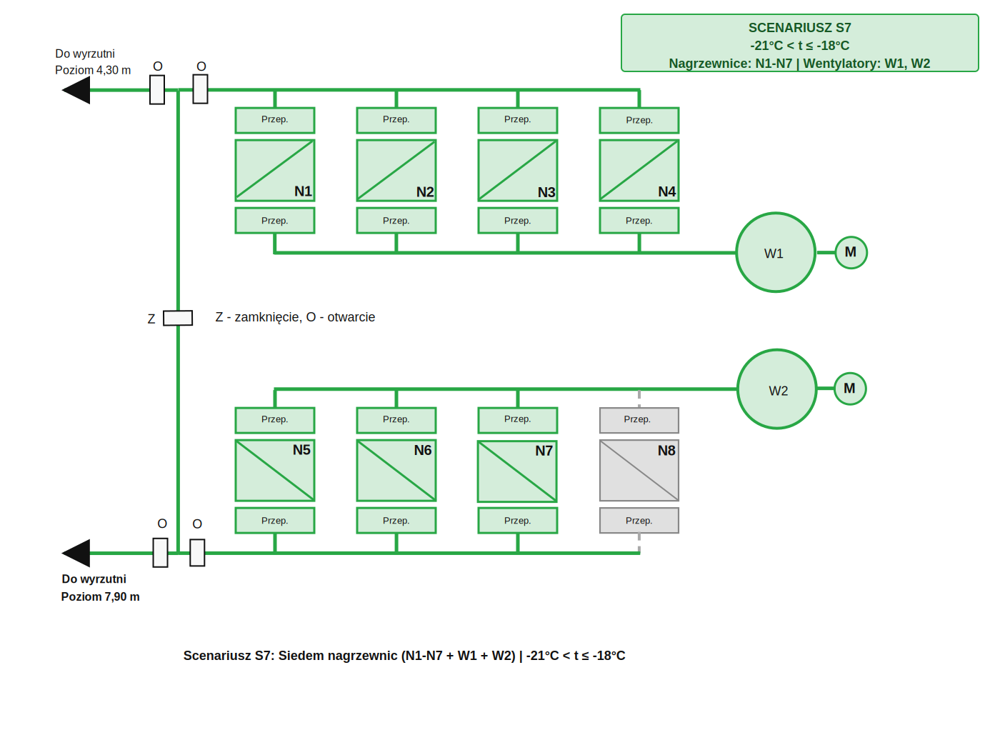

# Projekt Instalacji Ogrzewania Szybu BOGDANKA Szyb 2

## 📄 Dokumentacja Projektowa

### Dokumentacja wejściowa

Szczegółowa dokumentacja techniczna projektu:
- [Projekt instalacji ogrzewania szybu - PDF](../01-system/dokumentacja-wejsciowa/Projekt%20instalacji%20ogrzewania%20szybu.pdf)
- [Projekt instalacji ogrzewania szybu - dokumentacja](../01-system/dokumentacja-wejsciowa/Projekt%20instalacji%20ogrzewania%20szybu.md)

---

## 1. Układ Instalacji

System składa się z:

### 1.1 Ciąg 1 (C1)
- 4 nagrzewnice: N1, N2, N3, N4
- Wentylator: W1 (sterowanie 25-50 Hz)
- Wyrzutnia: +4,30m

### 1.2 Ciąg 2 (C2)
- 4 nagrzewnice: N5, N6, N7, N8
- Wentylator: W2 (sterowanie 25-50 Hz)
- Wyrzutnia: +7,90m

### 1.3 Elementy Wspólne
- Spinka ciągów (dla układu ograniczonego)
- Przepustnice regulacyjne (ciąg 1, ciąg 2, spinka, wyrzutnie)
- Czujniki temperatury (8 na wylotach nagrzewnic + 1 w szybie na -30m)
- Zawory wody grzewczej (8 regulacyjnych, zakres 20-100%)

### 1.4 Schematy Instalacji

#### Nawiew z dwóch ciągów wentylacyjnych (Układ Podstawowy)


Rys. 1. Nawiew powietrza ogrzanego z wykorzystaniem dwóch ciągów wentylacyjnych.

**Charakterystyka:**
- Oba ciągi pracują niezależnie
- Przepustnica na spince ciągów: **ZAMKNIĘTA**
- Nawiew na poziomy: +4,30m (C1) i +7,90m (C2)
- Stosowany w scenariuszach S5-S8 (temperatura < -11°C)

#### Nawiew z dolnego ciągu przez spinę (Układ Ograniczony)


Rys. 2. Nawiew powietrza ogrzanego do wyrzutni poziomu 4,30 m z wykorzystaniem drugiego ciągu wentylacyjnego przez spinę ciągów.

**Charakterystyka:**
- Ciąg 2 (C2) aktywny, Ciąg 1 (C1) wyłączony
- Przepustnica na spince ciągów: **OTWARTA**
- Nawiew przez spinę na poziom: +4,30m
- Stosowany w scenariuszach S1-S4 podczas rotacji układów (Algorytm RC)

---

## 2. Schematy Regulacji (UAR)

### 2.1 UAR Nagrzewnicy (Tz = 50°C)

Regulator PID steruje zaworem wody grzewczej:
- **Wejście:** temperatura powietrza na wylocie z nagrzewnicy
- **Wyjście:** pozycja zaworu (20-100%)
- **Setpoint:** 50°C


**Opis działania:**
- **Regulator PID** porównuje temperaturę zadaną (Tz=50°C) z temperaturą mierzoną
- **Sygnał sterujący (CV)** kontroluje zawór regulacyjny wody grzewczej (20-100%)
- **Zawór regulacyjny** zmienia przepływ gorącej wody przez nagrzewnicę
- **Czujnik temperatury** mierzy temperaturę powietrza na wylocie
- **Pętla sprzężenia zwrotnego** zapewnia automatyczną regulację
- 🔴 Woda grzewcza (zasilanie) - czerwona linia
- 🔵 Woda powrotna - niebieska linia
- 🟢 Sygnały sterujące/pomiarowe - ciemnozielone przerywane linie

**Stan aktywny:**
- Regulator PID w trybie REGULACJA (CV = 20-100%, zmienne)
- Przepustnice otwarte
- Ciągła korekta temperatury

**Stan nieaktywny:**
- Regulator PID w trybie UTRZYMANIE (CV = 20%, stałe)
- Zawór utrzymywany na 20% (ochrona przed zamrożeniem)
- Przepustnice zamknięte

📄 `schematy/schemat_uar_nagrzewnica.svg`

### 2.2 UAR Wentylatora (Ts = 2°C)

Regulator PID steruje częstotliwością wentylatora:
- **Wejście:** temperatura w szybie (na -30m)
- **Wyjście:** częstotliwość (25-50 Hz)
- **Setpoint:** 2°C


**Opis działania:**
- **Regulator PID** utrzymuje temperaturę w szybie (Ts=2°C na poziomie -30m)
- **Sygnał sterujący (CV)** kontroluje częstotliwość (25-50 Hz)
- **Przetwornica częstotliwości (Falownik)**
  - Konwertuje sygnał PID na zmienną częstotliwość
  - Wyjście: 400V 3~ o częstotliwości 25-50 Hz
  
- **Wentylator (W1/W2)**
  - W1 obsługuje nagrzewnice N1-N4 (poziom 4,30m)
  - W2 obsługuje nagrzewnice N5-N8 (poziom 7,90m)
  - Wydajność zależy od prędkości obrotowej

- **Czujnik temperatury w szybie**
  - Poziom -30m
  - Sprzężenie zwrotne do regulatora

**Logika regulacji:**
- 🔻 T_szyb ↓ (za zimno) → PID ↑ częstotliwość → silnik szybciej → więcej ciepłego powietrza
- 🔺 T_szyb ↑ (za ciepło) → PID ↓ częstotliwość → silnik wolniej → mniej ciepłego powietrza

📄 `schematy/schemat_uar_predkosc_wentylatora.svg`

---

## 3. Układy Pracy

### 3.1 Układ Podstawowy (S1-S8)

**Dla S1-S4:**
- Aktywny: Ciąg 1 (C1)
- Wentylator: W1 (PID)
- Nawiew: +4,30m
- Spinka: zamknięta

**Dla S5-S8:**
- Aktywny: Ciąg 1 (C1) + Ciąg 2 (C2)
- Wentylatory: W1 (MAX 50 Hz), W2 (PID)
- Nawiew: +4,30m i +7,90m
- Spinka: zamknięta

📄 Zobacz: [Schematy scenariuszy S0-S8](#5-scenariusze-pracy-systemu)

### 3.2 Układ Ograniczony (S1-S4)

**Zastosowanie:** Podczas rotacji układów (Algorytm RC)

- Aktywny: Ciąg 2 (C2)
- Wentylator: W2 (PID)
- Nawiew: przez spinę do +4,30m
- Spinka: otwarta
- Przepustnica C1: zamknięta

📄 Zobacz: [Rotacja układów RC](#63-algorytm-rc-rotacja-układów-pracy-ciągów)

---

## 4. Parametry Techniczne

### 4.1 Nagrzewnice
- Ilość: 8 (N1-N8)
- Temperatura powietrza na wylocie: 50°C (regulowana)
- Zawory: 8 regulacyjnych (20-100%)
- Ochrona antyzamrożeniowa: min. 20% otwarcia zaworu

### 4.2 Wentylatory
- Ilość: 2 (W1, W2)
- Zakres częstotliwości: 25-50 Hz
- Tryby pracy: PID / MAX / OFF
- Sterowanie: falownik (przetwornica częstotliwości)

### 4.3 Przepustnice
- Ciąg 1: główna + kolektor
- Ciąg 2: główna + kolektor
- Spinka: regulacyjna (dla układu ograniczonego)
- Wyrzutnie: +4,30m, +7,90m

### 4.4 Czujniki
- Temperatura zewnętrzna: 1 czujnik (wejście do Algorytmu WS)
- Temperatury nagrzewnic: 8 czujników (wyloty N1-N8)
- Temperatura w szybie: 1 czujnik (poziom -30m)

---

## 5. Scenariusze Pracy Systemu

System automatycznie przełącza się między scenariuszami pracy w zależności od temperatury zewnętrznej (t_zewn) oraz algorytmów rotacji:

**Scenariusze bazowe (S0-S8):** 9 scenariuszy zależnych od temperatury  
**Algorytm WS:** Automatyczny wybór scenariusza  
**Algorytm RC:** Rotacja układów pracy ciągów (Podstawowy ↔ Ograniczony)  
**Algorytm RN:** Rotacja nagrzewnic w obrębie ciągu

📖 **[Szczegóły algorytmów sterowania](../02-algorytmy/algorytmy.md)**

### 5.0 Scenariusz S0: Brak Ogrzewania
**Warunki:** t ≥ 3°C | **Nagrzewnice:** Brak | **Wentylatory:** Brak


**Stan systemu:**
- Wszystkie nagrzewnice wyłączone
- Wszystkie wentylatory wyłączone
- Wszystkie zawory zamknięte (Z)
- Brak przepływu powietrza (przepustnice zamknięte)
- System w trybie czuwania - oszczędzanie energii

---

### 5.1 Scenariusz S1: Minimalne Ogrzewanie
**Warunki:** -1°C < t ≤ 2°C | **Nagrzewnice:** N1 | **Wentylatory:** W1 (PID)


**Stan systemu:**
- Nagrzewnica N1 aktywna (zielona)
- Wentylator W1 pracuje z regulacją PID
- Nawiew do wyrzutni poziom 4,30m
- Temp. docelowa: 50°C na wylocie z N1

---

### 5.2 Scenariusz S2: Dwie Nagrzewnice
**Warunki:** -4°C < t ≤ -1°C | **Nagrzewnice:** N1-N2 | **Wentylatory:** W1 (PID)


**Stan systemu:**
- Nagrzewnice N1, N2 aktywne
- Wentylator W1 pracuje z regulacją PID
- Nawiew do wyrzutni poziom 4,30m
- Zwiększona moc grzewcza przy spadku temperatury

---

### 5.3 Scenariusz S3: Trzy Nagrzewnice
**Warunki:** -8°C < t ≤ -4°C | **Nagrzewnice:** N1-N3 | **Wentylatory:** W1 (PID)


**Stan systemu:**
- Nagrzewnice N1, N2, N3 aktywne
- Wentylator W1 pracuje na wyższej mocy
- Nawiew do wyrzutni poziom +4,30m
- Stopniowe zwiększanie mocy grzewczej

---

### 5.4 Scenariusz S4: Pełny Górny Ciąg
**Warunki:** -11°C < t ≤ -8°C | **Nagrzewnice:** N1-N4 | **Wentylatory:** W1 (PID lub MAX)


**Stan systemu:**
- Wszystkie nagrzewnice górnego ciągu (N1-N4) aktywne
- Wentylator W1 w pełnej mocy
- Nawiew do wyrzutni poziom +4,30m
- Maksymalna moc górnego ciągu

---

### 5.5 Scenariusz S5: Uruchomienie Dolnego Ciągu
**Warunki:** -15°C < t ≤ -11°C | **Nagrzewnice:** N1-N5 | **Wentylatory:** W1 (MAX), W2 (PID)


**Stan systemu:**
- Nagrzewnice N1-N5 aktywne (wszystkie z ciągu 1 + jedna z ciągu 2)
- Wentylator W1 pracuje z maksymalną prędkością (50 Hz)
- Wentylator W2 sterowany regulatorem PID (25-50 Hz)
- **Nawiew na OBA poziomy: +4,30m i +7,90m**
- Uruchomienie drugiego ciągu wentylacyjnego
- Znaczące zwiększenie mocy grzewczej

---

### 5.6 Scenariusz S6: Sześć Nagrzewnic
**Warunki:** -18°C < t ≤ -15°C | **Nagrzewnice:** N1-N6 | **Wentylatory:** W1 (MAX), W2 (PID)


**Stan systemu:**
- Nagrzewnice N1-N6 aktywne (cały ciąg 1 + dwie z ciągu 2)
- Wentylator W1 pracuje z maksymalną prędkością (50 Hz)
- Wentylator W2 sterowany regulatorem PID (25-50 Hz)
- **Nawiew na OBA poziomy: +4,30m i +7,90m**
- Zwiększona moc dolnego ciągu (N5-N6)

---

### 5.7 Scenariusz S7: Siedem Nagrzewnic
**Warunki:** -21°C < t ≤ -18°C | **Nagrzewnice:** N1-N7 | **Wentylatory:** W1 (MAX), W2 (PID)



**Stan systemu:**
- Nagrzewnice N1-N7 aktywne (cały ciąg 1 + trzy z ciągu 2)
- Wentylator W1 pracuje z maksymalną prędkością (50 Hz)
- Wentylator W2 sterowany regulatorem PID (25-50 Hz)
- **Nawiew na OBA poziomy: +4,30m i +7,90m**
- Bardzo niskie temperatury zewnętrzne

---

### 5.8 Scenariusz S8: Maksymalne Obciążenie
**Warunki:** t ≤ -21°C | **Nagrzewnice:** N1-N8 | **Wentylatory:** W1 (MAX), W2 (PID)


**Stan systemu:**
- WSZYSTKIE nagrzewnice N1-N8 aktywne (wszystkie z obu ciągów)
- Wentylator W1 pracuje z maksymalną prędkością (50 Hz)
- Wentylator W2 sterowany regulatorem PID (25-50 Hz)
- **Nawiew na OBA poziomy: +4,30m i +7,90m**
- System działa na maksymalnym obciążeniu - pełna moc obu ciągów

---

## 6. Algorytmy Sterowania - Wizualizacje

System wykorzystuje **trzy współpracujące algorytmy** zapewniające automatyczne sterowanie i równomierne rozłożenie eksploatacji urządzeń:

### 6.1 Algorytm WS: Automatyczny Wybór Scenariusza

**Cel algorytmu:**
- Automatyczny dobór scenariusza (S0-S8) w zależności od temperatury zewnętrznej
- Określa ILE nagrzewnic potrzeba do utrzymania 2°C w szybie
- Ciągły monitoring temperatury z histerezą przy wyłączaniu
- Bezpieczne sekwencje przejść między scenariuszami


**Kluczowe elementy:**
- **KROK 1:** Odczyt czujnika t_zewn z filtrem uśredniania (3 próbki)
- **KROK 2:** Określenie wymaganego scenariusza na podstawie drzewa decyzyjnego
  - t ≥ 3°C → S0 (brak ogrzewania)
  - -1°C < t ≤ 2°C → S1 (1 nagrzewnica)
  - -4°C < t ≤ -1°C → S2 (2 nagrzewnice)
  - ... itd. aż do S8 (8 nagrzewnic przy t ≤ -21°C)
- **KROK 3:** Sprawdzenie czy wymagana zmiana scenariusza
  - Uwzględnienie czasu stabilizacji (60s)
  - Sprawdzenie trybu AUTO/MANUAL
- **KROK 4:** Wykonanie zmiany scenariusza (sekwencja bezpieczna)
  - Zatrzymanie zbędnych nagrzewnic
  - Konfiguracja wentylatorów (PID/MAX/OFF)
  - Uruchomienie dodatkowych nagrzewnic
- **KROK 5:** Aktualizacja statystyk i monitoringu

**Obsługa awarii czujnika:**
- Przy braku odczytu → utrzymanie ostatniego scenariusza przez 300s
- Po przekroczeniu czasu → alarm krytyczny i przełączenie na tryb MANUAL

**Histereza temperaturowa:**
- Różne progi dla włączania i wyłączania (zapobiega oscylacjom)
- Przykład S3: włączenie przy -4°C, wyłączenie dopiero przy -3°C (1°C histerezy)

📖 **[Szczegółowy algorytm WS](../02-algorytmy/algorytm-WS-wybor-scenariusza.md)**

---

### 6.2 Algorytm RC: Rotacja Układów Pracy Ciągów

**Cel algorytmu:**
- Cykliczna zmiana układu pracy między Podstawowym a Ograniczonym
- Wyrównanie eksploatacji W1 i W2
- Okres rotacji: definiowany przez technologa (np. 168h / 7 dni)


**Zasada działania:**
- **Układ Podstawowy:** Ciąg 1 (N1-N4) + W1 → nawiew na +4,30m
- **Układ Ograniczony:** Ciąg 2 (N5-N8) + W2 → nawiew przez **spinę ciągów** na +4,30m

**Algorytm:**
- **Główna pętla:** Wykonywana co CYKL_PĘTLI_ALGORYTMÓW (domyślnie 60s)
- **Krok 1:** Sprawdzenie warunków rotacji (scenariusz S1-S4, gotowość C2, tryb AUTO)
- **Krok 2:** Sprawdzenie czy upłynął okres rotacji (OKRES_ROTACJI_UKŁADÓW)
- **Krok 3:** Określenie nowego układu (Podstawowy ↔ Ograniczony)
- **Krok 4:** Wykonanie sekwencji zmiany układu (z koordynacją z Algorytmem RN)
- **Krok 5:** Aktualizacja liczników czasu pracy

#### Rotacja dla poszczególnych scenariuszy:

**S1: Rotacja przy minimalnym ogrzewaniu (1 nagrzewnica)**

**Zakres temperatur:** -1°C < t ≤ 2°C

| Układ | Nagrzewnice | Wentylator | Wizualizacja |
|-------|-------------|------------|--------------|
| **Podstawowy** | N1 | W1 PID |  |
| **Ograniczony** | N5 | W2 PID |  |

---

**S2: Rotacja przy umiarkowanym ogrzewaniu (2 nagrzewnice)**

**Zakres temperatur:** -4°C < t ≤ -1°C

| Układ | Nagrzewnice | Wentylator | Wizualizacja |
|-------|-------------|------------|--------------|
| **Podstawowy** | N1, N2 | W1 PID |  |
| **Ograniczony** | N5, N6 | W2 PID |  |

---

**S3: Rotacja przy średnim ogrzewaniu (3 nagrzewnice)**

**Zakres temperatur:** -8°C < t ≤ -4°C

| Układ | Nagrzewnice | Wentylator | Wizualizacja |
|-------|-------------|------------|--------------|
| **Podstawowy** | N1, N2, N3 | W1 PID |  |
| **Ograniczony** | N5, N6, N7 | W2 PID |  |

---

**S4: Rotacja przy wysokim ogrzewaniu (4 nagrzewnice)**

**Zakres temperatur:** -11°C < t ≤ -8°C

| Układ | Nagrzewnice | Wentylator | Wizualizacja |
|-------|-------------|------------|--------------|
| **Podstawowy** | N1-N4 | W1 PID |  |
| **Ograniczony** | N5-N8 | W2 PID |  |

**Uwagi:**
- Rotacja działa **tylko** w scenariuszach S1-S4 (temperatury umiarkowane)
- W scenariuszach S5-S8 rotacja **nie jest stosowana** - system zawsze pracuje w układzie Podstawowym

📖 **[Szczegółowy algorytm RC](../02-algorytmy/algorytm-RC-rotacja-ciagow.md)**

---

### 6.3 Algorytm RN: Rotacja Nagrzewnic w Obrębie Ciągu

**Cel algorytmu:**
- Równomierne zużycie wszystkich nagrzewnic w ciągu
- Okres rotacji: definiowany przez technologa (np. 168h / 7 dni)
- Po 3 miesiącach: > 90% wyrównania czasu pracy wszystkich nagrzewnic


**Zasada:** Najdłużej pracująca → Postój, Najdłużej w postoju → Praca

#### Przykład zastosowania algorytmu dla S3 (3 nagrzewnice w ciągu):

**Tydzień 1: N1, N2, N3**


**Pracują:** N1 (najstarsza), N2, N3  
**Postój:** N4

---

**Tydzień 2: N2, N3, N4**


**Pracują:** N2, N3, N4 (najnowsza)  
**Postój:** N1 (odpoczynek po najdłuższym czasie pracy)  
**Akcja:** Wyłączono N1, załączono N4

---

**Tydzień 3: N3, N4, N1**


**Pracują:** N3, N4, N1  
**Postój:** N2 (odpoczynek)  
**Akcja:** Wyłączono N2, załączono N1

---

**Tydzień 4: N4, N1, N2**


**Pracują:** N4, N1, N2  
**Postój:** N3 (odpoczynek)  
**Akcja:** Wyłączono N3, załączono N2

📖 **[Szczegółowy algorytm RN](../02-algorytmy/algorytm-RN-rotacja-nagrzewnic.md)**

---

### 6.4 Koordynacja Algorytmów RC i RN


**Diagram timeline** pokazuje przykładową sekwencję zdarzeń dla scenariusza S3:
- Blokady (mutex) między algorytmami
- Odstępy czasowe (1h po zmianie układu, 15min między rotacjami)
- Mechanizmy zapobiegania konfliktom
- 10 kluczowych wydarzeń w czasie (0h → 410h)

---

## 7. System SCADA/HMI

### 7.1 Panel Główny - Elementy Wizualizacji

#### Kolory i Konwencje Wizualne:

**Stan Elementów:**
- 🟢 **Zielony** - Element aktywny, pracujący
- ⚪ **Szary** - Element nieaktywny, wyłączony
- 🔴 **Czerwony** - Awaria, alarm
- 🟡 **Żółty** - Ostrzeżenie, tryb przejściowy

**Przepływy:**
- **Linie ciągłe** (grube) - Aktywny przepływ
- **Linie przerywane** (cienkie) - Brak przepływu lub przepływ minimalny
- 🔴 **Czerwony** - Woda grzewcza (zasilanie, gorąca)
- 🔵 **Niebieski** - Woda powrotna (chłodniejsza)
- 🟢 **Ciemnozielony** - Sygnały sterujące/pomiarowe PID
- ⚪ **Szary** - Powietrze

**Zawory:**
- **Z** - Zamknięty
- **O** - Otwarty
- **%** - Pozycja w procentach (dla zaworów regulacyjnych)

### 7.2 Główne Wskaźniki na Panelu HMI

**Temperatury:**
- **t_zewn** - Temperatura zewnętrzna [°C]
- **Tz** - Temperatura zadana na wylocie z nagrzewnicy (50°C)
- **T_N1...T_N8** - Temperatury rzeczywiste na wylotach z nagrzewnic [°C]
- **Ts** - Temperatura zadana w szybie (2°C)
- **T_szyb** - Temperatura rzeczywista w szybie na poziomie -30m [°C]

**Parametry Wentylatorów:**
- **W1_f** - Częstotliwość wentylatora W1 [Hz] (25-50)
- **W2_f** - Częstotliwość wentylatora W2 [Hz] (25-50)
- **W1_I** - Prąd silnika W1 [A]
- **W2_I** - Prąd silnika W2 [A]

**Zawory Regulacyjne:**
- **Z_N1...Z_N8** - Pozycje zaworów regulacyjnych [%] (20-100)

**Statusy:**
- **Scenariusz** - Aktualny scenariusz pracy (S0-S8)
- **Układ Pracy** - Podstawowy / Ograniczony
- **Tryb** - AUTO / MANUAL
- **Alarmy** - Lista aktywnych alarmów

**Rotacje (Algorytmy RC i RN):**
- **Czas do rotacji układów (RC)** - Pozostały czas do zmiany układu [h]
- **Aktualny układ** - Podstawowy / Ograniczony
- **Czas pracy C1** - Łączny czas pracy ciągu 1 [h]
- **Czas pracy C2** - Łączny czas pracy ciągu 2 [h]
- **Stosunek C1/C2** - Proporcja eksploatacji (cel: ~1.0)
- **Czas do rotacji nagrzewnic (RN)** - Pozostały czas do wymiany nagrzewnicy [h]
- **Czasy pracy N1-N8** - Łączne czasy pracy poszczególnych nagrzewnic [h]
- **Liczba załączeń N1-N8** - Liczniki startów nagrzewnic

### 7.3 Tryby Pracy Systemu

**Tryb AUTO (Automatyczny):**
- System automatycznie wybiera scenariusz na podstawie t_zewn
- Regulatory PID aktywnie kontrolują:
  - Temperaturę powietrza (zawory N1-N8)
  - Temperaturę w szybie (wentylatory W1-W2)
- Automatyczne włączanie/wyłączanie nagrzewnic
- Automatyczna regulacja prędkości wentylatorów

**Tryb MANUAL (Ręczny):**
- Operator ma pełną kontrolę nad systemem
- Możliwość ręcznego ustawienia:
  - Pozycji zaworów (20-100%)
  - Częstotliwości wentylatorów (25-50 Hz)
  - Włączenia/wyłączenia poszczególnych nagrzewnic
- Zabezpieczenia nadal aktywne (min. 20% zaworu, limity temperatur)

### 7.4 System Alarmów

**Alarmy Krytyczne (Czerwone):**
- 🔴 **Brak odczytu t_zewn** - Utrzymanie ostatniego stanu
- 🔴 **Temperatura > 60°C** - Zamknięcie zaworu do 20%
- 🔴 **Wentylator nie pracuje** - Wyłączenie odpowiednich nagrzewnic
- 🔴 **Temp. wody < 5°C** - Ryzyko zamrożenia

**Alarmy Ostrzegawcze (Żółte):**
- 🟡 **Temperatura < 40°C** przy pracy - Zwiększenie otwarcia zaworu
- 🟡 **Przepustnica nie reaguje** - Kontynuacja pracy
- 🟡 **Zbyt długi czas nagrzewania** - Sprawdzenie parametrów PID

**Informacje (Niebieskie):**
- 🔵 **Zmiana scenariusza** - Automatyczne przełączenie
- 🔵 **Przełączenie AUTO/MANUAL** - Zmiana trybu przez operatora
- 🔵 **Zmiana parametrów PID** - Modyfikacja nastaw

### 7.5 Trendy Historyczne

Panel HMI umożliwia wyświetlanie trendów:
- Temperatura zewnętrzna (24h)
- Temperatura w szybie (24h)
- Temperatury na wylotach z nagrzewnic (8 krzywych)
- Pozycje zaworów regulacyjnych (8 krzywych)
- Częstotliwości wentylatorów (2 krzywe)
- Pobór mocy całkowity [kW]

### 7.6 Ekrany Dostępne w Systemie

1. **Ekran Główny** - Synoptyka z aktualnym scenariuszem i układem pracy
2. **Szczegóły Nagrzewnic** - Parametry N1-N8, czasy pracy, liczba załączeń
3. **Szczegóły Wentylatorów** - Parametry W1-W2, czasy pracy ciągów
4. **Trendy** - Wykresy historyczne
5. **Alarmy** - Historia i aktywne alarmy
6. **Nastawy** - Parametry PID, temperatury zadane, okresy rotacji
7. **Diagnostyka** - Stan urządzeń i statystyki
8. **Rotacja RC** - Historia zmian układów, stosunek eksploatacji C1/C2
9. **Rotacja RN** - Czasy pracy nagrzewnic, predykcja następnej rotacji

### 7.7 Parametry Nastaw PID

**UAR Temperatury Nagrzewnic (N1-N8):**
```
Kp = [do określenia podczas rozruchu]
Ti = [do określenia podczas rozruchu]
Td = [do określenia podczas rozruchu]
Tz = 50°C (stała)
CV_min = 20% (ochrona antyzamrożeniowa)
CV_max = 100%
```

**UAR Prędkości Wentylatorów (W1, W2):**
```
Kp = [do określenia podczas rozruchu]
Ti = [do określenia podczas rozruchu]
Td = [do określenia podczas rozruchu]
Ts = 2°C (stała)
f_min = 25 Hz (minimalna prędkość)
f_max = 50 Hz (maksymalna prędkość)
```

### 7.8 Wymagania Techniczne

**Platforma SCADA:** iFix, WinCC, Wonderware, Ignition lub podobna  
**Komunikacja PLC:** Modbus TCP/RTU, OPC UA lub protokół właścicielski  
**Czas odświeżania:** 1s dla parametrów procesowych  
**Archiwizacja:** min. 1 rok danych historycznych  
**Rozdzielczość:** min. 1920x1080 dla pełnej wizualizacji

**Poziomy dostępu:**
- **Operator:** monitoring, kwitowanie alarmów
- **Inżynier:** zmiana trybu AUTO/MANUAL, ręczne sterowanie
- **Administrator:** zmiana nastaw PID, konfiguracja systemu

**Bezpieczeństwo:**
- Logi wszystkich akcji operatora
- Codzienne kopie bezpieczeństwa bazy danych

---

## 8. Podsumowanie Wizualizacji

### 8.1 Zestawienie Plików SVG

- **Łącznie plików SVG:** 23
- **Scenariusze podstawowe (S0-S8):** 9 plików
- **Schematy instalacji:** 2 pliki (nawiew z dwóch ciągów, nawiew przez spinę)
- **Schematy UAR:** 2 pliki (UAR nagrzewnica, UAR wentylator)
- **Rotacja RC (Układy Ograniczone S1-S4):** 4 pliki
- **Rotacja RN (Cykl nagrzewnic):** 3 pliki
- **Diagramy algorytmów:** 4 pliki (flowchart WS, RC, RN, koordynacja RC-RN)

---

## 🔗 Powiązane Dokumenty

- [System Sterowania](../01-system/system.md) - kompletna architektura systemu SAR
- [Algorytmy WS, RC, RN](../02-algorytmy/algorytmy.md) - szczegółowe opisy logiki sterowania
- [Dokumentacja wejściowa](../01-system/dokumentacja-wejsciowa/) - pliki projektowe od zleceniodawcy

---

**Ostatnia aktualizacja:** 24 Listopad 2025  
**Wersja dokumentu:** 4.0  
**Status:** Kompletna dokumentacja projektu instalacji z wizualizacjami systemu SCADA/HMI, scenariuszami pracy i algorytmami sterowania
