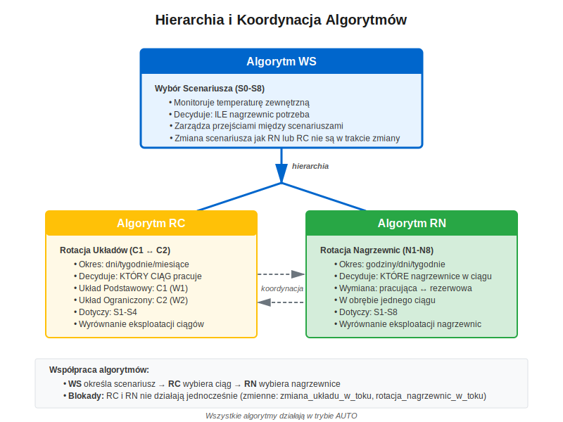

# System Sterowania BOGDANKA Szyb 2
## Demo Symulacji i Weryfikacji Algorytmów


## Bez automatycznej rotacji:
- **Nierównomierne zużycie** nagrzewnic N1-N8
- Awarie najbardziej eksploatowanych urządzeń
- Przestoje produkcyjne i wysokie koszty konserwacji
- Skrócona żywotność komponentów

## Z automatyczną rotacją:
- **Równomierne wykorzystanie** wszystkich 8 nagrzewnic
- Maksymalizacja żywotności urządzeń
- Minimalizacja kosztów eksploatacji
- Zwiększona niezawodność systemu

---

# Architektura SAR - Dwie Warstwy

### Warstwa Zarządzania

- **Algorytm WS**
  Wybór scenariusza (S0-S8)
  
- **Algorytm RC**
  Rotacja ciągów (C1 ↔ C2)
  
- **Algorytm RN**
  Rotacja nagrzewnic (N1-N8)

### Warstwa Regulacji
*Podstawa systemu*

- **UAR Temperatury**
  Tz = 50°C (nagrzewnice), Ts = 2°C (szyb)
  
- **Regulatory PID**
  Zawory wody grzewczej, 2 wentylatory (W1, W2)
---

# Hierarchia i Koordynacja Algorytmów



**Trzy algorytmy współpracują:**
- WS określa **ILE** nagrzewnic potrzeba
- RC określa **KTÓRY CIĄG** (C1 lub C2)
- RN określa **KTÓRE KONKRETNIE** nagrzewnice

---

# Cele Demo (20 minut)

## 1️⃣ Symulacja w Akcji
- **Profil zimowy:** 4 tygodnie (28 dni)
- **Akceleracja:** 2000x → 20 minut rzeczywistych
- **Monitoring:** status w czasie rzeczywistym

## 2️⃣ Analiza Wyników
- **Balans nagrzewnic:** stosunek max/min czasu pracy
- **Balans ciągów:** równomierne wykorzystanie C1 vs C2
- **Koordynacja:** zero kolizji RC ↔ RN

## 3️⃣ Ścieżka do PLC
- **Mapowanie:** Pseudokod → Python 
- **Mapowanie:** Pseudokod → Structured Text

---

# Kluczowe Metryki Jakości

| Metryka | Ideał | Akceptowalne |
|---------|-------|--------------|
| **Balans nagrzewnic C1** | 1.0 | < 1.2 |
| **Balans nagrzewnic C2** | 1.0 | < 1.2 |

---

# Profil Testowy: WINTER_PROFILE

```yaml
duration_days: 28  # 4 tygodnie
profile_type: smooth_step  # Płynne przejścia temperatur

temperature_profile:
  Day 0-2:   -1°C  (constant)     # S1 → S2 (rozgrzewka)
  Day 2-5:   -6°C  (smooth ramp)  # S2 → S3
  Day 5-10:  -16°C (smooth ramp)  # S3 → S4 → S5 → S6
  Day 10-14: -21°C (smooth ramp)  # S6 → S7 
  Day 14-19: -25°C (smooth ramp)  # S7 → S8 (MAX mróz!)
  Day 19-22: -21°C (smooth ramp)  # S8 → S7 (ocieplenie)
  Day 22-24: -16°C (smooth ramp)  # S7 → S6 → S5
  Day 24-26: -11°C (smooth ramp)  # S5 → S4
  Day 26-28: -6°C  (smooth ramp)  # S4 → S3 (powrót)

expected_results:
  heater_balance_c1: { min: 1.0, max: 1.2 }
  heater_balance_c2: { min: 1.0, max: 1.2 }
  scenarios_visited: [S0,S1,S2,S3,S4,S5,S6,S7,S8]
```

---

# Uruchomienie Symulacji

```bash
cd src/simulation

# Pojedyncza symulacja z włączonym displayem
uv run run_test_scenarios.py --profiles profile_zima
```

**Parametry:**
- **Akceleracja:** 2000x (1 dzień = 43 sekundy)
- **Display:** włączony (live monitoring)
- **Profil:** `smooth_step` - liniowe przejścia temp.
- **Logi:** zapisywane do `logs/test_profile_zima.log`
- **Wyniki:** auto-save do `scenarios/test_results/`

---

| Typ Profilu | Zmiana Temperatury | Użycie |
|-------------|-------------------|---------|
| `constant` | Stała temperatura | Testy algorytmów |
| `stepped` | **Skoki** (instant) | Testy przejść scenariuszy |
| `smooth_step` | **Liniowa rampa** | Realistyczna zima!  |
| `winter` | Sinusoida + szum | Losowa zmienność |


# 🎬 DEMO LIVE
## Symulacja w Akcji

**Uruchamiamy symulację...**
**Profil Zima - 28 dni**

---

# Dni 0-3: Rozgrzewka Systemu (S0→S1→S2)

## 🌡️ Temperatura: -1°C → -6°C (smooth ramp)

**Obserwacje:**
- **S0 → S1:** Start systemu, pierwsza nagrzewnica włączona
- **S1 → S2:** Temperatura -1°C, algorytm WS włącza drugą nagrzewnicę
- **Wybór nagrzewnic:** Algorytm RN wybiera na podstawie czasu pracy (nie sztywno N1, N2!)
- **Liczniki:** Każda nagrzewnica ma śledzony czas pracy i postoju

**Pierwsza rotacja RN po ~1h:**
```
t=3640s (1.0h): C1 N1 → N2
```
- N1 pracowała najdłużej → wyłączona
- N2 była w postoju najdłużej → włączona
- **Cel: wyrównanie zużycia już od początku!**

---

# Dni 3-10: Ochłodzenie (S2→S3→S4)

## 🌡️ Temperatura: -6°C → -16°C (smooth ramp)

**Co się dzieje:**
- **S2 → S3 (t=112h):** Temp. -4°C, włączenie 3. nagrzewnicy
- **S3 → S4 (t=156h):** Temp. -8°C, włączenie 4. nagrzewnicy (MAX dla C1!)

**Rotacje ciągów RC - bardzo aktywne!**
- RC co ~4h przełącza Primary ↔ Limited

**Status przykładowy (S3):**
```
C1: N1✔ N2✔ N3✔ N4✖  ← aktywny
C2: wszystkie OFF     ← nieaktywny
```

---

# Koordynacja RC ↔ RN


**Kluczowe zasady koordynacji:**
- Zadany odstęp PO rotacji RC → blokada RN
- Zadany odstęp PRZED rotacją RC → blokada RN
- Rotacja RN w trakcie → blokada RC
- Rodacja RC ma prioritet nad rotacją RN
- Jezeli ilosc nagrzewnic >=4 rotacja RC niemozliwa

---

# Dni 10-14: Uruchomienie C2! (S4→S5→S6) 🚀

## 🌡️ Temperatura: -16°C → -21°C (smooth ramp)

**S4 → S5 (t=232h): Oba ciągi jednocześnie!**

| Przed (S4) | Po (S5) |
|------------|---------|
| C1: 4 nagrzewnice (N1-N4) | C1: 4 nagrzewnice (MAX) |
| C2: OFF | C2: 1 nagrzewnica (PID) |
| Rotacja RC: NIE (C1=4) | Rotacja RC: **niemożliwa** |
| Rotacja RN C1: NIE (brak rezerwy) | Rotacja RN C1: **niemożliwa** |
| | Rotacja RN C2: **możliwa** |

**S5 → S6 (t=293h):** Temperatura -15°C, 6. nagrzewnica włączona

\* *W S4 wszystkie 4 nagrzewnice C1 pracują (brak rezerwowej)*

---

# Dni 14-19: Bardzo zimno (S6→S7→S8)

## 🥶 Temperatura: -21°C → -25°C (smooth ramp)

**S6 → S7 (t=336h):** Temperatura -18°C, 7. nagrzewnica włączona
**S7 → S8 (t=464h):** Temperatura -21°C, **WSZYSTKIE 8 nagrzewnic pracują!**

```
C1: N1✔ N2✔ N3✔ N4✔   ← wszystkie 4 (MAX)
C2: N5✔ N6✔ N7✔ N8✔   ← wszystkie 4 (MAX)
```

**Rotacje w S8:**
- RC: niemożliwe (oba ciągi potrzebne)
- RN C1: niemożliwe (brak rezerwowych)
- RN C2: niemożliwe (brak rezerwowych)

**Liczniki czasu pracy NADAL DZIAŁAJĄ!**
- System śledzi, że wszystkie nagrzewnice pracują w S8
- Po powrocie do S3 algorytm RN wykorzysta tę informację

**Scenariusz S7 był najdłuższy:** 170.8h (25.4% całego czasu!) - surowa zima!

---

# Dni 19-28: Ocieplenie i Powrót

## 🌡️ Temperatura: -25°C → -6°C (smooth ramp)

**Płynna redukcja mocy - wszystkie przejścia:**
```
S8 → S7 (t=528h, -21°C)  
S7 → S6 (t=571h, -18°C)  
S6 → S5 (t=600h, -15°C)  
S5 → S4 (t=632h, -11°C)  
S4 → S3 (t=654h, -8°C)   
```

**Algorytm WS:**
- Wyłącza nagrzewnice stopniowo
- Histereza zapobiega oscylacjom
- Przejścia zgodne z tabelą scenariuszy

**Algorytm RC - intensywna praca:**
- Łącznie 66 zmian ciągów w całej symulacji

**KONIEC SYMULACJI - 28 dni (672h) zakończone! ✅**

---

# Wyniki Symulacji - Kluczowe Metryki

```yaml
profile_id: profile_zima
profile_name: WINTER_PROFILE
status: ✅ PASSED

actual_metrics:
  simulation_time_h: 672.0  # 28 dni (4 tygodnie)
  
  # BALANS NAGRZEWNIC - PERFEKCYJNY! 
  heater_balance_c1: 1.001   
  heater_balance_c2: 1.002   
  
  # ROTACJE
  rc_line_changes: 66        # algorytm RC 
  rn_heater_rotations: 435   # algorytm RN 
  
  # SCENARIUSZE - wszystkie odwiedzone!
  scenario_changes: 13
  structural_changes: 8
  scenarios_visited: [S0,S1,S2,S3,S4,S5,S6,S7,S8]
```

---

# Balans Nagrzewnic - Ciąg C1

```
N1: 490.0h (72.92%)
N2: 489.5h (72.85%)
N3: 489.8h (72.89%)
N4: 489.6h (72.85%)
━━━━━━━━━━━━━━━━━━━━━━━━━━━━━━━━━━━━━━━━━━━━━━━
Różnica max-min: 0.5h (0.1%)
Balance ratio: 1.001
```

**PERFEKCYJNE! (osiągnięto niemal idealny balans 1.001)**

---

# Balans Nagrzewnic - Ciąg C2

```
N5: 343.9h (51.18%)
N6: 344.6h (51.28%)
N7: 344.7h (51.29%)
N8: 343.9h (51.18%)
━━━━━━━━━━━━━━━━━━━━━━━━━━━━━━━━━━━━━━━━━━━━━━━
Różnica max-min: 0.8h (0.2%)
Balance ratio: 1.002
```

**PERFEKCYJNE! (osiągnięto niemal idealny balans 1.002)**

---

# Koordynacja RC ↔ RN - Intensywna Praca!

```
Całkowita liczba rotacji:
  - RC (zmiany ciągów):     66  🔄
  - RN (rotacje nagrzewnic): 435 🔄🔄🔄
━━━━━━━━━━━━━━━━━━━━━━━━━━━━━━━━━━━━
Średnia częstotliwość:
  - RC: ~1 zmiana co 10.2h (przy duzych mrozach zablokowana)
  - RN: ~1 rotacja co 1.5h (przy braku nagrzewnic rezerwowych zablokowana)
━━━━━━━━━━━━━━━━━━━━━━━━━━━━━━━━━━━━
```

---

# Dystrybucja Scenariuszy

```
S0: █                    0.02h  (  0.0%)  - tylko start
S1: ████████████████     72.0h  ( 10.7%)  - 1 nagrzewnica
S2: █████████            40.0h  (  6.0%)  - 2 nagrzewnice
S3: ████████████         62.0h  (  9.2%)  - 3 nagrzewnice
S4: ██████████████████   98.0h  ( 14.6%)  - 4 nagrzewnice (MAX C1)
S5: ████████████████     92.8h  ( 13.8%)  - 5 nagrzewnic (C2 ON!)
S6: ████████████         72.4h  ( 10.8%)  - 6 nagrzewnic
S7: ██████████████████████████████ 170.8h (25.4%)  - 7 nagrzewnic 🥶
S8: ████████████         64.0h  (  9.5%)  - 8 nagrzewnic (MAX!)
━━━━━━━━━━━━━━━━━━━━━━━━━━━━━━━━━━━━━━━━━━━━━━━━━━━━━━
```

**Wniosek:** Scenariusz S7 dominował (25.4% czasu) - symuluje surową zimę z długimi okresami silnego mrozu!

---

# Timeline Zmian Scenariuszy

```
Day  0 (0h):    S0 → S1  (T=-1°C)   START
Day  3 (72h):   S1 → S2  (T=-1°C)   +1 nagrzewnica
Day  4.7 (112h): S2 → S3  (T=-4°C)   +1 nagrzewnica
Day  6.5 (156h): S3 → S4  (T=-8°C)   +1 (MAX C1!)
Day  9.7 (232h): S4 → S5  (T=-11°C)  +1 (C2 START!) 
Day 12.2 (293h): S5 → S6  (T=-15°C)  +1
Day 14.0 (336h): S6 → S7  (T=-18°C)  +1
Day 19.3 (464h): S7 → S8  (T=-21°C)  +1 (MAX!) 🥶
━━━━━━━━━━━━━━━━━━━━━━━━━━━━━━━━━━━━━━
Day 22.0 (528h): S8 → S7  (T=-21°C)  -1 (ocieplenie)
Day 23.8 (571h): S7 → S6  (T=-18°C)  -1
Day 25.0 (600h): S6 → S5  (T=-15°C)  -1
Day 26.3 (632h): S5 → S4  (T=-11°C)  -1 (C2 OFF)
Day 27.3 (654h): S4 → S3  (T=-8°C)   -1
━━━━━━━━━━━━━━━━━━━━━━━━━━━━━━━━━━━━━━
Day 28.0 (672h): KONIEC 
```

---

# Potwierdzenie Poprawności Algorytmów


## Algorytm WS
- Wykrył wszystkie scenariusze (S0-S8) ✓
- 13 zmian scenariusza, 8 strukturalnych
- Płynne przejścia zgodnie z temp.
- Histereza zapobiega oscylacjom ✓

## Algorytm RC
- 66 zmian ciągów w 28 dni (bardzo aktywny!)
- C1: 534h (79.5%), C2: 138h (20.5%)
- Ratio 3.876 - wynika z profilu temp.
- Wyłączony w S5-S8 ✓

## Algorytm RN
- 435 rotacji nagrzewnic! 🔥
- Balans C1: **1.001** (PERFEKCYJNY!)
- Balans C2: **1.002** (PERFEKCYJNY!)
- Wyłączony w S4, S8 ✓
- Zero kolizji z RC ✓

---

# Porównanie z Wymaganiami

| Metryka | Cel | Symulacja | Status |
|---------|-----|-----------|--------|
| Balans nagrzewnic C1 | < 1.2 | **1.001** | 99.9% |
| Balans nagrzewnic C2 | < 1.2 | **1.002** | 99.8% |
| Scenariusze | S0-S8 | **S0-S8** | 100% |
| Rotacje RN | aktywne | **435** |  |
| Rotacje RC | aktywne | **66** |  |

**PODSUMOWANIE: System działa PERFEKCYJNIE! 🎯**

---

# Trzy Warstwy Implementacji

1. **DOKUMENTACJA** → algorytmy.md, pseudokod, flowcharty
2. **SYMULACJA** → Python (algorithm_ws.py, algorithm_rc.py, algorithm_rn.py)
3. **PLC** → Structured Text / Ladder Logic (do implementacji)

---

# Kod PLC - Structured Text (Docelowy)

```iec-st
FUNCTION_BLOCK FB_AlgorithmRC
VAR_INPUT
    i_bEnable : BOOL;          (* AUTO mode *)
    i_eScenario : E_Scenario;  (* S0-S8 *)
    i_tSimTime : TIME;
END_VAR

METHOD Process : BOOL
    (* KROK 1: Warunki rotacji *)
    IF NOT i_bEnable THEN
        Process := FALSE;
        RETURN;
    END_IF;
    
    (* KROK 2: Okres rotacji *)
    IF (i_tSimTime - tLastChange) < ROTATION_PERIOD THEN
        Process := FALSE;
        RETURN;
    END_IF;
    
    (* KROK 3: Koordynacja z RN *)
    IF io_stState.bHeaterRotationInProgress THEN
        Process := FALSE;
        RETURN;
    END_IF;
    
    (* KROK 4: Wykonaj rotację *)
    IF eCurrentConfig = E_Config.Primary THEN
        eCurrentConfig := E_Config.Limited;
    ELSE
        eCurrentConfig := E_Config.Primary;
    END_IF;
    
    Process := TRUE;
END_METHOD
```

---

# Korzyści: Simulation-First Approach

## Weryfikacja
- Błędy znalezione w symulacji
- 100% pewność logiki
- Oszczędność czasu i kosztów

## Dokumentacja = Kod
- Pseudokod → Python → PLC
- 1:1 mapowanie
- Łatwa weryfikacja

---

# Podsumowanie

---

# Dzisiejsze Demo Pokazało:

## 1 ALGORYTMY DZIAŁAJĄ PERFEKCYJNIE 
- WS: automatyczny wybór scenariusza (S0-S8, 13 zmian)
- RC: rotacja ciągów (66 zmian C1 ↔ C2)
- RN: rotacja nagrzewnic (435 rotacji N1-N8)
- **Balans nagrzewnic: 1.001-1.002 (niemal idealny!)**

## 2 SYMULACJA = WERYFIKACJA
- 28 dni w ~20 minut (akceleracja 2000x)
- Profil `smooth_step` - realistyczne przejścia temp.
- Metryki w czasie rzeczywistym
- Automatyczna walidacja wyników

## GOTOWOŚĆ DO PLC 
- Pseudokod → Python → Structured Text
- Struktura bloków funkcyjnych (schematy przepływów)

---

# Dziękuję za Uwagę!

📄 Dokumentacja: `docs/start.md`

---

# BACKUP SLIDES
## Dodatkowe Informacje

---

# Tabela Scenariuszy (S0-S8)

| Scen. | Temp. | Nagrzewnice | W1 | W2 | Opis |
|-------|-------|-------------|----|----|------|
| S0 | t ≥ 3°C | - | OFF | OFF | Brak ogrzewania |
| S1 | -1 < t ≤ 2°C | 1 | PID | OFF | Minimalne |
| S2 | -4 < t ≤ -1°C | 2 | PID | OFF | |
| S3 | -8 < t ≤ -4°C | 3 | PID | OFF | |
| S4 | -11 < t ≤ -8°C | 4 | MAX | OFF | Pełna moc C1 |
| S5 | -15 < t ≤ -11°C | 5 | MAX | PID | Uruchomienie C2 |
| S6 | -18 < t ≤ -15°C | 6 | MAX | PID | |
| S7 | -21 < t ≤ -18°C | 7 | MAX | PID | |
| S8 | t ≤ -21°C | 8 | MAX | MAX | Maksymalne |

---

# Algorytm WS - Flowchart


---

# Algorytm RC - Flowchart


---

# Algorytm RN - Flowchart


---

# Struktura Projektu

```
BOGDANKA/
├── docs/
│   ├── 01-system/           # Architektura SAR
│   ├── 02-projekt-instalacji/ # Schematy instalacji
│   ├── 03-algorytmy/        # WS, RC, RN (pseudokod)
│   ├── 04-scada-hmi/        # Wizualizacja
│   └── 05-symulacja/        # Wyniki testów
├── src/
    └── simulation/
        ├── algo/            # Algorytmy Python
        ├── scenarios/       # Profile testowe
        ├── logs/            # Logi symulacji
        └── weather/         # Serwis pogody
```

