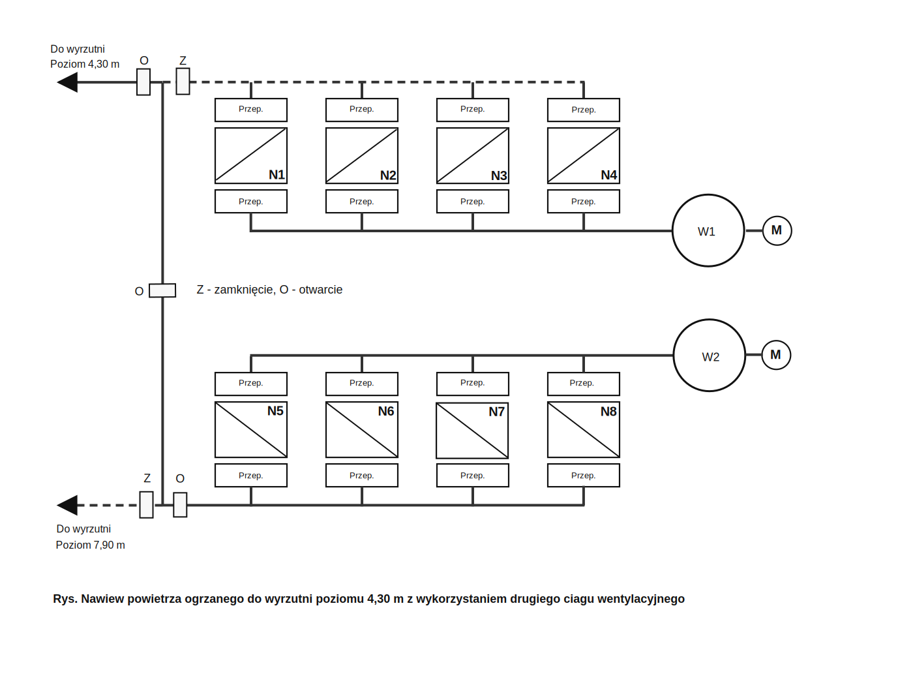
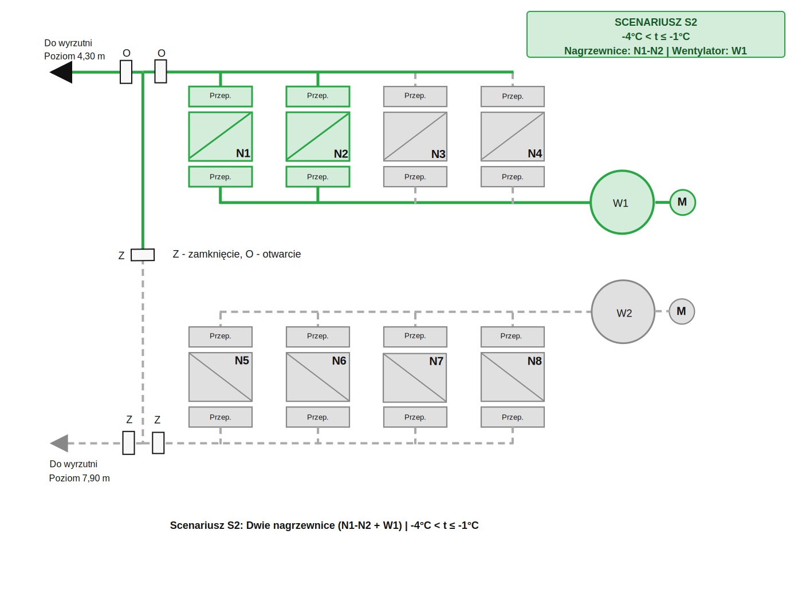
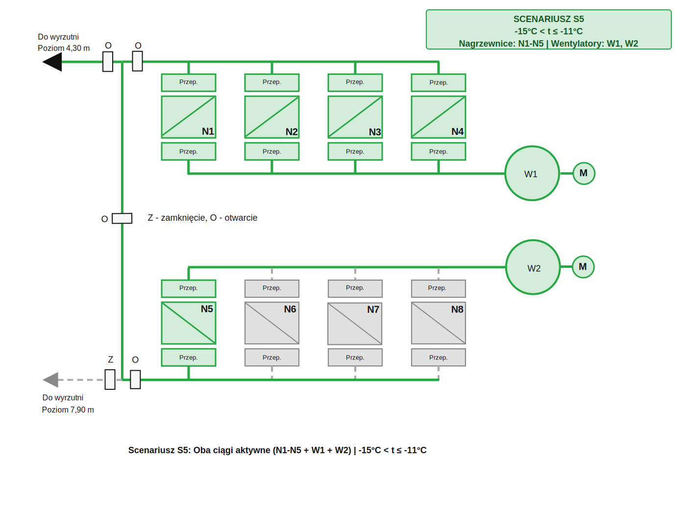
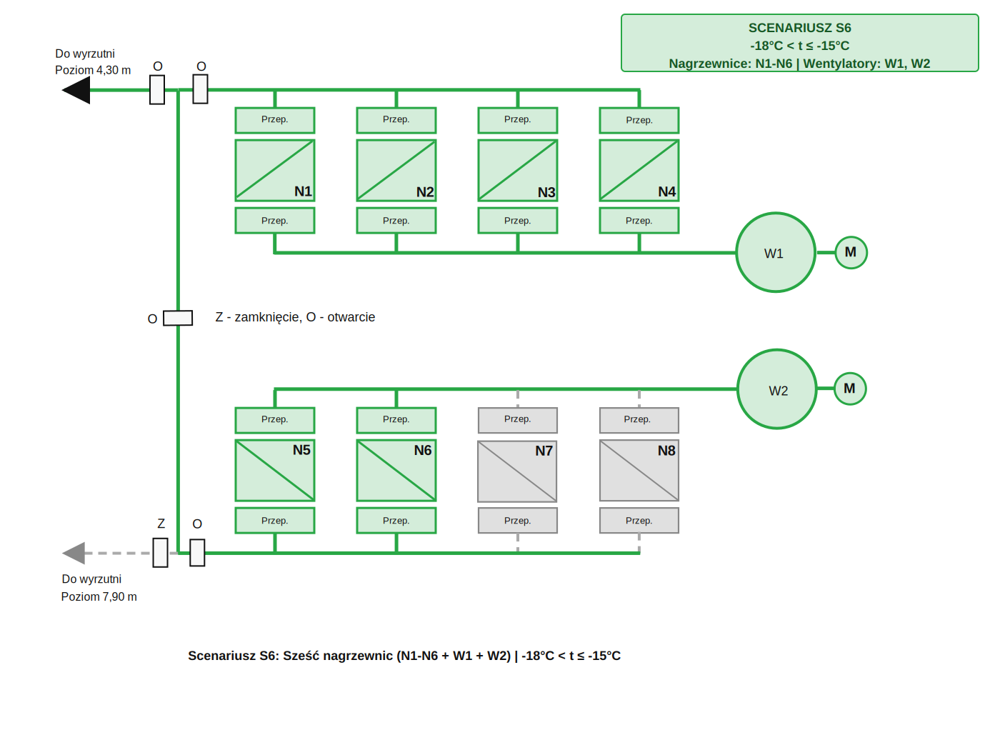
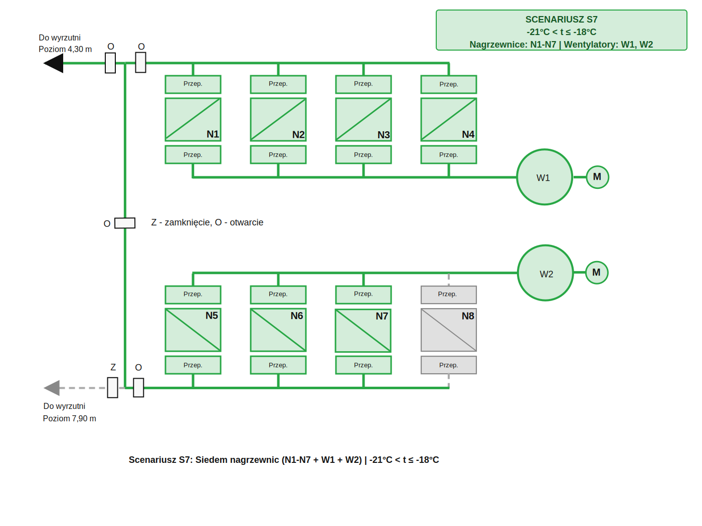
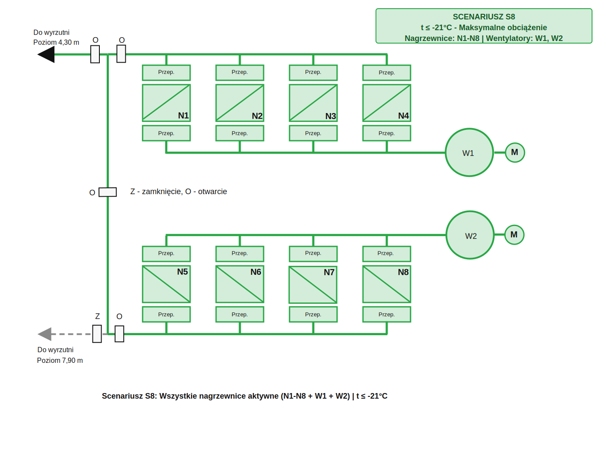

# Symulacja Sterowania Nagrzewnicami BOGDANKA Szyb 2

## Prezentacja Wizualizacji Systemu SCADA/HMI

Ten dokument przedstawia symulację interfejsu operatorskiego (HMI) dla systemu sterowania nagrzewnicami i wentylatorami w szybie kopalnianym. System wizualizuje działanie układów automatycznej regulacji (UAR) w zależności od temperatury zewnętrznej.

[Wymagania dla systemu sterowania](Doc/System%20Sterowania%20BOGDANKA%20szyb%202.md)

---

## Panel Główny - Ekran Synoptyczny

### Schemat Bazowy Instalacji



**Opis:**
- Schemat przedstawia kompletny układ nawiewu powietrza ogrzanego
- 8 nagrzewnic (N1-N8) w dwóch ciągach wentylacyjnych
- 2 wentylatory (W1, W2) z silnikami elektrycznymi
- System przepustnic i zaworów regulacyjnych
- Dwa poziomy wyrzutni: +4,30m i +7,90m

---

## Scenariusze Pracy Systemu

System automatycznie przełącza się między 9 scenariuszami pracy w zależności od temperatury zewnętrznej (t_zewn).

### Scenariusz S0: Brak Ogrzewania
**Warunki:** t ≥ 3°C | **Nagrzewnice:** Brak | **Wentylatory:** Brak


**Stan systemu:**
- Wszystkie nagrzewnice wyłączone
- Wszystkie wentylatory wyłączone
- Wszystkie zawory zamknięte (Z)
- Brak przepływu powietrza (przepustnice zamknięte)
- System w trybie czuwania - oszczędzanie energii

---

### Scenariusz S1: Minimalne Ogrzewanie
**Warunki:** -1°C < t ≤ 2°C | **Nagrzewnice:** N1 | **Wentylatory:** W1


**Stan systemu:**
- Nagrzewnica N1 aktywna (zielona)
- Wentylator W1 pracuje
- Nawiew do wyrzutni poziom 4,30m
- Temp. docelowa: 50°C na wylocie z N1

---

### Scenariusz S2: Dwie Nagrzewnice
**Warunki:** -4°C < t ≤ -1°C | **Nagrzewnice:** N1-N2 | **Wentylatory:** W1



**Stan systemu:**
- Nagrzewnice N1, N2 aktywne
- Wentylator W1 pracuje
- Nawiew do wyrzutni poziom 4,30m
- Zwiększona moc grzewcza przy spadku temperatury

---

### Scenariusz S3: Trzy Nagrzewnice
**Warunki:** -8°C < t ≤ -4°C | **Nagrzewnice:** N1-N3 | **Wentylatory:** W1


**Stan systemu:**
- Nagrzewnice N1, N2, N3 aktywne
- Wentylator W1 pracuje na wyższej mocy
- Nawiew do wyrzutni poziom +4,30m
- Stopniowe zwiększanie mocy grzewczej

---

### Scenariusz S4: Pełny Górny Ciąg
**Warunki:** -11°C < t ≤ -8°C | **Nagrzewnice:** N1-N4 | **Wentylatory:** W1


**Stan systemu:**
- Wszystkie nagrzewnice górnego ciągu (N1-N4) aktywne
- Wentylator W1 w pełnej mocy
- Nawiew do wyrzutni poziom +4,30m
- Maksymalna moc górnego ciągu

---

### Scenariusz S5: Uruchomienie Dolnego Ciągu
**Warunki:** -15°C < t ≤ -11°C | **Nagrzewnice:** N1-N5 | **Wentylatory:** W1, W2



**Stan systemu:**
- Nagrzewnice N1-N5 aktywne
- Oba wentylatory W1, W2 pracują
- Górne zawory otwarte
- Dolny zawór zamknięty (poziom 7,90m)
- Nawiew TYLKO do wyrzutni 4,30m
- Uruchomienie drugiego ciągu wentylacyjnego
- Znaczące zwiększenie mocy grzewczej

---

### Scenariusz S6: Sześć Nagrzewnic
**Warunki:** -18°C < t ≤ -15°C | **Nagrzewnice:** N1-N6 | **Wentylatory:** W1, W2



**Stan systemu:**
- Nagrzewnice N1-N6 aktywne
- Oba wentylatory W1, W2 pracują
- Górne zawory otwarte
- Dolny zawór zamknięty (poziom 7,90m)
- Nawiew TYLKO do wyrzutni 4,30m
- Zwiększona moc dolnego ciągu (N5-N6)

---

### Scenariusz S7: Siedem Nagrzewnic
**Warunki:** -21°C < t ≤ -18°C | **Nagrzewnice:** N1-N7 | **Wentylatory:** W1, W2



**Stan systemu:**
- Nagrzewnice N1-N7 aktywne
- Oba wentylatory W1, W2 w wysokiej mocy
- Górne zawory otwarte
- Dolny zawór zamknięty (poziom 7,90m)
- Nawiew TYLKO do wyrzutni 4,30m
- Bardzo niskie temperatury zewnętrzne

---

### Scenariusz S8: Maksymalne Obciążenie
**Warunki:** t ≤ -21°C | **Nagrzewnice:** N1-N8 | **Wentylatory:** W1, W2



**Stan systemu:**
- WSZYSTKIE nagrzewnice N1-N8 aktywne (zielone)
- Oba wentylatory W1, W2 w maksymalnej mocy
- Górne zawory otwarte
- Dolny zawór zamknięty (poziom 7,90m)
- Nawiew TYLKO do wyrzutni 4,30m
- System działa na maksymalnym obciążeniu - cała moc skoncentrowana na jednej wyrzutni

---

## Układy Automatycznej Regulacji (UAR)

### 1. UAR Temperatury Powietrza - Schemat Ogólny


**Opis działania:**
- **Regulator PID** porównuje temperaturę zadaną (Tz=50°C) z temperaturą mierzoną
- **Sygnał sterujący (CV)** kontroluje zawór regulacyjny wody grzewczej (20-100%)
- **Zawór regulacyjny** zmienia przepływ gorącej wody przez nagrzewnicę
- **Czujnik temperatury** mierzy temperaturę powietrza na wylocie
- **Pętla sprzężenia zwrotnego** zapewnia automatyczną regulację
- 🔴 Woda grzewcza (zasilanie) - czerwona linia
- 🔵 Woda powrotna - niebieska linia
- 🟢 Sygnały sterujące/pomiarowe - ciemnozielone przerywane linie

---

### 2. UAR Nagrzewnicy - Stan Aktywny


**Stan - Nagrzewnica w pracy:**
- **Regulator PID w trybie REGULACJA**
  - SP (setpoint) = 50°C
  - PV (process variable) = temperatura mierzona
  - CV (control variable) = 20-100% (zmienne)

- **Zawór regulacyjny**
  - Regulowany w zakresie 20-100%

- **Przepustnice otwarte**
  - Pełny przepływ powietrza przez nagrzewnicę

- **Pętla sprzężenia zwrotnego**
  - Ciągła korekta temperatury
  - Automatyczna kompensacja zaburzeń

---

### 3. UAR Nagrzewnicy - Stan Nieaktywny


**Stan - Nagrzewnica wyłączona:**
- **Regulator PID w trybie UTRZYMANIE**
  - Utrzymuje zawór na stałej pozycji 20%
  - SP = CV = 20% (stałe)
  - PV = ignorowane (temperatura nie jest używana)

- **Zawór regulacyjny**
  - Utrzymywany na stałej pozycji 20%
  - Ochrona przed zamrożeniem

- **Przepustnice zamknięte**
  - Brak przepływu powietrza
  - Nagrzewnica nie oddaje ciepła

- **Sekwencja wyłączania (STOPPING → OFF):**
  1. PID zamyka zawór z aktualnej pozycji do 20%
  2. Zawór ustabilizowany na 20%
  3. Zamykanie przepustnic

---

### 4. UAR Prędkości Wentylatora


**Opis działania:**
- **Regulator PID** utrzymuje temperaturę w szybie (Ts=2°C na poziomie -4,30m)
- **Sygnał sterujący (CV)** kontroluje częstotliwość (25-50 Hz)
- **Przetwornica częstotliwości (Falownik)**
  - Konwertuje sygnał PID na zmienną częstotliwość
  - Wyjście: 400V 3~ o częstotliwości 25-50 Hz
  
- **Wentylator (W1/W2)**
  - W1 obsługuje nagrzewnice N1-N4 (poziom 4,30m)
  - W2 obsługuje nagrzewnice N5-N8 (poziom 7,90m)
  - Wydajność zależy od prędkości obrotowej

- **Czujnik temperatury w szybie**
  - Poziom -30m
  - Sprzężenie zwrotne do regulatora w kazdym ciągu

**Logika regulacji:**
- 🔻 T_szyb ↓ (za zimno) → PID ↑ częstotliwość → silnik szybciej → więcej ciepłego powietrza
- 🔺 T_szyb ↑ (za ciepło) → PID ↓ częstotliwość → silnik wolniej → mniej ciepłego powietrza

---

## Panel HMI - Elementy Wizualizacji

### Kolory i Konwencje Wizualne

#### Stan Elementów:
- 🟢 **Zielony** - Element aktywny, pracujący
- ⚪ **Szary** - Element nieaktywny, wyłączony
- 🔴 **Czerwony** - Awaria, alarm
- 🟡 **Żółty** - Ostrzeżenie, tryb przejściowy

#### Przepływy:
- **Linie ciągłe** (grube) - Aktywny przepływ
- **Linie przerywane** (cienkie) - Brak przepływu lub przepływ minimalny
- 🔴 **Czerwony** - Woda grzewcza (zasilanie, gorąca)
- 🔵 **Niebieski** - Woda powrotna (chłodniejsza)
- 🟢 **Ciemnozielony** - Sygnały sterujące/pomiarowe PID
- ⚪ **Szary** - Powietrze

#### Zawory:
- **Z** - Zamknięty
- **O** - Otwarty
- **%** - Pozycja w procentach (dla zaworów regulacyjnych)

---

## Główne Wskaźniki na Panelu HMI

### Temperatury:
- **t_zewn** - Temperatura zewnętrzna [°C]
- **Tz** - Temperatura zadana na wylocie z nagrzewnicy (50°C)
- **T_N1...T_N8** - Temperatury rzeczywiste na wylotach z nagrzewnic [°C]
- **Ts** - Temperatura zadana w szybie (2°C)
- **T_szyb** - Temperatura rzeczywista w szybie na poziomie -30m [°C]

### Parametry Wentylatorów:
- **W1_f** - Częstotliwość wentylatora W1 [Hz] (25-50)
- **W2_f** - Częstotliwość wentylatora W2 [Hz] (25-50)
- **W1_I** - Prąd silnika W1 [A]
- **W2_I** - Prąd silnika W2 [A]

### Zawory Regulacyjne:
- **Z_N1...Z_N8** - Pozycje zaworów regulacyjnych [%] (20-100)

### Statusy:
- **Scenariusz** - Aktualny scenariusz pracy (S0-S8)
- **Tryb** - AUTO / MANUAL
- **Alarmy** - Lista aktywnych alarmów

---

## Tryby Pracy Systemu

### Tryb AUTO (Automatyczny)
- System automatycznie wybiera scenariusz na podstawie t_zewn
- Regulatory PID aktywnie kontrolują:
  - Temperaturę powietrza (zawory N1-N8)
  - Temperaturę w szybie (wentylatory W1-W2)
- Automatyczne włączanie/wyłączanie nagrzewnic
- Automatyczna regulacja prędkości wentylatorów

### Tryb MANUAL (Ręczny)
- Operator ma pełną kontrolę nad systemem
- Możliwość ręcznego ustawienia:
  - Pozycji zaworów (20-100%)
  - Częstotliwości wentylatorów (25-50 Hz)
  - Włączenia/wyłączenia poszczególnych nagrzewnic
- Zabezpieczenia nadal aktywne (min. 20% zaworu, limity temperatur)

---

## System Alarmów

### Alarmy Krytyczne (Czerwone):
- 🔴 **Brak odczytu t_zewn** - Utrzymanie ostatniego stanu
- 🔴 **Temperatura > 60°C** - Zamknięcie zaworu do 20%
- 🔴 **Wentylator nie pracuje** - Wyłączenie odpowiednich nagrzewnic
- 🔴 **Temp. wody < 5°C** - Ryzyko zamrożenia

### Alarmy Ostrzegawcze (Żółte):
- 🟡 **Temperatura < 40°C** przy pracy - Zwiększenie otwarcia zaworu
- 🟡 **Przepustnica nie reaguje** - Kontynuacja pracy
- 🟡 **Zbyt długi czas nagrzewania** - Sprawdzenie parametrów PID

### Informacje (Niebieskie):
- 🔵 **Zmiana scenariusza** - Automatyczne przełączenie
- 🔵 **Przełączenie AUTO/MANUAL** - Zmiana trybu przez operatora
- 🔵 **Zmiana parametrów PID** - Modyfikacja nastaw

---

## Trendy Historyczne

Panel HMI umożliwia wyświetlanie trendów:
- Temperatura zewnętrzna (24h)
- Temperatura w szybie (24h)
- Temperatury na wylotach z nagrzewnic (8 krzywych)
- Pozycje zaworów regulacyjnych (8 krzywych)
- Częstotliwości wentylatorów (2 krzywe)
- Pobór mocy całkowity [kW]

---

## Parametry Nastaw PID

### UAR Temperatury Nagrzewnic (N1-N8):
```
Kp = [do określenia podczas rozruchu]
Ti = [do określenia podczas rozruchu]
Td = [do określenia podczas rozruchu]
Tz = 50°C (stała)
CV_min = 20% (ochrona antyzamrożeniowa)
CV_max = 100%
```

### UAR Prędkości Wentylatorów (W1, W2):
```
Kp = [do określenia podczas rozruchu]
Ti = [do określenia podczas rozruchu]
Td = [do określenia podczas rozruchu]
Ts = 2°C (stała)
f_min = 25 Hz (minimalna prędkość)
f_max = 50 Hz (maksymalna prędkość)
```

---

## Podsumowanie Funkcjonalności HMI

### Ekrany Dostępne w Systemie:
1. **Ekran Główny** - Synoptyka z aktualnym scenariuszem
2. **Szczegóły Nagrzewnic** - Parametry N1-N8
3. **Szczegóły Wentylatorów** - Parametry W1-W2
4. **Trendy** - Wykresy historyczne
5. **Alarmy** - Historia i aktywne alarmy
6. **Nastawy** - Parametry PID i temperatury zadane
7. **Diagnostyka** - Stan urządzeń i statystyki

### Możliwości Operatora:
- Monitoring wszystkich parametrów w czasie rzeczywistym
- Przełączanie trybu AUTO/MANUAL
- Ręczne sterowanie w trybie MANUAL
- Zmiana parametrów PID (z odpowiednimi uprawnieniami)
- Przeglądanie trendów historycznych
- Kwituowanie alarmów
- Export danych do raportów

---

## Notatki Implementacyjne

### Wymagania Techniczne:
- **Platforma SCADA**: iFix, WinCC, Wonderware, Ignition lub podobna
- **Komunikacja PLC**: Modbus TCP/RTU, OPC UA lub protokół właścicielski
- **Czas odświeżania**: 1s dla parametrów procesowych
- **Archiwizacja**: min. 1 rok danych historycznych
- **Rozdzielczość**: min. 1920x1080 dla pełnej wizualizacji

### Bezpieczeństwo:
- **Poziomy dostępu**:
  - Operator: monitoring, kwitowanie alarmów
  - Inżynier: zmiana trybu AUTO/MANUAL, ręczne sterowanie
  - Administrator: zmiana nastaw PID, konfiguracja systemu
- **Logi**: Zapis wszystkich akcji operatora
- **Backup**: Codzienne kopie bezpieczeństwa bazy danych

---

**Ostatnia aktualizacja:** 2025-11-19
**Wersja dokumentu:** 1.0
**Status:** Symulacja/Propozycja HMI

